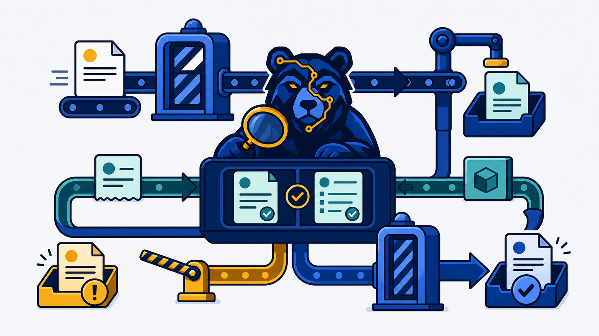
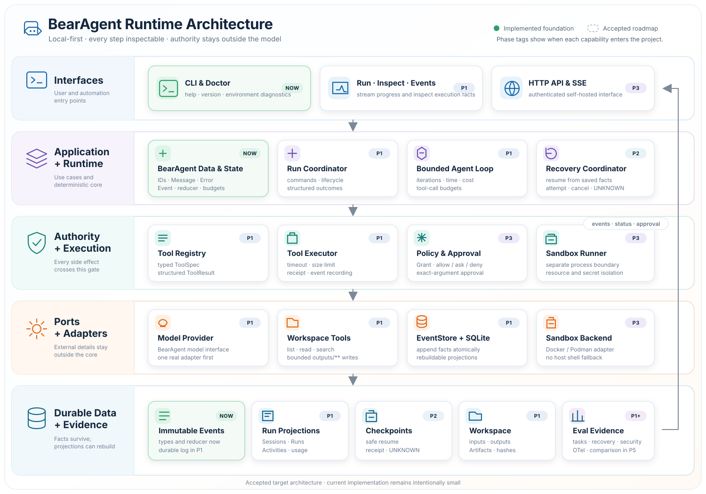
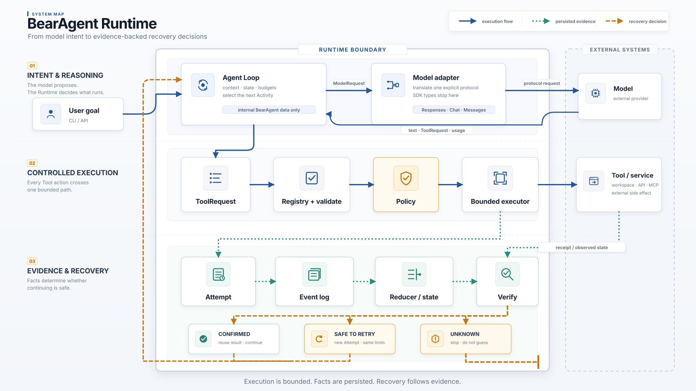

<div align="center">
  

  <h1>BearAgent: Verifiable Agent Execution</h1>

  <p><strong>一个在模型决策与外部副作用之间负责执行、诊断与恢复的 local-first Runtime。</strong></p>
  <p>它记录完整执行事实，在恢复前验证故障判断，并约束外部动作的权限和影响范围。</p>

  <p>
    <a href="site/src/content/docs/zh-cn/index.mdx"></a>
    <a href="#快速开始"></a>
  </p>

  <p>
    <a href="https://github.com/CherryYang05/BearAgent/actions/workflows/ci.yml"></a>
    
    
    
    <a href="docs/project/roadmap.md"></a>
  </p>

  <p>
    <a href="#为什么需要-bearagent">为什么需要 BearAgent</a> ·
    <a href="#快速开始">快速开始</a> ·
    <a href="#架构总览">架构总览</a> ·
    <a href="#能力边界">能力边界</a> ·
    <a href="#学习与开发">学习与开发</a>
  </p>
</div>

<br>



## 为什么需要 BearAgent

LLM Agent 正从生成答案走向调用文件系统、API、数据库和其他外部工具。模型可以提出下一步动作，
但一旦动作开始改变真实环境，困难就不再只是“模型是否回答正确”，而是系统能否判断动作实际发生了
什么，以及失败后怎样继续才不会扩大影响。

一次 Tool 调用超时，并不能证明它没有执行；一个错误被暂时消除，也不能证明系统找到了正确原因。
如果 Runtime 缺少完整的执行事实、结果证据和恢复边界，自动重试可能重复产生副作用，错误恢复也可能
掩盖真正的问题。

BearAgent 把模型输出视为执行提议，而不是执行权限。它在 Agent orchestration 与外部副作用之间加入
一层确定性的 Runtime，统一检查请求、执行 Tool、记录 Event、计算状态，并保留模型、Runtime、Tool
与外部环境之间的执行关系。

失败发生后，Runtime 不会根据最后一条错误直接重试，而是结合执行阶段、因果关系和外部状态形成可以
验证的故障判断，再通过结果查询、read-after-write、dry-run、canary 或 reconcile 等低风险操作核对
判断。只有诊断得到足够证据，并且恢复动作满足权限、状态和影响范围约束后，系统才会复用、重试、
补偿或继续执行；否则回滚、停止或进入 `UNKNOWN`。

BearAgent 最终要建立的是一条确定性的 diagnosis–verification–recovery 闭环：不仅记录发生了什么，
还要判断为什么失败、验证恢复依据，并限制错误恢复可能造成的副作用。

## 当前可以做什么

> [!NOTE]
> 当前 P1 先回答“发生了什么”；P2 将回答“结果能否确认，以及应该复用、重试、核对还是停下”；
> P3 再回答“动作是否获准，以及它最多能够影响哪里”。Roadmap 中的设计方向不代表当前已经实现。

| 可检查 | 有边界 | 默认拒绝 | 本地优先 |
|---|---|---|---|
| Model 与 Tool Activity、Error、预算和 Artifact 关联到同一个 Run | 模型次数、Tool 次数、token、费用和总时间都有 hard budget | Tool 必须经过 Registry、参数规范化、Policy 和 Executor | SQLite、workspace 和 `outputs/**` 默认留在本机 |

当前第一个完整场景是**仓库与本地文档研究**：Agent 可以在指定 workspace 中列出、读取和搜索文本，并把完整 UTF-8 结果原子写入 `outputs/**`。任务结束后，可以用 Run ID 查询状态、Artifact 和完整Event 序列。

## 快速开始

需要 Git、[uv](https://docs.astral.sh/uv/) 和 Python 3.12。

### 1. 安装并检查环境

```console
git clone https://github.com/CherryYang05/BearAgent.git
cd BearAgent
uv python install 3.12
uv sync --all-groups --locked
uv run bearagent doctor
```

### 2. 准备本机配置

在仓库根目录创建 `data/`，再复制两份示例文件：

- `config.example.json` → `data/config.json`
- `examples/run-profile-v2.example.json` → `data/p1-run-profile.json`

- 在 `data/config.json` 中填写模型协议、base URL、API key 和 model；
- 在 profile 中选择同一个 `provider_id`，并把默认全为 `0` 的预算改为有限值；
- `data/` 默认被 Git 忽略。不要把 API key 写进 profile、命令、Event、日志或 Git。

字段含义、完整示例与三种受支持协议见[配置参考](docs/reference/configuration.md)。

### 3. 启动一次 Run

```console
uv run bearagent run "阅读 docs，并把项目简介写到 outputs/intro.md"
```

默认情况下，当前目录是 workspace，Event 写入 `data/bearagent.db`。命令会输出 Run ID、最终状态、
模型回答和 Artifact。

### 4. 用 Run ID 回看过程

```console
uv run bearagent run inspect <run-id> --json
uv run bearagent run events <run-id> --after-sequence 0 --limit 100 --json
```

如果命令失败，先保存 Run ID，不要立即删除数据库或重复执行。退出码和排错步骤见
[CLI 完整手册](site/src/content/docs/zh-cn/guides/cli.md)。

## 架构总览

下图展示当前已经接通的组件。入口与 adapter 可以替换，但 Runtime 的状态、预算、Policy 和 Event
规则不依赖某个模型 SDK 或数据库实现。



一次 Tool 调用必须经过同一条受控路径：

```text
Model 提出 ToolRequest
  -> Registry 精确查找
  -> Tool.prepare 校验并规范化参数
  -> Policy 返回 ALLOW 或 DENY
  -> ToolExecutor 有界执行
  -> EventStore 保存事实
```

更完整的模块关系、数据契约和术语见[总体架构](docs/architecture/overview.md)。

## 一次请求怎样穿过 Runtime



这张图表达四个长期边界：

1. Provider SDK 对象只停留在 adapter，Runtime 只交换 BearAgent 自己的数据类型；
2. 模型只能提出 `ToolRequest`，不能绕过 Policy 直接操作 workspace；
3. Event 保存已经发生的事实，RunState 与预算由 Reducer 从 Event 计算；
4. 恢复决定必须由 Attempt、Receipt 或可核对的外部状态支撑；证据不足时进入 `UNKNOWN`，而不是猜测。

## 能力边界

| 当前可用 | 设计方向 |
|---|---|
| `doctor/run/inspect/events` CLI | 进程中断后的安全 resume 与恢复决策 |
| Responses、Chat Completions、Anthropic Messages 三种显式协议 | 按 URL 猜协议或失败后自动 fallback（不计划隐式提供） |
| SQLite Event、projection 与重开查询 | Attempt、Receipt、reconcile 与 `UNKNOWN` |
| workspace list/read/search 与 `outputs/**` 原子写入 | 受控 sandbox shell/code 与联网 Tool/MCP；不会回退到 host shell |
| 固定 allowlist Policy 与五类 hard budget | Grant、用户 Approval 与隔离 runner |
| Fake 5/5 与一组脱敏真实模型 5/5 证据 | Web UI、Memory、多 Agent 与分布式执行 |

真实模型 gate 的脱敏证据位于
[F-0017 live report](docs/evidence/F-0017-p1-live-report-v1.json)。它只证明报告中记录的 suite、commit、
配置和价格快照，不代表所有 Provider 都已在线联调。

## 学习与开发

| 你想做什么 | 从这里开始 |
|---|---|
| 从零理解一次 Agent 文件任务 | [全书阅读地图](site/src/content/docs/zh-cn/learn/index.md) |
| 安装、配置、运行与排错 | [CLI 完整手册](site/src/content/docs/zh-cn/guides/cli.md) |
| 理解 Runtime 的模块连接 | [一次请求怎样穿过 Runtime](site/src/content/docs/zh-cn/architecture/runtime-flow.md) |
| 沿代码和测试继续阅读 | [开发者代码路线](site/src/content/docs/zh-cn/development/index.md) |
| 查看当前状态与阶段目标 | [当前状态](site/src/content/docs/zh-cn/project/status.md) · [Roadmap](docs/project/roadmap.md) |
| 修改 Feature | [AGENTS.md](AGENTS.md) · [Feature Specs](docs/specs/README.md) · [ADRs](docs/adr/README.md) |

提交变更前运行完整质量门：

```console
uv lock --check
uv run ruff format --check .
uv run ruff check .
uv run pyright
uv run pytest
uv run python scripts/check_docs.py
uv run python scripts/check_governance.py
npm run build --prefix=site
```

`docs/`、代码和测试保存工程事实；`site/` 把同一组事实组织成面向初学者的中文学习路线。文档站
可以本地开发、构建和预览，不负责部署 BearAgent Runtime。

## License

许可证尚未决定。正式公开分发前会在 Apache-2.0 与 AGPL-3.0 之间通过 ADR 确认；当前不要假设拥有
复制、修改或分发授权。
