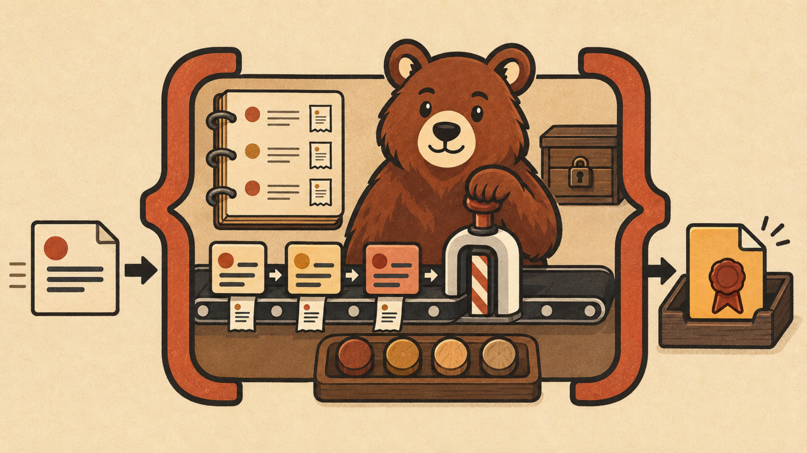
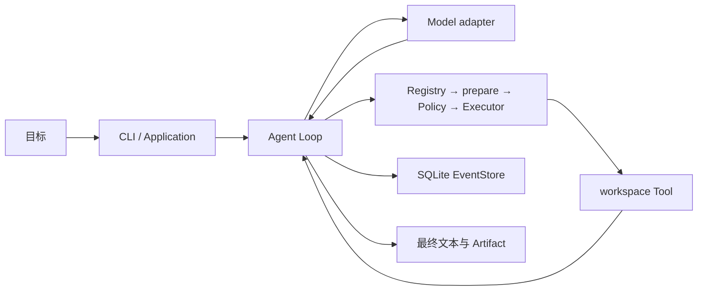

<div align="center">
  
  <h1>BearAgent</h1>
  <p><strong>一个 local-first、可检查的个人 Agent Runtime。</strong></p>
  <p>模型提出下一步，Runtime 控制工具、预算、记录和文件边界。</p>
  <p>
    <a href="#十分钟跑通一次任务">十分钟开始</a> ·
    <a href="site/src/content/docs/zh-cn/index.mdx">中文学习书</a> ·
    <a href="docs/index.md">工程文档</a> ·
    <a href="docs/project/roadmap.md">Roadmap</a>
  </p>
</div>



你可以把 Model 想成负责判断“下一步做什么”的大脑，把 Runtime 想成真正负责执行的软件。BearAgent
保存每次模型和 Tool Activity，限制模型次数、Tool 次数、token、费用和总时间，并且只允许内置文件
Tool 在指定 workspace 中工作。

当前可运行的第一个场景是仓库与本地文档研究：Agent 可以列出、读取和搜索文本，只把完整 UTF-8
结果原子写入 `outputs/**`。任务结束后，你可以用 Run ID 查询状态、Artifact 和完整 Event 序列。

> [!IMPORTANT]
> P1“可检查执行”已经完成。进程中断后自动恢复属于 P2；用户 Approval 和隔离 runner 属于 P3。
> `site/` 是独立的文档展示站，可以在本地开发、构建和预览；它不负责部署 BearAgent Runtime。

## 十分钟跑通一次任务

需要 Git、[uv](https://docs.astral.sh/uv/) 和 Python 3.12。

### 1. 安装并检查环境

```console
git clone https://github.com/CherryYang05/BearAgent.git
cd BearAgent
uv python install 3.12
uv sync --all-groups --locked
uv run bearagent doctor
```

### 2. 准备两个本机配置文件

- 把 `config.example.json` 复制为 `data/config.json`；
- 把 `examples/run-profile-v2.example.json` 复制为 `data/p1-run-profile.json`。

在 `data/config.json` 中填写模型协议、base URL、API key 和 model。在 profile 中选择相同的
`provider_id`，并把默认全为 0 的预算改成你愿意承担的有限值。

这两个默认文件都位于 Git 忽略的 `data/` 目录。不要把 API key 写进 profile、命令、Event、日志或
Git。字段逐项解释见[配置参考](docs/reference/configuration.md)。

### 3. 启动 Run

```console
uv run bearagent run "阅读 docs，并把项目简介写到 outputs/intro.md"
```

默认情况下，当前目录是 workspace，Event 写入 `data/bearagent.db`。命令会输出 Run ID、最终状态、
模型回答和 Artifact。

### 4. 用 Run ID 回看过程

```console
uv run bearagent run inspect <run-id> --json
uv run bearagent run events <run-id> --after-sequence 0 --limit 100 --json
```

如果命令失败，不要先删数据库或重复执行。先保存 Run ID，再按
[CLI 完整手册](site/src/content/docs/zh-cn/guides/cli.md)中的退出码和排错表检查。

## 一次请求发生了什么



这里有三条不能绕过的边界：

1. 外部模型 SDK 对象只停留在 adapter，Runtime 只交换 BearAgent 自己的数据类型；
2. 模型只能提出 ToolRequest，所有 Tool 都要经过 Registry、参数规范化、默认拒绝 Policy 和 Executor；
3. Event 保存发生过的事实，RunState 和预算由 Reducer 从 Event 计算，不维护第二份“真状态”。

## 当前能做与不能做

| 已实现 | 还没有实现 |
|---|---|
| `doctor/run/inspect/events` CLI | 进程中断后自动 resume/retry |
| Responses、Chat Completions、Anthropic Messages 三种显式协议 | 根据 URL 猜协议或失败后 fallback |
| SQLite Event 与 projection | Attempt、Receipt、reconcile、`UNKNOWN` |
| workspace list/read/search 与 `outputs/**` 原子写入 | 任意 host shell、联网 Tool、MCP |
| 固定 allowlist Policy 和五类 hard budget | 用户 Approval、Grant、隔离 runner |
| Fake 5/5 与一组脱敏真实模型 5/5 证据 | Web UI、多用户、多个 Agent |

真实模型 gate 的脱敏证据位于
[F-0017 P1 live report](docs/evidence/F-0017-p1-live-report-v1.json)。它只证明报告记录的 suite、commit、
配置和价格快照，不代表所有 Provider 都已在线联调。

## 按一本书继续学习

在线站点的仓库源码位于 [`site/`](site/README.md)。建议按以下顺序阅读：

1. [全书阅读地图](site/src/content/docs/zh-cn/learn/index.md)；
2. [一项 Agent 任务怎样运转](site/src/content/docs/zh-cn/learn/agent-basics.md)；
3. [一次请求怎样穿过 Runtime](site/src/content/docs/zh-cn/architecture/runtime-flow.md)；
4. [源码阅读路线](site/src/content/docs/zh-cn/development/index.md)；
5. [Agent 仍然难在哪里](site/src/content/docs/zh-cn/learn/open-problems.md)。

`docs/`、代码和测试保存工程事实；`site/` 把相同事实组织成学习路线。Roadmap 中的计划不能当作当前
能力，外部参考项目的功能也不能当作 BearAgent 的实现证据。

## 开发与验证

准备修改代码时先读 [`AGENTS.md`](AGENTS.md)，再确认 Feature Spec、相关 ADR 和唯一 active Plan。

```powershell
uv lock --check
uv run ruff format --check .
uv run ruff check .
uv run pyright
uv run pytest
uv run python scripts/check_docs.py
npm.cmd run build --prefix=site
```

## License

许可证尚未决定。正式公开分发前会在 Apache-2.0 与 AGPL-3.0 之间通过 ADR 确认；当前不要假设拥有
复制、修改或分发授权。
