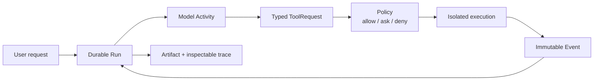

# BearAgent

[](#project-status)
[](https://www.python.org/)
[](https://github.com/CherryYang05/BearAgent/actions/workflows/ci.yml)

BearAgent is a lightweight, local-first and self-hostable runtime for safely and reliably executing long-running, tool-intensive personal AI tasks.

BearAgent 是一个轻量、local-first、可自托管的个人 AI Agent Runtime，重点解决长任务中的工具调用、状态持久化、权限控制、故障恢复和可追踪执行。

> [!IMPORTANT]
> BearAgent 当前已完成 **P0 Engineering Baseline** 并进入 P1。F-0001 领域契约和 F-0015 本地 Starlight 文档站已实现；目前仍不能调用真实模型或执行 Agent 任务。

## Why BearAgent

很多 Agent demo 的核心只是一个 `while model -> tool -> model` 循环；一旦进程重启、外部副作用结果不确定、模型请求越权或上下文持续膨胀，就很难解释系统实际发生了什么。

BearAgent 从运行时边界开始设计。以下是由 P1-P3 逐步实现的目标执行模型，不代表当前已经支持全部能力：



核心方向：

- durable execution at explicit safe boundaries；
- typed tools, runtime Grants and exact-argument approvals；
- isolated runner，不在主进程执行模型生成 shell；
- event log、trace、checkpoint 和 eval 各自有明确语义；
- local-first、单用户、单进程、SQLite first；
- Skills、MCP、Memory 和 Web UI 后置到稳定内核之后。

## Project status

**P0 已完成，P1 进行中。** 当前仓库已经具备稳定的领域 ID、Message、Error 与 Event envelope，但还不是可执行真实任务的 Agent。

### Available now

- Architecture、Roadmap、Feature Spec、ADR 和 AI 开发 SOP；
- Python 3.12、uv lockfile 和明确的 package boundaries；
- `bearagent --help`、`--version` 和 `doctor`；
- Fake Model、Fake Tool 和 In-memory Event Store；
- F-0001 的类型化领域 ID、Message、Error、Event envelope 和 schema snapshot；
- 位于 `site/`、可本地构建的中文 Starlight 学习文档；
- Ruff、Pyright、pytest、文档检查和 Windows/Linux CI。

### Not implemented yet

- 真实 ModelProvider 和 Agent Loop；
- workspace 文件 Tool 和 SQLite 持久化；
- checkpoint、resume、cancel、retry 和 `UNKNOWN` 恢复语义；
- Policy、Approval、Sandbox、MCP、Memory 和 Web UI。

当前阶段是 [P1 Minimum Useful Agent](docs/project/roadmap.md)，目标是完成一次真实、受限、可追踪的本地文件任务。

## Quick start

Prerequisite: [uv](https://docs.astral.sh/uv/).

```powershell
git clone https://github.com/CherryYang05/BearAgent.git
cd BearAgent
uv python install 3.12
uv sync --all-groups --locked
uv run bearagent --help
uv run bearagent doctor
```

机器可读诊断：

```powershell
uv run bearagent doctor --json
```

也可以通过 Python module 启动：

```powershell
uv run python -m bearagent doctor --json
```

## Development

完整验证：

```powershell
uv run ruff format --check .
uv run ruff check .
uv run pyright
uv run pytest
uv run python scripts/check_docs.py
```

自动格式化：

```powershell
uv run ruff format .
uv run ruff check --fix .
```

开始功能开发前：

1. 阅读 [`AGENTS.md`](AGENTS.md)、[Roadmap](docs/project/roadmap.md)和[总体架构](docs/architecture/overview.md)。
2. 按 [AI 开发 SOP](docs/development/ai-development-sop.md)调查相关 Spec、ADR、代码和测试。
3. 创建或更新 Feature Spec；S2 变更同时创建 ADR，并在被接受后建立 Implementation Plan。
4. 按 Plan 的纵向切片测试和实现，最后执行 Docs Impact 检查与问题导向 review。

## Repository layout

```text
src/bearagent/
├── domain/          internal facts and value types
├── runtime/         state transitions and execution kernel
├── application/     commands and use cases
├── ports/           model, tool, store, policy and sandbox contracts
├── adapters/        provider, persistence, tool and test adapters
└── interfaces/      CLI now; HTTP API later

tests/
├── architecture/    dependency boundary checks
├── integration/     executable entry points
└── unit/            deterministic behavior and test adapters
```

## Documentation

- 本地学习文档站：`npm --prefix=site ci`，然后运行 `npm run dev --prefix=site`，访问 `http://localhost:4321/zh-cn/`；
- [文档首页](docs/index.md)
- [总体架构](docs/architecture/overview.md)
- [AI 辅助开发 SOP](docs/development/ai-development-sop.md)
- [项目路线图](docs/project/roadmap.md)
- [本地与服务器部署策略](docs/deployment/self-hosting.md)
- [Feature Specs](docs/specs/README.md)
- [Implementation Plans](docs/plans/README.md)
- [Architecture Decision Records](docs/adr/README.md)

## Roadmap

| Phase | Outcome |
|---|---|
| P0 | Engineering and architecture baseline |
| P1 | Local CLI agent with one provider and bounded workspace tools |
| P2 | Checkpoint, resume, cancel, retry, idempotency and `UNKNOWN` |
| P3 | Policy, approval, sandbox runner and secure self-hosted beta |
| P4 | Web UI, Skills, MCP and inspectable Memory |
| P5 | OpenTelemetry, replay, eval and public documentation |

P3 是第一个完整项目完成线。详见[路线图](docs/project/roadmap.md)。

## Design constraints

- Runtime core 不依赖 FastAPI、UI、模型 SDK、MCP、Docker 或数据库 adapter。
- 模型和 Tool 输出始终是不可信数据，不能授予权限。
- 外部副作用必须经过 ToolExecutor 和 PolicyEngine。
- 不承诺 exactly-once；不确定副作用进入 `UNKNOWN`。
- shell/code execution 只能进入独立 runner，不能回退到 host subprocess。

## License

尚未决定。公开发布代码前将在 Apache-2.0 与 AGPL-3.0 之间做 ADR；在许可证确定前，请不要假设拥有复制、修改或分发授权。
