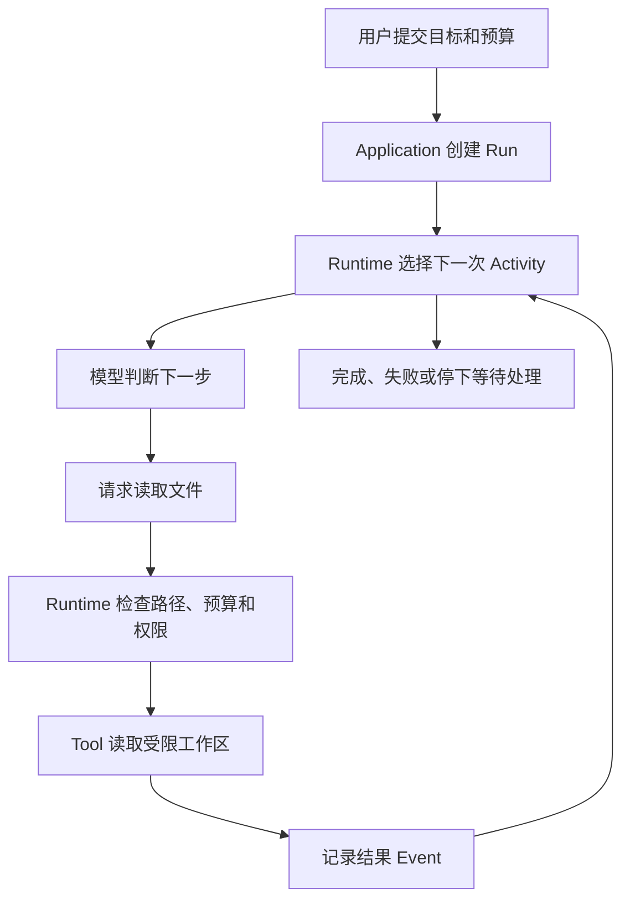
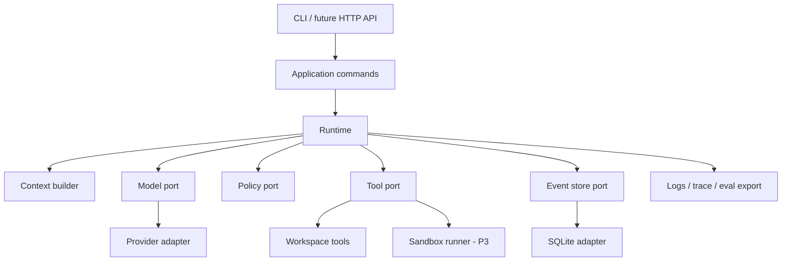

# BearAgent 总体架构

## 1. 先看一次 Run

BearAgent 的第一个任务很具体：在指定工作区中阅读仓库和本地文档，并把结果写到 `outputs/**`。
以“读取一份架构文档并生成总结”为例，系统需要走过以下路径：



模型只决定“下一步想做什么”。Runtime 负责验证请求、调用外部实现、保存事实、计算状态并决定
是否还能继续。BearAgent 的架构首先要让这条路径可检查，再在后续阶段加入可靠恢复和授权。

## 2. 项目要守住的四条结果

1. **过程能够还原。** 每次模型和工具 Activity、预算、错误和 Artifact 都能关联到同一个 Run。
2. **结果不明时不猜。** 只有能确认结果时才继续；无法确认的外部写入进入 `UNKNOWN`，不自动当作失败重做。
3. **权限不来自文字。** 模型、Prompt、Skill、工作区文件和 Tool 输出都不能给自己增加权限。
4. **个人能够维护。** P0 至 P3 保持单用户、单 Agent、单进程、SQLite 和 CLI，复杂度由真实需求触发。

这四条是长期边界。P1 先完成可检查执行，P2 增加恢复，P3 接入权限、隔离和安全自托管。

## 3. 当前代码与后续设计

### 3.1 当前已经实现

| 范围 | 已有行为 |
|---|---|
| 工程基础 | Python 3.12、uv、CLI doctor、Ruff、Pyright、pytest、CI 和 import boundary 测试 |
| 内部数据 | 类型化 ID、Message、Error、通用 Event 外壳和 JSON schema 快照 |
| 状态规则 | P1 Run/Activity 状态、12 种具体 Event、纯 Reducer 和五类预算检查 |
| 持久事实 | EventStore port、SQLite WAL、显式 migration、Run/Activity projection 和事务回滚 |
| 模型边界 | ModelProvider port、确定性测试 adapter 和首个 OpenAI Responses 流式 adapter |
| Tool 执行边界 | 有界 Tool 数据、精确 Registry、默认拒绝 Policy 和统一 ToolExecutor |
| workspace 只读边界 | 一层目录列出、分段 UTF-8 读取、普通字符串搜索和跨平台路径拒绝 |
| workspace 输出边界 | `outputs/**` UTF-8 原子创建/替换、Artifact 元数据和失败前旧目标保护 |
| Agent 执行链 | 从已提交 Event 构造有界 Context，串行调用模型与 Tool，并把 v2 Activity 事实写回 Store |
| 固定任务 | 五个版本化文件任务在内存和 SQLite Store 上使用 Fake Provider 完成确定性验证 |
| 用户入口 | `run/inspect/events` CLI、严格 Run profile、human/JSON renderer 和安全退出码 |
| 查询 | application query service 只通过 EventStore 读取 projection 与分页 Event，并重建 Artifact 元数据 |
| 测试替身 | Fake model、Fake tool、内存 Event store |
| 文档 | 工程 `docs/` 与本地 Starlight 学习/开发者站点 |

`bootstrap.py` 已把 OpenAI adapter、SQLite、workspace Tools、固定 Policy 和 AgentLoop 组装到同一
生产入口。F-0005 测试注入 Fake Provider，让五个固定任务走这条 production composition，并重开
SQLite 检查 `inspect/events`。真实模型 API 尚未做退出演练；持久事实也仍不等于进程重启后会自动继续。

### 3.2 已接受但尚未接通

- P1：决定并执行真实模型 API/4-of-5 gate（若保留），再完成整个里程碑 Reality Check；
- P2：Checkpoint、Attempt、暂停/继续/取消、恢复协调和 `UNKNOWN` 处置；
- P3：Grant、Policy、Approval、隔离 runner、HTTP API、认证和备份恢复；
- P4：Skill、MCP、Web UI、Memory 和受控联网；
- P5：跨版本 trace 与持续评测。

后文解释这些模块的长期连接方式，但每一节都会标明阶段。具体交付顺序以[路线图](../project/roadmap.md)
和 Feature Spec 为准。

## 4. 模块怎样连接



### 4.1 Core、port 和 adapter

Runtime 和 domain 是核心规则。它们只认识 BearAgent 自己的数据类型。

`port` 描述核心需要外部能力提供什么，例如“发送模型请求”“执行工具”“保存一条 Event”。`adapter`
是某种具体实现，例如 OpenAI-compatible 模型、SQLite、内存测试存储或文件工具。

外层 adapter 依赖内层 port。核心不能导入 Provider SDK、FastAPI、MCP、Docker 或数据库 adapter。
这样更换外部系统时，Run 状态、预算和权限规则不会随 SDK 一起改变。

```text
interfaces -> application -> domain/runtime + ports
adapters   -------------------------------------^
```

同一 port 的实现要运行同一组行为测试。例如内存和 SQLite Event store 都必须对连续追加、sequence
冲突和读取顺序给出相同结果。调用方因此可以换实现而不改变用法。

### 4.2 目录

```text
src/bearagent/
├── domain/       ID、Message、Event、状态和 Error
├── runtime/      Reducer、预算、后续执行与恢复规则
├── application/  启动、查询和控制 Run 的用例
├── ports/        模型、存储、Policy、Tool、sandbox 的要求
├── adapters/     Provider、SQLite、文件、sandbox 和测试实现
├── interfaces/   CLI；HTTP API 后置
└── bootstrap.py  只负责组装依赖
```

测试按行为边界分成 unit、contract、integration、recovery、security 和 evals。

## 5. 模块之间交换什么数据

进入 Runtime 前，Provider adapter 把 SDK 响应翻译成 BearAgent Message；离开 Runtime 后，存储
adapter 把 Event 写成 JSON 或数据库字段。SDK 对象和数据库 row 都不能跨过边界进入核心。

### 5.1 关键类型

- 每种 ID 都是不同的 UUID4 类型，业务排序使用 sequence 或时间；
- Message 包含 system、user、assistant、tool 角色，以及文本、工具请求和工具结果；
- Error 包含稳定分类、代码、可重试标志和经过筛选的安全详情；
- Event 包含自身 ID、Run ID、sequence、类型、版本、带时区时间和 JSON payload。

公开类型冻结、拒绝未知字段，并通过 JSON schema 快照审查变化。详细决定见
[ADR-0007](../adr/ADR-0007-provider-neutral-domain-schemas.md)。

## 6. 术语

| 术语 | 在 BearAgent 中表示什么 |
|---|---|
| Agent | 模型、可用工具、说明和限制的配置，不是一次执行 |
| Session | 一段连续对话，可以包含多个 Run |
| Run | 处理一条用户请求的一次可保存执行 |
| Activity | Run 中一次需要跟踪的模型调用或工具调用 |
| Attempt | 某个 Activity 的一次执行尝试，重试会创建新的 Attempt |
| Event | 已经发生、不可变并按 sequence 排序的事实 |
| Command | 希望系统执行的动作，可以被拒绝，因此未必成为 Event |
| Reducer | 逐条读取 Event 并计算状态的无 I/O 函数 |
| Budget | Run 创建时确定的资源上限，以及由 Event 得出的实际用量 |
| Checkpoint | 某个 Event sequence 对应的状态快照，可以删除重建 |
| Artifact | Run 生成并由用户取回的文件或结构化产物 |
| Receipt | 外部系统返回、用于确认操作结果的证据 |
| Reconcile | 根据目标状态、幂等键或 Receipt 核对操作是否发生 |
| `UNKNOWN` | 外部操作可能已发生，但 Runtime 暂时无法确认结果 |
| Tool | 读取或改变外部环境的动作接口 |
| Skill | 可复用的说明、知识和流程提示，不包含权限 |
| Grant | 对主体、动作、资源和约束的授权 |
| Workflow | 由代码确定阶段顺序的流程，不等于 Agent Loop |

涉及状态和接口时，不用 Task、Job、Thread 或 Turn 代替 Run，也不用 Capability 同时表示业务流程
和安全权限。

## 7. Run、Activity、Event 和 Reducer

Run 表示整条用户请求，Activity 表示其中一次模型或工具操作。两个层次分开后，用户既能看到任务
是否完成，也能定位哪一次调用失败。

### 7.1 P1 当前状态

```text
Run:      QUEUED -> RUNNING -> SUCCEEDED | FAILED
Activity: PENDING -> RUNNING -> SUCCEEDED | FAILED
```

P1 同时最多一个 active Activity。pause、cancel、Approval 和 `UNKNOWN` 不在当前状态中。

Reducer 只接受同一 Run、连续 sequence、白名单类型和版本，以及合法的状态转换。它返回新的冻结
`RunState`，不访问数据库、模型、工具、系统时钟或随机数。

### 7.2 预算

Run 创建时固定模型调用次数、工具调用次数、token、费用和总时间上限。模型/工具次数在请求 Event
记账；实际 token/费用在模型完成或失败时记账。预算检查只阻止新的 Activity，不丢弃已经发生的
完成或失败事实。

因此某次模型调用可能让实际 token 超过上限。Runtime 要记录超额，然后禁止下一步，而不是修改
历史让数字看起来合规。

### 7.3 P2/P3 状态扩展

P2 将增加 pause、cancel、Attempt 和 `UNKNOWN`；P3 再增加 `WAITING_APPROVAL`。这些状态必须由
新 Event 明确表达，不能由 P1 Reducer 猜测生成。

## 8. Event 保存与恢复

### 8.1 Event 是事实来源

Event 只追加，不原地修改。Run、Activity、Approval、Checkpoint 和搜索索引都是查询或加速结构。
追加 Event 与更新 projection 必须在同一个 SQLite transaction 中完成，避免“状态已变但事实缺失”。

每条 Event 至少包含：

```text
event_id, run_id, sequence, event_type, schema_version,
occurred_at, causation_id, correlation_id, payload
```

不兼容 payload 使用新 schema version 和明确迁移/upcaster，不改变旧 JSON 的含义。

### 8.2 P2 将怎样恢复

Runtime 启动后扫描非终态 Run，从最近可用 Checkpoint 加后续 Event 重建状态；Checkpoint 损坏时
回到完整 Event。恢复只发生在模型或工具 Activity 的已保存边界，不恢复 token stream 中间位置。

| 中断时的 Activity | 默认处理 |
|---|---|
| 纯读、无副作用 | 在次数和期限内创建新 Attempt 重试 |
| 已确认成功 | 复用已保存结果，不重复执行 |
| 工作区原子写 | 检查临时文件、目标文件和内容 hash |
| 支持幂等键的远程写 | 用同一键查询或重试 |
| 无法查询的外部写 | 标记 `UNKNOWN`，等待人工判断 |

BearAgent 不承诺任意外部 API exactly-once，也不假装可以从任意 Python 调用栈继续。

## 9. 模型接入（F-0004 已实现边界）

`ModelProvider` port 接受 BearAgent 的 `ModelRequest`，返回内部 `ModelEvent`。具体 adapter 负责：

- 把 Message 和 Tool schema 翻译成 SDK 请求；
- 处理 timeout、取消和有限重试；
- 把文本、工具调用、usage、finish reason 和错误翻译回来；
- 记录 Provider request ID、模型和配置版本，但不保存密钥。

F-0004 已实现首个 OpenAI Responses 流式 adapter，并使用确定性替代实现与契约测试约束内部接口。
SDK 自动重试被禁用，工具调用参数必须是有界 JSON object，流中只有文本增量、完整工具调用和唯一
完成事件可以进入 Runtime。F-0016 的 AgentLoop 已通过该 port 调度模型，F-0005 又在
`bootstrap.py` 把首个生产 adapter 接到 CLI。OpenAI SDK client 延迟到首个模型 Activity 真正开始时
创建；零预算 Run 因此先保存 `budget_exhausted`，缺少凭据则保存安全的
`provider_authentication`，而不是在 composition 阶段丢失 Run。自动测试始终注入 Fake Provider，
没有读取真实 key 或发出真实模型请求；第二个生产 adapter 出现时，需要运行同一组模型行为测试。

参数错误、权限错误和上下文超限不能盲目重试。只有明确的临时错误允许有限重试。

## 10. Tool、Policy 和 workspace

### 10.1 统一 Tool 路径

F-0006 已建立统一入口。F-0007 在这条入口后实现 `workspace.list`、`workspace.read` 和
`workspace.search`。每个 Tool 先用 `ToolSpec` 声明输入/输出 schema、副作用类别、timeout、输出上限
和未来能否安全重试。`ToolResult` 返回结构化 JSON 或安全 Error，不只返回任意字符串。

```text
模型提出 ToolRequest
  -> Registry 精确查找 Tool
  -> Tool.prepare 校验并规范化参数
  -> P1 Policy 返回 ALLOW / DENY
  -> ToolExecutor 限时执行并检查结果大小
```

Registry 拒绝重名和模糊匹配。P1 Policy 默认拒绝，只允许程序启动时列出的名称，并且始终拒绝
外部写入和代码执行。timeout、异常和超大结果会变成不同的安全 Error；Executor 不自动重试。
`CancelledError` 原样传播。

F-0007 的三个只读 Tool 和 F-0008 的 `workspace.write` 已通过这条路径运行测试。F-0016 增加了
ToolExecutor 的记录式返回，并由 AgentLoop 把原始/规范化请求、Policy 决定和完整 ToolResult 写入
v2 Event。P3 再加入 Grant、`ASK` 和 Approval。

### 10.2 P1 文件范围

F-0007 当前提供一层目录列出、分段 UTF-8 读取和普通字符串递归搜索。输入中的 `/` 与 `\` 在
Policy 前统一成 `/`；adapter 再用当前平台的 `Path` 连接根目录。绝对路径、盘符、UNC、`..`、
symlink、junction、特殊文件和检查/打开身份不一致都会失败。目录、文件、行、搜索范围、结果和时间
都有可信上限。

F-0008 增加 `workspace.write`：只接受有限 UTF-8 文本并写入 `outputs/**`。Tool 在目标目录写完整
临时文件并 `fsync`，复核路径和期限后用一次 `os.replace` 提交；成功结果只返回 Artifact ID、规范化
路径、类型、编码、字节数和 SHA-256。它不保存 Event、不自动重试，也不自动清理成功 Artifact。

P1 Policy 只有固定允许/拒绝规则。P3 才增加可配置 Grant 和用户 Approval。

### 10.3 P3 隔离执行

shell/code Tool 只通过独立 `SandboxBackend` runner：无特权用户、只读根文件系统、每 Run 受限
workspace、CPU/内存/PID/时间/输出限制、默认断网，并且不挂 Provider 密钥、主数据库、宿主根目录
或 Docker socket。runner 不可用时 Tool 明确不可用，不回退到 host subprocess。

## 11. Context、Skill、Memory 和 MCP

### 11.1 P1 ContextBuilder（F-0016 已实现）

ContextBuilder 只读取同一 Run 已提交的 v2 Event。它按 Runtime 安全规则、Agent 说明、用户目标和
历史的稳定顺序构造 `ModelRequest`，并从注册时 `ToolSpec` 生成按名称排序的 Tool schema。

单个 ToolResult 超过 byte 上限时会变成带原始大小和有限 preview 的 JSON envelope；完整结果仍保留在
Event。总 Context 超限时只丢弃最早的完整模型/Tool 交互组，不拆开 Tool call 与结果，也不让模型生成
隐藏摘要或 Artifact。每次 ModelCallRequested v2 都保存 exact request 和省略/截断报告。

### 11.2 P4 扩展

Skill 是版本化说明包，不是权限；其中脚本默认不可执行。Memory 从带来源、可删除的 SQLite/文件
记录开始，先使用 FTS5，只有实际数据证明不足时才引入向量检索。MCP 作为 Tool provider adapter，
每个 server 和 Tool 仍需 schema、timeout、输出上限和 Grant。

接入 Skill、Memory 或 MCP 都不能改变 Runtime 的 ToolRequest、Policy 和 Event 路径。

## 12. SQLite 与本地数据（F-0003 已实现子集；P2 扩展）

F-0003 当前 schema v1 已经包含：

```text
events                  只追加的事实
run_projections         当前 Run 查询状态
activity_projections    当前 Activity 查询状态
schema_migrations       带名称和 SHA-256 的 migration ledger
```

Event insert、Reducer 校验和 projection update 在同一个 `BEGIN IMMEDIATE` transaction 中完成。
SQLite 使用 WAL、foreign keys、`synchronous=FULL` 和有限 busy timeout；读取遇到非法 JSON、sequence
缺口或 projection 分叉时直接失败。正常关闭并重开数据库后可以查询已提交事实，但 Runtime 还不会
扫描或继续非终态 Run。

后续阶段会在同一事实基础上增加：

```text
sessions       对话元数据
approvals      P3 等待和处理结果
checkpoints    某个 sequence 的状态快照
artifacts      文件路径、hash、类型和来源 Activity
```

`event_id` 全局唯一，`run_id + sequence` 唯一。F-0008 已把 Artifact 文件写入 workspace 的
`outputs/**`。F-0016 已把包含 Artifact 的完整 ToolResult、来源 ToolCallId 和 ActivityId 写进 v2
Event；SQLite 继续复用现有 payload JSON 列，没有新增 Artifact 查询表或 migration。

建议数据目录：

```text
data/
├── bearagent.db
├── workspaces/default/
├── artifacts/<run_id>/
├── memory/
└── backups/
```

Runtime 或 Provider 配置持有的 API key 不会被主动复制进 Event、workspace 或 Artifact。开发期使用
环境变量或本机 secret store；服务器部署时只把 secret 挂给 Runtime API，不给 runner。用户目标、
模型参数和 Tool 内容仍按各自 Event 契约保存；这里不是对不可信内容做敏感字面量过滤。

## 13. 用户入口

### 13.1 P1 CLI

```text
bearagent run "整理 workspace 中的资料"
bearagent run inspect <run_id>
bearagent run events <run_id>
bearagent doctor
```

`run` 默认读取当前目录作为 workspace、`data/p1-run-profile.json` 和 `data/bearagent.db`，也允许用
显式选项覆盖。profile 只有 versioned AgentConfig 和 BudgetLimits；Provider key/base URL 只从环境
注入。人类可读输出与 `--json` 使用同一个 application result，不复制查询或状态规则。

`inspect` 返回 Reducer projection 和从已提交 v2 Tool Event 重建的 Artifact。`events` 使用有界页、
sequence cursor 和 `has_more`；默认 human 输出不打印 payload，显式 `--json` 才导出完整 Event。查询
只调用 EventStore port，数据库不存在时不会创建空库。进程中断后的非终态 Run 会原样显示，不会
自动恢复或伪造 terminal 状态。

### 13.2 P3 HTTP/SSE

P3 才增加 Run 创建、查询、Event stream、取消、Approval 和 Artifact 下载 API。CLI 与 API 操作同一
Run。SSE 通过持久 Event sequence 续接，不只依赖内存 token stream。Web UI 属于 P4。

## 14. Event、trace 和评测不是一件事

```text
Event      已经发生的领域事实，也是恢复依据
Trace      调用嵌套、耗时和 Provider/Tool 诊断
Checkpoint 加快状态重建的快照
```

P1 从固定任务、结构化日志和 Event 查询开始；P2 增加中断恢复断言；P3 增加权限和隔离断言；P5
再接入 OpenTelemetry 和跨版本报告。

评测既看最终答案，也看执行路径：是否只使用允许的最小工具集，是否越权，崩溃后是否重复副作用，
预算和重试是否符合规则，以及 Prompt/Skill/模型版本变化是否造成回归。

## 15. 安全边界

以下输入都不可信：用户附件、workspace 文件、网页、MCP、模型输出、Tool 输出、第三方 Skill、模型
生成的命令、路径、URL 和代码。

必须测试：

- 路径遍历、symlink escape 和 TOCTOU；
- Prompt injection 要求提权；
- Approval 后参数替换、过期和重放；
- SSRF、命令注入和 shell escape；
- 超大输出、无限流和压缩炸弹；
- Runtime 自己持有的密钥被复制进 Prompt、日志、Event 或 Artifact；
- runner 访问宿主、Docker socket、主数据库或 Provider key；
- 重启后重复删除、发布、付款或远程写入。

P1/P2 只在本机或私有通道使用。公开访问前必须完成认证、会话保护、rate limit、Policy/Approval、
runner 隔离、日志脱敏和备份恢复演练。

## 16. 技术选择

| 层 | P1–P3 选择 | 原因 |
|---|---|---|
| 语言 | Python 3.12 | 模型与评测生态成熟，个人开发效率高 |
| 包管理 | uv | 环境、依赖组和 lockfile 统一 |
| 数据校验 | Pydantic | 边界校验和 JSON schema |
| 异步 | asyncio/AnyIO | 流式模型和工具调用 |
| CLI | Typer | 先形成可用本地入口 |
| API | FastAPI + SSE，P3 引入 | 单向事件流足够，Web 后置 |
| 存储 | SQLite WAL + 显式 migration | 无外部服务，事务和备份清楚 |
| HTTP | httpx | async、timeout 和 streaming |
| 测试 | pytest | 覆盖单元、契约、集成和故障注入 |
| 质量 | Ruff + Pyright | 快速、可自动化 |
| 文档 | Markdown/MDX + Starlight | 中文学习导航、本地搜索和 Mermaid |
| 部署 | Docker Compose + 1Panel | 符合单机自托管范围 |

第一版不把 LangChain/LangGraph 或 Temporal 作为内核。只有真实需求证明需要多 worker、复杂 timer
或补偿流程时，才用新 ADR 重新评估。

## 17. 阶段完成时要证明什么

| 阶段 | 关键证据 |
|---|---|
| P1 | 固定文件任务完成；路径越界和预算耗尽被拒绝；每个 Activity 可由 Event 还原 |
| P2 | 多个 kill point 后状态一致；已确认写入不重复；无法确认结果进入 `UNKNOWN` |
| P3 | Approval 参数不可篡改；runner 读不到宿主资源；备份可以在空目录恢复 |

模块单元测试不能代替端到端用户结果。详细任务数和退出门槛见[项目路线图](../project/roadmap.md)。

## 18. 已接受决定与开放问题

已经接受的决定见 [ADR 索引](../adr/README.md)。ADR 生效不表示功能已经实现。

F-0008 已通过 ADR-0012 决定：P1 不设置 Artifact TTL，也不自动清理成功文件；崩溃残留和 reconcile
留给 P2。对应后续 Feature 开始前仍需决定：

- F-0012/F-0014：服务器资源与 Docker/Podman runner；
- P4 Web UI：独立前端还是最小服务端页面；
- 公开发布：Apache-2.0 或 AGPL-3.0。

开放问题不授权提前实现。影响模块边界、持久 schema、安全或生产依赖时，必须在对应 Feature 前
写入 ADR。

## 参考资料

外部资料用于发现问题和比较方案，不证明 BearAgent 已实现同类能力。完整说明见站点的
[参考资料](../../site/src/content/docs/zh-cn/reference/sources.md)。
