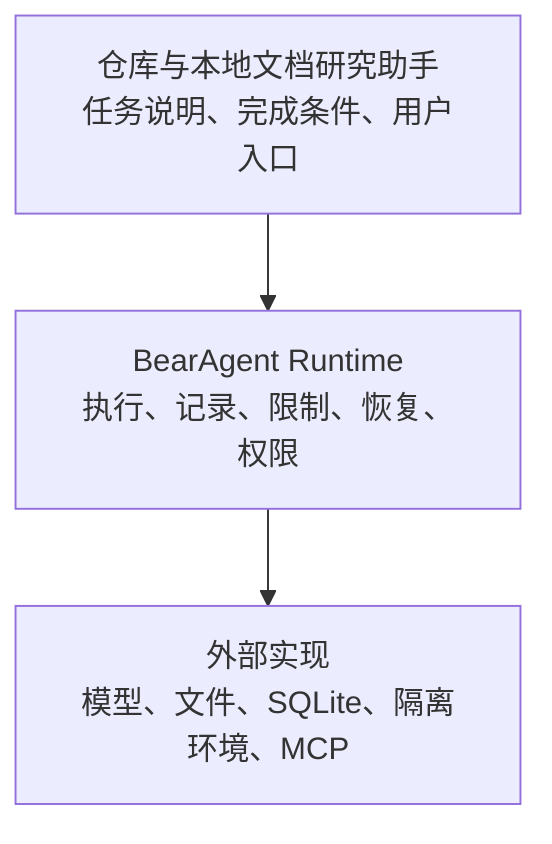
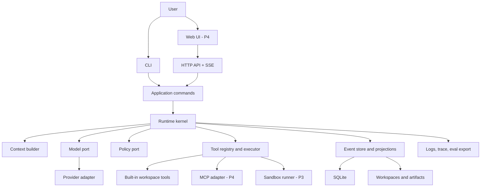
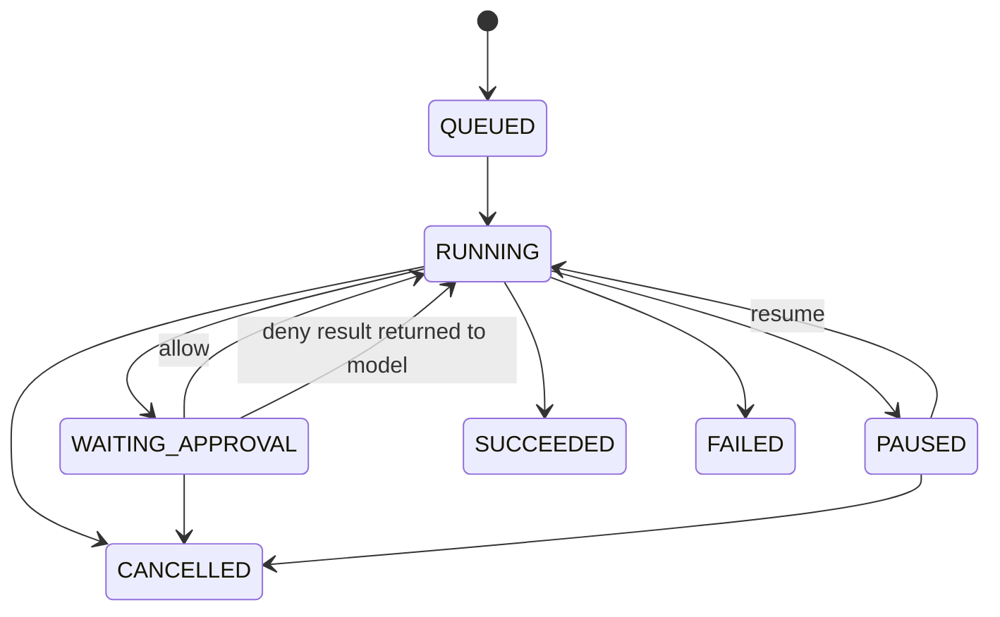
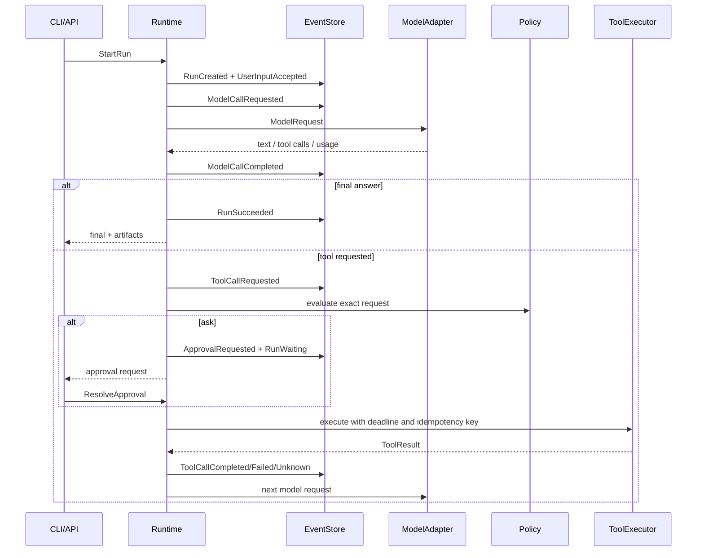

# BearAgent 总体架构

## 1. 架构结论

BearAgent 的第一目标不是覆盖最多 Agent 功能，而是完成一个个人可以理解、运行和验证的最小运行时：

> 让一个 Agent 在限定的本地工作区完成长任务；每一步有记录，失败后不乱重试，危险操作必须获得授权。

架构围绕四件事展开：

1. **过程可查**：每次模型和工具操作、预算、错误和产物都能关联起来。
2. **恢复有依据**：中断后只从可确认的位置继续；无法确认的外部操作明确停住。
3. **权限在模型之外**：模型只能提出请求，运行时决定是否允许、询问用户或拒绝。
4. **数据由用户掌握**：第一版使用单用户、单进程、SQLite 和命令行，复杂度只在真实需求出现后增加。

评测从 P1 就开始：P1 检查任务和执行记录，P2 检查中断恢复，P3 检查权限与隔离。P5 再把这些证据接入统一的追踪和跨版本比较系统。最小上下文组装属于 P1；复杂压缩、Skill、MCP 与 Memory 放到 P4。P1-P3 完成后，BearAgent 才达到“小而完整”的可信 Runtime 完成线。详细目标用户和竞争边界见[产品定位](../project/product-positioning.md)。

### 1.1 产品层与 Runtime 层



参考应用回答“交付什么任务”，Runtime 回答“这些任务怎样被执行、约束和恢复”。P1-P3 的验收必须同时覆盖两层，不能把 Runtime 组件测试当作完整产品证据。

### 1.2 P1-P3 的递进关系

| 阶段 | 先证明什么 | 暂不声称什么 |
|---|---|---|
| P1 | 一次真实本地文件 Run 可以有界完成，事实与失败可检查 | 崩溃后自动续跑、安全自托管 |
| P2 | 已持久化事实能在安全边界恢复，未知副作用得到诚实处理 | 模型已经获得任意工具权限或公网安全性 |
| P3 | 权限、审批、隔离 runner 与自托管运维形成闭环 | Web 产品体验、MCP/Memory 生态或多用户能力 |

## 2. 调研如何影响架构

外部项目用于发现问题，不用于复制功能：

| 项目类型 | 代表项目 | BearAgent 吸收什么 | 暂时不做什么 |
|---|---|---|---|
| 完整 Agent 产品 | Proma、Manus、Claude Code | 工作区体验、权限提示、隔离环境和失败证据 | 桌面全栈、浏览器和大量渠道 |
| 垂直 Agent | DeepTutor | Tool 与固定流程分开，结果保留来源 | 教学业务、多个检索引擎和多用户 |
| 编码 Agent | CodeWhale、Claw Code | 授权顺序、机器可读输出和行为对照 | 多模型并行控制面和产品兼容复刻 |
| Runtime / 框架 | LangGraph、Pydantic AI | 持久状态、类型化边界、追踪和代码化评测 | 把第三方框架直接变成 BearAgent 内核 |
| 基础设施工具 | Inspect、E2B、MCP | Agent 评测、隔离执行和标准化工具连接 | 在执行与权限语义稳定前提前集成 |

这些项目证明了不同 Agent 的差异主要发生在任务范围、上下文、工具环境、权限、持久化行为和产品入口，而不只是模型循环。BearAgent 要更早明确运行时事实、恢复规则和权限边界；详细比较与来源见[产品定位](../project/product-positioning.md)和本文末尾参考资料。

## 3. 范围

### 3.1 P1-P3 必须具备

- 一个内部统一的模型接口，第一版只有一个真正可用的 Provider adapter。
- 一个明确有界的 Agent Loop 与最小 ContextBuilder，限制上下文、迭代数、token、费用、时间和工具次数。
- 类型化 Tool schema、结构化 ToolResult、timeout、输出大小限制和取消传播。
- 工作区内的 `list/read/search/write` 基础文件工具。
- `allow / ask / deny` 策略和一次性审批。
- SQLite 事件日志、Run projection、Activity 状态、Artifact 元数据和 Checkpoint。
- 在安全边界恢复；可检查、暂停、恢复、取消和重试 Run。
- CLI；P3 增加最小 HTTP API 与 SSE。
- 对 shell/code execution 使用独立 runner，不在 API/runtime 进程直接执行模型生成命令。
- 结构化日志、黄金 trace 和故障注入测试。

### 3.2 明确后置

- Multi-Agent、planner/researcher/reviewer 角色聊天室。
- GraphRAG、多向量数据库、多检索引擎。
- 浏览器自动化、电脑控制、语音、图片和视频。
- Telegram、微信、飞书、Slack 等渠道。
- 多用户、组织 RBAC、计费和插件市场。
- Kubernetes、Kafka、Redis、Celery、PostgreSQL、Temporal。
- Electron 或原生桌面应用。

后置不等于架构不支持，而是只有指标证明单进程/SQLite/单 Agent 无法满足需求时才引入复杂度。

## 4. 设计原则

1. **核心保持独立**：内核只认识 BearAgent 自己的数据和接口，不认识 FastAPI、MCP、Docker 或模型 SDK。
2. **事件记录事实**：Event 只追加；状态表、Checkpoint 和索引都可以从事实重建。
3. **外部操作必须显式**：任何会改变文件或外部系统的操作都经过统一执行入口。
4. **文字不是权限**：Prompt、模型输出、Tool 输出和 Skill 都不能授予权限。
5. **只从安全位置恢复**：不尝试保存 Python 调用栈，只从已持久化的模型或工具操作边界继续。
6. **不假装 exactly-once**：不能确认外部写入结果时进入 `UNKNOWN`，由查询、幂等重试或人工处理。
7. **先做好单用户**：单用户单进程正确运行后，再讨论分布式 worker 和租户隔离。
8. **优先可检查**：配置、Memory、事件、审批和 Artifact 尽量可读、可导出、可追溯。
9. **外部实现可替换**：模型、MCP、存储和隔离环境可以替换，内部消息与事件不跟随 SDK 变化。
10. **文档也是版本化证据**：被接受的行为、设计和验证必须进入仓库，不依赖聊天记忆。

## 5. 系统分层



### 5.1 依赖方向

```text
interfaces -> application -> domain/runtime ports
adapters   --------------------^
```

外层 adapter 依赖内层 port；内层不得反向 import 外层。推荐用构造注入完成组装，不在领域模块使用全局 registry 或 service locator。

### 5.2 建议目录

```text
bear-agent/
├── README.md
├── AGENTS.md
├── pyproject.toml
├── migrations/
├── docs/
│   ├── architecture/
│   ├── specs/
│   ├── plans/
│   ├── adr/
│   ├── development/
│   ├── deployment/
│   └── templates/
├── site/                    # Starlight public learning documentation
├── src/bearagent/
│   ├── domain/             # messages, events, states, errors, ids
│   ├── runtime/            # reducer, engine, budgets, recovery
│   ├── application/        # commands and use cases
│   ├── ports/              # model, store, policy, tools, sandbox
│   ├── adapters/
│   │   ├── model/
│   │   ├── sqlite/
│   │   ├── tools/
│   │   └── sandbox/
│   ├── interfaces/
│   │   ├── cli/
│   │   └── api/
│   └── bootstrap.py        # composition root only
├── tests/
│   ├── unit/
│   ├── contract/
│   ├── integration/
│   ├── recovery/
│   ├── security/
│   └── evals/
└── deploy/
```

## 6. 统一术语

| 术语 | 精确定义 | 不要混用 |
|---|---|---|
| Agent | 使用模型、工具和策略完成目标的配置，不是一次执行 | Run |
| Session | 用户连续对话的容器；可以包含多个 Run | Thread、Conversation |
| Run | 对一条用户请求的一次可持久化执行 | Task、Job、Turn |
| Activity | 一个需要跟踪生命周期的模型调用或工具调用 | Step（含义太宽） |
| Attempt | 同一个 Activity 的一次执行尝试；重试会创建新的 Attempt | Activity |
| Event | 已经发生、不可变、带顺序的事实 | 日志文本、Command |
| Command | 希望系统执行的动作，可以被拒绝 | Event |
| Checkpoint | 某个 event sequence 上的派生状态快照，可重建 | Event log |
| Artifact | Run 生成并由用户取回的文件或结构化产物 | Tool stdout |
| Receipt | 外部系统返回的、可用于核对操作结果的证据 | ToolResult 的任意文本 |
| Reconcile | 根据目标状态、幂等键或 Receipt 核对操作究竟发生了什么 | Retry |
| UNKNOWN | 外部操作可能已经发生，但 Runtime 暂时无法确认结果 | FAILED |
| Tool | 具有输入 schema 和执行语义的动作接口 | Skill |
| Skill | 可按需加载的指令、知识和工作流程提示 | Tool、Grant |
| Grant | 对主体、动作、资源和约束的授权 | DeepTutor 的 Capability |
| Workflow | 可选的确定性多阶段编排 | Agent Loop |

第一版避免使用 `Capability` 作为领域名，因为它在不同项目中既表示“业务流水线”又表示“安全权限”，容易制造长期歧义。

## 7. Run 与 Activity 状态机

Run 生命周期只表达用户可见的执行状态；模型调用和工具调用放在 Activity 中，避免把 `MODEL_CALL`、`TOOL_RUNNING` 塞进顶层状态造成组合爆炸。



Activity 状态：

```text
PENDING -> RUNNING -> SUCCEEDED
                   -> FAILED
                   -> CANCELLED
                   -> UNKNOWN
```

`UNKNOWN` 表示 runtime 在外部副作用提交后、结果持久化前失联，不能证明动作是否发生。它不能自动伪装成 FAILED。

### 7.1 F-0002 已实现的 P1 子集

F-0002 当前只实现 Run 的 `QUEUED / RUNNING / SUCCEEDED / FAILED` 与 Activity 的
`PENDING / RUNNING / SUCCEEDED / FAILED`。上图中的 pause、cancel、approval 和 `UNKNOWN` 仍是
P2/P3 目标，不能由 P1 reducer 生成。P1 同时最多一个 active Activity。

状态由严格纯 reducer 从连续、同 Run、白名单 type/version 的 Event 推导。预算 limit 在
`RunCreated` 成为受信事实；model iteration 与 Tool call 在 request Event 记账，实际 token/费用
在模型 completion/failure Event 记账。Budget gate 只阻止新的 Activity request，不丢弃已经开始的
Activity completion/failure，也不把一次实际 token/费用超额伪装成没有发生。

相同 Event sequence 得到值相等的 `RunState`，但 P1 没有 startup scan、Checkpoint 或自动续跑；
这些仍属于 P2 safe recovery。

### 7.2 F-0003 已实现的持久事实子集

F-0003 使用标准库 `sqlite3` 实现 EventStore adapter。每次 append 在 `BEGIN IMMEDIATE`
transaction 内核对已持久 Event/projection sequence，运行同一个 F-0002 reducer，插入完整 Event
envelope，并更新 normalized Run/Activity projection；任一步失败全部回滚。

当前 schema v1 只包含 `events`、`run_projections`、`activity_projections` 和带 SHA-256 校验的
`schema_migrations`。SQLite 使用 WAL、foreign keys、`synchronous=FULL` 和有限 busy timeout；
同一 sequence 的竞争 writer 最多一个提交。Event payload 和 query 有上限，读取到非法 JSON、
不连续 sequence 或 projection 分叉时 fail closed。

这意味着正常关闭并重开数据库后，已提交事实和真实非终态状态仍可查询；不意味着 Runtime 会扫描
或继续非终态 Run。Checkpoint、startup recovery、retry、cancel 和 `UNKNOWN` 仍属于 P2。

## 8. 一次 Run 的标准流程



每次关键状态转换与对应 Event 必须在同一个 SQLite transaction 内提交。SSE token 可以实时发出，但不逐 token 写 WAL；只有完成后的模型响应、usage 和 tool call 被持久化。崩溃时允许丢失尚未完成的 token stream，然后从上一个安全边界重新请求模型。

## 9. Event 与 Command 的数据格式和规则

### 9.1 核心 Command

```text
CreateSession
StartRun
ProvideUserInput
ResolveApproval
PauseRun
ResumeRun
CancelRun
RetryActivity
```

### 9.2 核心 Event

```text
SessionCreated
RunCreated
RunStarted
UserInputAccepted

ModelCallRequested
ModelCallStarted
ModelCallCompleted
ModelCallFailed

ToolCallRequested
PolicyEvaluated
ApprovalRequested
ApprovalResolved
ToolCallStarted
ToolCallCompleted
ToolCallFailed
ToolCallUncertain

CheckpointCreated
RunPaused
RunResumed
RunSucceeded
RunFailed
RunCancelled
```

所有 Event envelope 至少包含：

```text
event_id
run_id
sequence
event_type
schema_version
occurred_at
causation_id
correlation_id
payload
```

Payload 使用内部 Pydantic schema；Event 只追加不原地修改。Schema 变化采用版本号和显式 upcaster/migration，不能默默改变旧 JSON 的含义。

## 10. Durable execution 的真实语义

### 10.1 P2 承诺

- Run 状态、输入、完整模型响应、Tool 请求/结果、审批和 Artifact 元数据不会因正常重启丢失。
- Runtime 启动时扫描非终态 Run，并从最近 Checkpoint + 后续 Event 重建状态。
- 只在安全边界恢复，不尝试序列化协程或调用栈。
- 已确认成功且有相同幂等键的 Tool Activity 不重复执行。
- 取消是协作式的：先记录意图，再向正在执行的 adapter/runner 传播取消；最终状态以持久事件为准。

### 10.2 不承诺

- 不承诺任意外部 API 的 exactly-once。
- 不承诺在模型 token stream 中间恢复到相同 token。
- 不承诺没有幂等接口的外部写操作可以无人工判断自动恢复。
- 不把 Checkpoint 当事实来源；Checkpoint 损坏时必须能从 Event 重建。

### 10.3 副作用恢复矩阵

| 工具类型 | 崩溃后默认动作 |
|---|---|
| 纯读、无副作用 | 自动重试，受次数与 deadline 限制 |
| 工作区原子写 | 查询临时文件/内容 hash；未提交则重试，已提交则补记结果 |
| 支持幂等键的远程写 | 用同一幂等键重试或查询状态 |
| 不支持幂等的远程写 | 标记 `UNKNOWN`，请求人工确认 |
| 删除、付款、发布等高风险动作 | 默认 `ask`，并要求执行前审批与执行后 receipt |

## 11. Model Port

内部接口只暴露 BearAgent 类型：

```python
class ModelProvider(Protocol):
    async def stream(self, request: ModelRequest) -> AsyncIterator[ModelEvent]: ...
```

F-0004 已实现的 `ModelRequest` 包含 model、messages、Tool input schema、最大输出 token、有限 timeout
与 prompt version；成功 stream 只产生 BearAgent 的 text delta、完整 Tool call 与唯一 completion。
completion 保存实际模型、finish reason、可选 usage 和 Provider request ID。错误以安全
`ModelProviderError` 终止 stream，不作为成功 Event 混入。

规则：

- Provider SDK 对象在 adapter 内完成翻译，不能进入 runtime/domain。
- F-0004 的首个 production adapter 使用官方 OpenAI Python SDK 与 Responses HTTP/SSE streaming；
  不使用 hosted Tool、Provider conversation、background mode 或 websocket。
- Adapter 禁用 SDK 自动 retry，只分类 transient/permanent failure；F-0016 的 Runtime 才能基于预算、
  Activity attempt 与 Event 决定有界 retry。
- F-0004 暴露 usage、finish reason、Provider request ID 和模型标识；F-0016 才负责把它们持久化，
  密钥始终不得进入 request/Event/error。
- Provider 输出不可信；函数名和 JSON object arguments 必须验证，Tool schema 不等于 Grant。
- Prompt/tool schema 必须做版本标记，保证 trace/eval 可比较。

F-0004 不包含 ContextBuilder、Agent Loop、Activity/Event 调度或 CLI Run；它们属于 F-0016/F-0005。
第二个模型服务适配器仍是后续用共用接口测试验证内部接口是否通用的入口，不在 P1 建兼容矩阵。

## 12. Tool、Policy 与 Sandbox

### 12.1 ToolSpec

每个 Tool 至少声明：

```text
name and version
description
input_schema
output_schema
side_effect: none | workspace_write | external_write | destructive
required_grants
default_timeout
max_output_bytes
retry_semantics: safe | idempotent | never
```

`ToolResult` 是结构化对象：status、content、stdout、stderr、artifacts、receipt、latency、error code、retryable、truncated。不能只返回一个任意字符串。

### 12.2 Policy

```text
ToolRequest
  -> canonicalize resource and arguments
  -> match Grant
  -> ALLOW / ASK / DENY
  -> exact-argument approval token
  -> ToolExecutor
```

Grant 表达：

```text
principal + action + resource + constraints
```

例如：

```yaml
principal: agent:default
action: filesystem.write
resource: workspace:/outputs/**
constraints:
  max_bytes: 10485760
  mode: ask
```

审批必须绑定 `run_id + tool_call_id + canonical_args_hash + expiry`。用户批准 `write_file(a.txt)` 不能被复用成批准 `delete_file(*)`。

### 12.3 Workspace tools

P1 只实现：

- `list_directory`
- `read_file`
- `search_files`
- `write_file`（P1 仅允许 `outputs/**`，原子临时文件 + rename）

路径在执行前做 canonicalization，拒绝绝对路径、`..` 逃逸和 symlink 跳出 workspace。P1 将 workspace 中已有源码和输入视为只读，只允许创建或替换 `outputs/**` 下的文件。读取/输出均设字节上限。删除、任意 HTTP 和 shell 不进入 P1。

### 12.4 Sandbox

P3 的 shell/code execution 走 `SandboxBackend`：

```text
Runtime API
  -> authenticated runner request
  -> rootless unprivileged container
  -> read-only root filesystem
  -> scoped workspace mount
  -> CPU/memory/PID/time/output limits
  -> network deny by default
  -> no host Docker socket
  -> no model/provider secrets
```

本地开发期如果没有 runner，shell 工具应不可用，而不是回退到 host subprocess。

## 13. Context、Skill、Memory 与 MCP

### 13.1 ContextBuilder

Prompt 输入按稳定层级组装：

1. runtime 安全与行为规则；
2. Agent 配置和已选择 Skill；
3. 当前 Run 目标、预算和 todo；
4. 最近对话与尚未解决的失败；
5. 相关 Artifact/Memory 的引用和必要摘录；
6. 当前可用 Tool schema。

每层有 token budget。压缩必须尽量可恢复：大文件内容可以替换为路径、hash、来源 Event 和短摘要，但不能只留下无法回溯的自由文本。失败和错误观察默认保留到问题解决，避免 Agent 重复同一错误。

P1 的 ContextBuilder 保持确定性：相同的已保存输入、Agent 版本和预算应得到相同的上下文计划。截断了什么、为什么截断以及改成了哪个 Artifact 引用都要可查看。P1 不使用模型自动总结历史；复杂压缩属于 P4。

### 13.2 Skill

P4 的 Skill 是版本化指令包，不是权限：

```text
skills/<name>/
├── SKILL.md
├── manifest.yaml
├── references/
└── scripts/        # 默认不可执行，仍需 Tool + Grant
```

Skill 声明所需 Tool/Grant，但不能自行授予。第三方 Skill 按不可信供应链输入处理。

P4 先用一个只读 Skill 验证“说明可以复用但不能扩大权限”，通过后再接入 MCP。Skill 和 MCP 不能用二选一的验收代替彼此。

### 13.3 Memory

P4 从可审计文件/SQLite 记录开始：

```text
raw evidence: immutable run events and artifact references
episodic: per-session/per-topic summaries with source event ids
profile: stable preferences/facts with confidence and provenance
```

先使用 SQLite FTS5 和显式标签检索；只有实际数据证明词法检索不足时才引入 embedding/vector store。Memory 写入要去重、可撤销、可过期，用户可以查看和删除。

### 13.4 MCP

MCP 只是 `ToolProvider` adapter：

```text
ToolRegistry
├── BuiltinToolProvider
└── MCPToolProvider
```

MCP server 和每个 MCP tool 都需要独立启用、schema 校验、timeout、输出上限和 Grant。MCP 的传输层授权不能代替 BearAgent 对具体工具请求的 Policy 检查。接入 MCP 不改变核心 ToolRequest/ToolResult/Policy/Event 契约。

## 14. SQLite 与文件布局

### 14.1 最小数据库

F-0003 当前实际 schema：

```text
events                  append-only source of truth
run_projections         current Run state and budget projection
activity_projections    ordered model/tool Activity projection
schema_migrations       version/name/checksum ledger
```

后续阶段目标表（尚未实现）：

```text
sessions       conversation metadata
approvals      pending/resolved approval projection
checkpoints    state snapshot at event sequence
artifacts      file metadata, hash, mime, producing activity
```

重要约束：

- `events(event_id)` 唯一；`events(run_id, sequence)` 唯一。
- P1 通过 SQLite `BEGIN IMMEDIATE` 串行化短写 transaction；不实现多进程 owner/lease。
- Event append 与 projection 更新在一个 transaction 中。
- SQLite 使用 WAL、foreign keys、`synchronous=FULL` 和有限 busy timeout；先单进程写入。
- JSON payload 有 schema version；迁移文件进入 Git。
- migration ledger 校验 version/name/SHA-256；进入 main 的 migration 不原地修改。
- Artifact 大内容放文件系统，SQLite 只存路径、hash 和元数据。

### 14.2 数据目录

```text
data/
├── bearagent.db
├── workspaces/default/
├── artifacts/<run_id>/
├── memory/
└── backups/
```

不把 API key 写入数据库事件、workspace 或 Artifact。开发期使用环境变量/本机 secret store，服务器期使用只挂给 API 的 secret 文件；runner 不挂载。

## 15. 接口设计

### 15.1 CLI first

```text
bearagent run "整理 workspace 中的调研资料"
bearagent run inspect <run_id>
bearagent run events <run_id>
bearagent run pause <run_id>
bearagent run resume <run_id>
bearagent run cancel <run_id>
bearagent approval list
bearagent approval allow <approval_id>
bearagent doctor
```

CLI 同时支持人类可读输出和 `--json`，方便测试和未来被其他 Agent 调用。

### 15.2 HTTP/SSE

P3 才增加：

```text
POST /api/runs
GET  /api/runs/{id}
GET  /api/runs/{id}/events
GET  /api/runs/{id}/stream
POST /api/runs/{id}/cancel
POST /api/approvals/{id}/resolve
GET  /api/artifacts/{id}
```

Web UI 与 API 使用同一 origin（`agent.bearguin.cn` 下的 `/api`），避免第一版承担跨域认证复杂度。

## 16. Observability、Replay 与 Eval

三个概念必须分开：

```text
Event log   = durable domain facts and recovery source
Trace       = latency, nesting, provider/tool diagnostics
Checkpoint  = recovery optimization
```

P1 先提供 JSON 结构化日志、事件检查命令和固定任务评测；P2 增加中断恢复断言，P3 增加权限与隔离断言。P5 再接 OpenTelemetry 和外部评测框架，形成跨版本比较。建议 span：

```text
AgentRun
├── ModelCall
├── PolicyEvaluation
├── ToolCall
│   └── SandboxExecution
└── Checkpoint
```

核心指标：成功率、运行时间、模型 tokens/cost、工具失败率、审批等待时间、恢复次数、恢复延迟、`UNKNOWN` 活动数、checkpoint 开销。

Eval 不只评答案，还评执行：

- 任务是否完成；
- 是否调用了允许的最小工具集；
- 是否越权或绕过审批；
- 崩溃后是否重复副作用；
- 成本、延迟、重试和上下文增长；
- Prompt/Skill/模型版本变化是否造成 trace 回归。

## 17. 安全模型

### 17.1 不可信输入

- 用户附件和 workspace 文件；
- 网页、MCP、模型和 Tool 输出；
- 第三方 Skill；
- 模型生成的命令、路径、URL 和代码。

### 17.2 必测威胁

- 路径遍历、symlink escape、TOCTOU；
- prompt injection 要求提升权限；
- 审批后参数替换；
- SSRF 和内网/metadata endpoint 访问；
- 命令注入和 shell escape；
- Tool 输出过大、无限流、压缩炸弹；
- secrets 出现在 prompt、日志、事件或 Artifact；
- runner 访问宿主 Docker socket、主数据目录或 provider key；
- 重启后重复删除、发布、付款或远程写入。

### 17.3 发布门槛

P1/P2 只能在本机或 SSH tunnel 下使用。公开可访问前必须有：认证、CSRF/会话保护、rate limit、Policy/Approval、runner 隔离、备份恢复演练、日志脱敏和依赖扫描。

## 18. 技术栈决策

| 层 | P1-P3 选择 | 原因 |
|---|---|---|
| Language | Python 3.12（仓库固定一个版本） | Agent/模型生态成熟，个人开发效率高，版本稳定 |
| Package | uv | 环境、锁文件、脚本统一 |
| Schema | Pydantic | 边界校验和 JSON schema |
| Async | asyncio/AnyIO | 流式模型与工具调用 |
| CLI | Typer | 快速形成可用入口 |
| API | FastAPI + SSE | P3 才引入；对单向 event stream 足够 |
| Storage | SQLite WAL + stdlib `sqlite3` + SQL migrations | 无新生产依赖、事务显式、适合单用户 |
| HTTP | httpx | async、timeout、streaming |
| Tests | pytest | 单元、共用接口、集成和故障注入测试 |
| Quality | Ruff + Pyright | 快速、可自动化 |
| Docs | Markdown/MDX + Starlight | 学习型导航、静态搜索和 Mermaid；P1 只本地构建 |
| Deployment | Docker Compose + 1Panel reverse proxy | 与自有服务器匹配，运维成本低 |

第一版不采用 LangChain/LangGraph 作为内核，是为了保持事件、权限和恢复语义可控；不采用 Temporal，是因为单用户/单进程阶段引入独立 workflow service 的成本高于收益。未来若出现多 worker、跨天 workflow、大量 timer 和复杂补偿事务，再用 ADR 评估 Temporal，而不是提前假设需要。

## 19. 质量属性与验收基线

| 属性 | P3 基线 |
|---|---|
| 可恢复性 | 在模型完成、工具完成、等待审批三个边界杀进程后可恢复 |
| 数据一致性 | Event 与 projection 事务一致；Checkpoint 可删除重建 |
| 安全 | workspace 不可逃逸；host runtime 不执行 shell；高风险动作必须 ask/deny |
| 可维护 | core 无外部框架类型泄漏；模块依赖测试通过 |
| 可观察 | 每个 Run/Activity 有关联 ID，可查看 usage、错误、审批和 Artifact |
| 成本控制 | 每个 Run 支持 token、金额、时间、迭代和工具次数预算 |
| 可测试 | Model、clock、id generator、store、policy、tool 都可替换为 fake |

## 20. 已接受的架构决定

- [ADR-0001](../adr/ADR-0001-python-single-process-first.md)：Python 与单进程优先；
- [ADR-0002](../adr/ADR-0002-event-log-safe-boundary-recovery.md)：Event log 与安全边界恢复；
- [ADR-0003](../adr/ADR-0003-sqlite-initial-durable-store.md)：SQLite 作为首个 durable store；
- [ADR-0004](../adr/ADR-0004-policy-outside-model.md)：Policy 位于模型之外；
- [ADR-0005](../adr/ADR-0005-no-host-shell-execution.md)：host runtime 不执行模型生成 shell；
- [ADR-0006](../adr/ADR-0006-p0-tooling-and-dependencies.md)：P0 工具与依赖基线；
- [ADR-0007](../adr/ADR-0007-provider-neutral-domain-schemas.md)：不依赖特定模型服务商的内部数据格式；
- [ADR-0008](../adr/ADR-0008-starlight-public-docs.md)：公共文档站使用 Starlight。
- [ADR-0009](../adr/ADR-0009-event-driven-run-state-and-budget-accounting.md)：Event 驱动的 Run 状态与预算记账。
- [ADR-0010](../adr/ADR-0010-openai-responses-first-model-adapter.md)：首个 production Model adapter 使用 OpenAI Responses API。

ADR 的 `accepted` 只表示决策已生效，不表示 Roadmap 中的恢复、Policy、runner 或 API 已经实现。

## 21. 对应 Feature 开始前仍需决定

- F-0008 前：Artifact 最大保留时间和自动清理策略；
- F-0012/F-0014 前：目标服务器架构、资源条件以及 Docker/Podman runner 选择；
- P4 Web UI 前：独立前端还是最小服务端页面；
- 公开发布代码前：Apache-2.0 或 AGPL-3.0 许可证。

开放问题不授权提前实现；影响跨模块边界、持久 schema、安全或生产依赖时，必须在对应 Feature 开始前落 ADR。

## 参考资料

- [DeepTutor Agent-Native Architecture](https://github.com/HKUDS/DeepTutor/blob/main/AGENTS.md)
- [DeepTutor README: Agent Loop, Memory, multi-user isolation](https://github.com/HKUDS/DeepTutor/blob/main/README.md)
- [Proma README: Pi runtime, workspaces, Skills, MCP and persistence](https://github.com/proma-ai/Proma/blob/main/README.md)
- [Manus: Context Engineering for AI Agents](https://manus.im/blog/Context-Engineering-for-AI-Agents-Lessons-from-Building-Manus)
- [Manus Sandbox](https://manus.im/blog/manus-sandbox)
- [CodeWhale authorization order](https://github.com/Hmbown/CodeWhale/blob/main/docs/AUTHORIZATION_ORDER.md)
- [CodeWhale persistence RFC](https://github.com/Hmbown/CodeWhale/blob/main/docs/rfcs/2189-persistence-sqlite.md)
- [Cloud-code 2.1.88 extracted study repository](https://github.com/Janlaywss/cloud-code)
- [Claude Code 2.1.88 source-map snapshot](https://github.com/Rito-w/claude-code)
- [Claw Code philosophy and scope](https://github.com/ultraworkers/claw-code/blob/main/PHILOSOPHY.md)
- [LangGraph overview and durable execution](https://docs.langchain.com/oss/python/langgraph/overview)
- [Pydantic Evals](https://pydantic.dev/docs/ai/evals/evals/)
- [Inspect agent evaluations](https://inspect.aisi.org.uk/)
- [E2B sandbox documentation](https://www.e2b.dev/docs)
- [MCP authorization specification](https://modelcontextprotocol.io/specification/2025-06-18/basic/authorization)
- [OpenAI Docs: Custom instructions with AGENTS.md](https://learn.chatgpt.com/docs/agent-configuration/agents-md)
