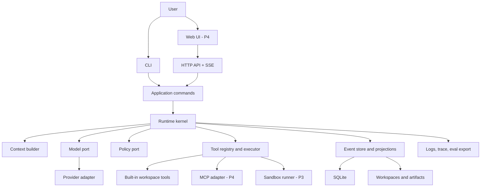
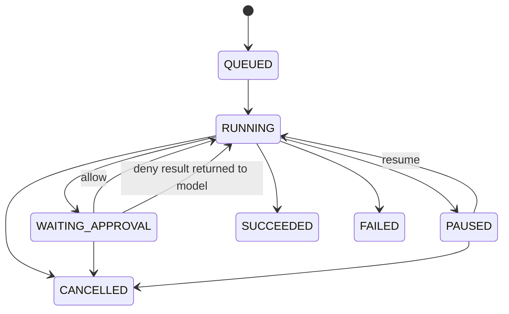
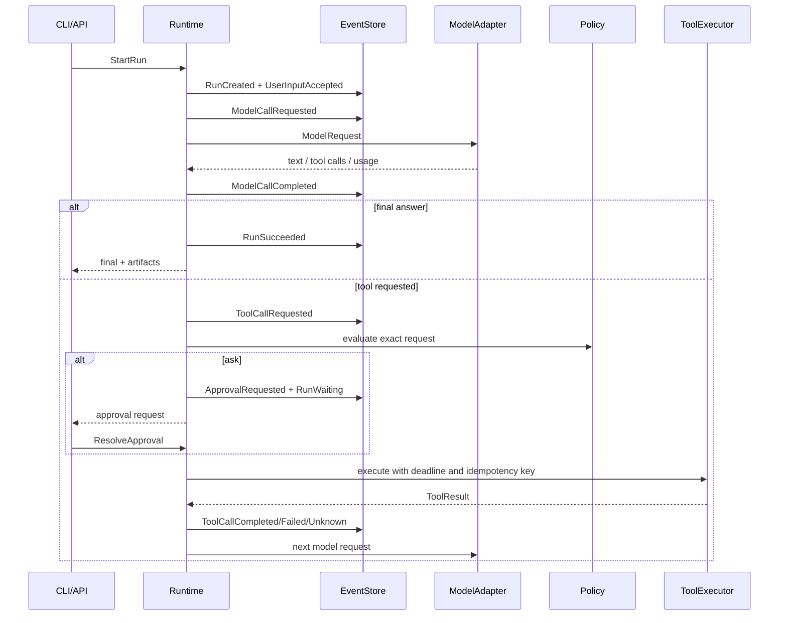

# BearAgent 总体架构

## 1. 架构结论

BearAgent 的第一目标不是覆盖最多 Agent 功能，而是完成一个可靠的最小运行时：

> 一个单用户、单 Agent、local-first、可自托管的 durable tool-using runtime；所有外部动作均受策略控制，执行事实可以持久化、检查和从安全边界恢复。

项目的核心差异化由四条主线构成：

1. **Durable execution**：Run、Activity、Event、Checkpoint、Resume、Cancel、Retry、Idempotency。
2. **Authority and isolation**：Grant、Policy、Approval、Workspace boundary、Sandbox runner、Secret isolation。
3. **Trace and replay**：持久事件、结构化日志、可重建 projection、可回放的评测输入。
4. **Context and memory**：可恢复的上下文压缩、文件外部记忆、带来源的长期记忆，而不是先堆向量数据库。

P1-P3 完成后，BearAgent 就是一个“小而完整”的项目；Web UI、Skills、MCP、Memory 是后续挂载在稳定内核上的产品能力。

## 2. 从参考项目借什么

| 参考 | 借鉴 | 不照搬 |
|---|---|---|
| DeepTutor | Tool 与多阶段 Capability 分层；统一 orchestrator 和 event stream；`ask_user` 的 pause/resume；文件型三层 Memory 及来源链；独立 sandbox/secret scope | 教学产品表面、多个 RAG 引擎、大量 capability、多用户、IM partner 和完整前端 |
| Proma | local-first workspace；Provider adapter；Skills/MCP 按工作区管理；会话 JSONL 思路；权限确认和后台运行体验 | Electron/Bun/React 桌面栈、远程机器人、多运行时兼容矩阵和产品级渠道管理 |
| Manus | 每任务隔离计算机；文件系统作为可恢复外部上下文；持续更新 todo 以维持目标注意；保留失败证据 | 第一版就提供完整 VM、浏览器和无限制 root 环境 |
| Codex | 仓库级 `AGENTS.md` 作为稳定工作约定；本地/隔离工作区；实现后验证和代码审查 | 把聊天上下文当长期项目记忆 |

DeepTutor 当前将单次 Tool 和接管整个 turn 的多阶段 Capability 分开，并让入口通过统一 orchestrator 路由；它的 Memory 使用 L1 事件、L2 surface facts、L3 cross-surface synthesis，并保留来源链。Proma 把 Provider、workspace、Skills、MCP、会话持久化和权限体验放在 local-first 桌面产品里。Manus 则明确把文件系统当可恢复的外部上下文，并把每个任务放在隔离 sandbox 中。

这些项目证明了方向，但 BearAgent 要更早把运行时事实、恢复语义和权限边界做成显式契约。

## 3. 范围

### 3.1 P1-P3 必须具备

- 一个内部统一的模型接口，第一版只有一个真正可用的 Provider adapter。
- 一个明确有界的 Agent Loop，限制迭代数、token、费用、时间和工具次数。
- 类型化 Tool schema、结构化 ToolResult、timeout、输出大小限制和取消传播。
- 工作区内的 `list/read/search/write` 基础文件工具。
- `allow / ask / deny` 策略和一次性审批。
- SQLite 事件日志、Run projection、Activity 状态、Artifact 元数据和 Checkpoint。
- 在安全边界恢复；可检查、暂停、恢复、取消和重试 Run。
- CLI；P3 增加最小 HTTP API 与 SSE。
- 对 shell/code execution 使用独立 runner，不在 API/runtime 进程直接执行模型生成命令。
- 结构化日志、黄金 trace 和故障注入测试。

### 3.2 明确后置

- Multi-Agent、planner/researcher/reviewer 角色聊天室。
- GraphRAG、多向量数据库、多检索引擎。
- 浏览器自动化、电脑控制、语音、图片和视频。
- Telegram、微信、飞书、Slack 等渠道。
- 多用户、组织 RBAC、计费和插件市场。
- Kubernetes、Kafka、Redis、Celery、PostgreSQL、Temporal。
- Electron 或原生桌面应用。

后置不等于架构不支持，而是只有指标证明单进程/SQLite/单 Agent 无法满足需求时才引入复杂度。

## 4. 设计原则

1. **Core owns policy-neutral state transitions**：内核只认识领域对象和端口，不认识 FastAPI、MCP、Docker 或模型 SDK。
2. **Events are facts**：Event 是不可变事实；Run/Activity 表、Checkpoint、搜索索引都是 projection 或优化。
3. **Side effects are explicit**：任何外部副作用都必须变成 Activity，经 Policy 和 ToolExecutor 执行。
4. **Authority is not language**：Prompt、模型输出和 Tool 输出都不能授予权限；权限只来自运行时 Grant。
5. **Resume at safe boundaries**：不恢复任意 Python 调用栈，只在已持久化的模型/工具 Activity 边界恢复。
6. **No fake exactly-once**：不能确认外部写入结果时进入 `UNKNOWN`，由查询、幂等重试或人工决定。
7. **Single-user first**：先把单用户单进程做正确，再讨论分布式 worker 和租户隔离。
8. **Inspectable over magical**：配置、Memory、事件、审批和 Artifact 尽量可读、可导出、可追溯。
9. **Replaceable adapters, stable domain**：Provider/MCP/存储/runner 可以替换，内部 Message/Event/ToolResult 不随 SDK 漂移。
10. **Documentation is versioned code**：被接受的行为、设计和验证证据必须在仓库中，不依赖聊天记忆。

## 5. 系统分层



### 5.1 依赖方向

```text
interfaces -> application -> domain/runtime ports
adapters   --------------------^
```

外层 adapter 依赖内层 port；内层不得反向 import 外层。推荐用构造注入完成组装，不在领域模块使用全局 registry 或 service locator。

### 5.2 建议目录

```text
bear-agent/
├── README.md
├── AGENTS.md
├── pyproject.toml
├── migrations/
├── docs/
│   ├── architecture/
│   ├── specs/
│   ├── adr/
│   ├── development/
│   ├── deployment/
│   └── templates/
├── src/bearagent/
│   ├── domain/             # messages, events, states, errors, ids
│   ├── runtime/            # reducer, engine, budgets, recovery
│   ├── application/        # commands and use cases
│   ├── ports/              # model, store, policy, tools, sandbox
│   ├── adapters/
│   │   ├── model/
│   │   ├── sqlite/
│   │   ├── tools/
│   │   └── sandbox/
│   ├── interfaces/
│   │   ├── cli/
│   │   └── api/
│   └── bootstrap.py        # composition root only
├── tests/
│   ├── unit/
│   ├── contract/
│   ├── integration/
│   ├── recovery/
│   ├── security/
│   └── evals/
└── deploy/
```

## 6. 统一术语

| 术语 | 精确定义 | 不要混用 |
|---|---|---|
| Agent | 使用模型、工具和策略完成目标的配置，不是一次执行 | Run |
| Session | 用户连续对话的容器；可以包含多个 Run | Thread、Conversation |
| Run | 对一条用户请求的一次可持久化执行 | Task、Job、Turn |
| Activity | 一个需要跟踪生命周期的模型调用或工具调用 | Step（含义太宽） |
| Event | 已经发生、不可变、带顺序的事实 | 日志文本、Command |
| Command | 希望系统执行的动作，可以被拒绝 | Event |
| Checkpoint | 某个 event sequence 上的派生状态快照，可重建 | Event log |
| Artifact | Run 生成并由用户取回的文件或结构化产物 | Tool stdout |
| Tool | 具有输入 schema 和执行语义的动作接口 | Skill |
| Skill | 可按需加载的指令、知识和工作流程提示 | Tool、Grant |
| Grant | 对主体、动作、资源和约束的授权 | DeepTutor 的 Capability |
| Workflow | 可选的确定性多阶段编排 | Agent Loop |

第一版避免使用 `Capability` 作为领域名，因为它在不同项目中既表示“业务流水线”又表示“安全权限”，容易制造长期歧义。

## 7. Run 与 Activity 状态机

Run 生命周期只表达用户可见的执行状态；模型调用和工具调用放在 Activity 中，避免把 `MODEL_CALL`、`TOOL_RUNNING` 塞进顶层状态造成组合爆炸。



Activity 状态：

```text
PENDING -> RUNNING -> SUCCEEDED
                   -> FAILED
                   -> CANCELLED
                   -> UNKNOWN
```

`UNKNOWN` 表示 runtime 在外部副作用提交后、结果持久化前失联，不能证明动作是否发生。它不能自动伪装成 FAILED。

## 8. 一次 Run 的标准流程



每次关键状态转换与对应 Event 必须在同一个 SQLite transaction 内提交。SSE token 可以实时发出，但不逐 token 写 WAL；只有完成后的模型响应、usage 和 tool call 被持久化。崩溃时允许丢失尚未完成的 token stream，然后从上一个安全边界重新请求模型。

## 9. Event 与 Command 契约

### 9.1 核心 Command

```text
CreateSession
StartRun
ProvideUserInput
ResolveApproval
PauseRun
ResumeRun
CancelRun
RetryActivity
```

### 9.2 核心 Event

```text
SessionCreated
RunCreated
RunStarted
UserInputAccepted

ModelCallRequested
ModelCallCompleted
ModelCallFailed

ToolCallRequested
PolicyEvaluated
ApprovalRequested
ApprovalResolved
ToolCallStarted
ToolCallCompleted
ToolCallFailed
ToolCallUncertain

CheckpointCreated
RunPaused
RunResumed
RunSucceeded
RunFailed
RunCancelled
```

所有 Event envelope 至少包含：

```text
event_id
run_id
sequence
event_type
schema_version
occurred_at
causation_id
correlation_id
payload
```

Payload 使用内部 Pydantic schema；Event 只追加不原地修改。Schema 变化采用版本号和显式 upcaster/migration，不能默默改变旧 JSON 的含义。

## 10. Durable execution 的真实语义

### 10.1 P2 承诺

- Run 状态、输入、完整模型响应、Tool 请求/结果、审批和 Artifact 元数据不会因正常重启丢失。
- Runtime 启动时扫描非终态 Run，并从最近 Checkpoint + 后续 Event 重建状态。
- 只在安全边界恢复，不尝试序列化协程或调用栈。
- 已确认成功且有相同幂等键的 Tool Activity 不重复执行。
- 取消是协作式的：先记录意图，再向正在执行的 adapter/runner 传播取消；最终状态以持久事件为准。

### 10.2 不承诺

- 不承诺任意外部 API 的 exactly-once。
- 不承诺在模型 token stream 中间恢复到相同 token。
- 不承诺没有幂等接口的外部写操作可以无人工判断自动恢复。
- 不把 Checkpoint 当事实来源；Checkpoint 损坏时必须能从 Event 重建。

### 10.3 副作用恢复矩阵

| 工具类型 | 崩溃后默认动作 |
|---|---|
| 纯读、无副作用 | 自动重试，受次数与 deadline 限制 |
| 工作区原子写 | 查询临时文件/内容 hash；未提交则重试，已提交则补记结果 |
| 支持幂等键的远程写 | 用同一幂等键重试或查询状态 |
| 不支持幂等的远程写 | 标记 `UNKNOWN`，请求人工确认 |
| 删除、付款、发布等高风险动作 | 默认 `ask`，并要求执行前审批与执行后 receipt |

## 11. Model Port

内部接口只暴露 BearAgent 类型：

```python
class ModelProvider(Protocol):
    async def stream(self, request: ModelRequest) -> AsyncIterator[ModelEvent]: ...
```

`ModelRequest` 包含 messages、tool schemas、model config、deadline、trace context；`ModelEvent` 只允许内部定义的 text delta、tool-call delta/completed、usage、response completed 和 error。

规则：

- Provider SDK 对象在 adapter 内完成翻译，不能进入 runtime/domain。
- P1 只实现一个 Provider adapter；第二个 adapter 用 contract tests 验证抽象是否真实。
- Retry 只处理明确的临时错误；参数错误、权限错误、上下文超限不得盲重试。
- usage、finish reason、provider request id 和模型标识必须持久化，密钥不得持久化。
- Prompt/tool schema 必须做版本标记，保证 trace/eval 可比较。

第一版可选择一个覆盖主要目标模型的 OpenAI-compatible adapter；若首要模型使用 Responses 协议，则实现独立 adapter。不要为了“支持几十家模型”引入一个主导整个领域模型的聚合框架。

## 12. Tool、Policy 与 Sandbox

### 12.1 ToolSpec

每个 Tool 至少声明：

```text
name and version
description
input_schema
output_schema
side_effect: none | workspace_write | external_write | destructive
required_grants
default_timeout
max_output_bytes
retry_semantics: safe | idempotent | never
```

`ToolResult` 是结构化对象：status、content、stdout、stderr、artifacts、receipt、latency、error code、retryable、truncated。不能只返回一个任意字符串。

### 12.2 Policy

```text
ToolRequest
  -> canonicalize resource and arguments
  -> match Grant
  -> ALLOW / ASK / DENY
  -> exact-argument approval token
  -> ToolExecutor
```

Grant 表达：

```text
principal + action + resource + constraints
```

例如：

```yaml
principal: agent:default
action: filesystem.write
resource: workspace:/outputs/**
constraints:
  max_bytes: 10485760
  mode: ask
```

审批必须绑定 `run_id + tool_call_id + canonical_args_hash + expiry`。用户批准 `write_file(a.txt)` 不能被复用成批准 `delete_file(*)`。

### 12.3 Workspace tools

P1 只实现：

- `list_directory`
- `read_file`
- `search_files`
- `write_file`（原子临时文件 + rename）

路径在执行前做 canonicalization，拒绝绝对路径、`..` 逃逸和 symlink 跳出 workspace。读取/输出均设字节上限。删除、任意 HTTP 和 shell 不进入 P1。

### 12.4 Sandbox

P3 的 shell/code execution 走 `SandboxBackend`：

```text
Runtime API
  -> authenticated runner request
  -> rootless unprivileged container
  -> read-only root filesystem
  -> scoped workspace mount
  -> CPU/memory/PID/time/output limits
  -> network deny by default
  -> no host Docker socket
  -> no model/provider secrets
```

本地开发期如果没有 runner，shell 工具应不可用，而不是回退到 host subprocess。

## 13. Context、Skill、Memory 与 MCP

### 13.1 ContextBuilder

Prompt 输入按稳定层级组装：

1. runtime 安全与行为规则；
2. Agent 配置和已选择 Skill；
3. 当前 Run 目标、预算和 todo；
4. 最近对话与尚未解决的失败；
5. 相关 Artifact/Memory 的引用和必要摘录；
6. 当前可用 Tool schema。

每层有 token budget。压缩必须尽量可恢复：大文件内容可以替换为路径、hash、来源 Event 和短摘要，但不能只留下无法回溯的自由文本。失败和错误观察默认保留到问题解决，避免 Agent 重复同一错误。

### 13.2 Skill

P4 的 Skill 是版本化指令包，不是权限：

```text
skills/<name>/
├── SKILL.md
├── manifest.yaml
├── references/
└── scripts/        # 默认不可执行，仍需 Tool + Grant
```

Skill 声明所需 Tool/Grant，但不能自行授予。第三方 Skill 按不可信供应链输入处理。

### 13.3 Memory

P4 从可审计文件/SQLite 记录开始：

```text
raw evidence: immutable run events and artifact references
episodic: per-session/per-topic summaries with source event ids
profile: stable preferences/facts with confidence and provenance
```

先使用 SQLite FTS5 和显式标签检索；只有实际数据证明词法检索不足时才引入 embedding/vector store。Memory 写入要去重、可撤销、可过期，用户可以查看和删除。

### 13.4 MCP

MCP 只是 `ToolProvider` adapter：

```text
ToolRegistry
├── BuiltinToolProvider
└── MCPToolProvider
```

MCP server 和每个 MCP tool 都需要独立启用、schema 校验、timeout、输出上限和 Grant。接入 MCP 不改变核心 ToolRequest/ToolResult/Policy/Event 契约。

## 14. SQLite 与文件布局

### 14.1 最小数据库

```text
sessions       conversation metadata
runs           current run projection and version
events         append-only source of truth
activities     query projection for model/tool operations
approvals      pending/resolved approval projection
checkpoints    state snapshot at event sequence
artifacts      file metadata, hash, mime, producing activity
schema_migrations
```

重要约束：

- `events(event_id)` 唯一；`events(run_id, sequence)` 唯一。
- 每个 Run 同一时间只有一个 owner；P1 使用进程内 per-run lock，后续再增加 lease。
- Event append 与 projection 更新在一个 transaction 中。
- SQLite 使用 WAL 模式和 busy timeout；先单进程写入。
- JSON payload 有 schema version；迁移文件进入 Git。
- Artifact 大内容放文件系统，SQLite 只存路径、hash 和元数据。

### 14.2 数据目录

```text
data/
├── bearagent.db
├── workspaces/default/
├── artifacts/<run_id>/
├── memory/
└── backups/
```

不把 API key 写入数据库事件、workspace 或 Artifact。开发期使用环境变量/本机 secret store，服务器期使用只挂给 API 的 secret 文件；runner 不挂载。

## 15. 接口设计

### 15.1 CLI first

```text
bearagent run "整理 workspace 中的调研资料"
bearagent run inspect <run_id>
bearagent run events <run_id>
bearagent run pause <run_id>
bearagent run resume <run_id>
bearagent run cancel <run_id>
bearagent approval list
bearagent approval allow <approval_id>
bearagent doctor
```

CLI 同时支持人类可读输出和 `--json`，方便测试和未来被其他 Agent 调用。

### 15.2 HTTP/SSE

P3 才增加：

```text
POST /api/runs
GET  /api/runs/{id}
GET  /api/runs/{id}/events
GET  /api/runs/{id}/stream
POST /api/runs/{id}/cancel
POST /api/approvals/{id}/resolve
GET  /api/artifacts/{id}
```

Web UI 与 API 使用同一 origin（`agent.bearguin.cn` 下的 `/api`），避免第一版承担跨域认证复杂度。

## 16. Observability、Replay 与 Eval

三个概念必须分开：

```text
Event log   = durable domain facts and recovery source
Trace       = latency, nesting, provider/tool diagnostics
Checkpoint  = recovery optimization
```

P1 先提供 JSON structured logs 和事件检查 CLI；P5 再接 OpenTelemetry。建议 span：

```text
AgentRun
├── ModelCall
├── PolicyEvaluation
├── ToolCall
│   └── SandboxExecution
└── Checkpoint
```

核心指标：成功率、运行时间、模型 tokens/cost、工具失败率、审批等待时间、恢复次数、恢复延迟、`UNKNOWN` 活动数、checkpoint 开销。

Eval 不只评答案，还评执行：

- 任务是否完成；
- 是否调用了允许的最小工具集；
- 是否越权或绕过审批；
- 崩溃后是否重复副作用；
- 成本、延迟、重试和上下文增长；
- Prompt/Skill/模型版本变化是否造成 trace 回归。

## 17. 安全模型

### 17.1 不可信输入

- 用户附件和 workspace 文件；
- 网页、MCP、模型和 Tool 输出；
- 第三方 Skill；
- 模型生成的命令、路径、URL 和代码。

### 17.2 必测威胁

- 路径遍历、symlink escape、TOCTOU；
- prompt injection 要求提升权限；
- 审批后参数替换；
- SSRF 和内网/metadata endpoint 访问；
- 命令注入和 shell escape；
- Tool 输出过大、无限流、压缩炸弹；
- secrets 出现在 prompt、日志、事件或 Artifact；
- runner 访问宿主 Docker socket、主数据目录或 provider key；
- 重启后重复删除、发布、付款或远程写入。

### 17.3 发布门槛

P1/P2 只能在本机或 SSH tunnel 下使用。公开可访问前必须有：认证、CSRF/会话保护、rate limit、Policy/Approval、runner 隔离、备份恢复演练、日志脱敏和依赖扫描。

## 18. 技术栈决策

| 层 | P1-P3 选择 | 原因 |
|---|---|---|
| Language | Python 3.12（仓库固定一个版本） | Agent/模型生态成熟，个人开发效率高，版本稳定 |
| Package | uv | 环境、锁文件、脚本统一 |
| Schema | Pydantic | 边界校验和 JSON schema |
| Async | asyncio/AnyIO | 流式模型与工具调用 |
| CLI | Typer | 快速形成可用入口 |
| API | FastAPI + SSE | P3 才引入；对单向 event stream 足够 |
| Storage | SQLite WAL + aiosqlite + SQL migrations | 无外部服务、事务清晰、适合单用户 |
| HTTP | httpx | async、timeout、streaming |
| Tests | pytest | 单元、契约、集成和故障注入 |
| Quality | Ruff + Pyright | 快速、可自动化 |
| Docs | Markdown；发布时 MkDocs Material | docs-as-code，静态部署简单 |
| Deployment | Docker Compose + 1Panel reverse proxy | 与自有服务器匹配，运维成本低 |

第一版不采用 LangChain/LangGraph 作为内核，是为了保持事件、权限和恢复语义可控；不采用 Temporal，是因为单用户/单进程阶段引入独立 workflow service 的成本高于收益。未来若出现多 worker、跨天 workflow、大量 timer 和复杂补偿事务，再用 ADR 评估 Temporal，而不是提前假设需要。

## 19. 质量属性与验收基线

| 属性 | P3 基线 |
|---|---|
| 可恢复性 | 在模型完成、工具完成、等待审批三个边界杀进程后可恢复 |
| 数据一致性 | Event 与 projection 事务一致；Checkpoint 可删除重建 |
| 安全 | workspace 不可逃逸；host runtime 不执行 shell；高风险动作必须 ask/deny |
| 可维护 | core 无外部框架类型泄漏；模块依赖测试通过 |
| 可观察 | 每个 Run/Activity 有关联 ID，可查看 usage、错误、审批和 Artifact |
| 成本控制 | 每个 Run 支持 token、金额、时间、迭代和工具次数预算 |
| 可测试 | Model、clock、id generator、store、policy、tool 都可替换为 fake |

## 20. 首批 ADR

进入编码前建议接受以下 ADR：

1. `0001-python-single-process-first.md`
2. `0002-event-log-and-safe-boundary-recovery.md`
3. `0003-sqlite-as-initial-durable-store.md`
4. `0004-policy-outside-model.md`
5. `0005-no-host-shell-execution.md`

## 21. 仍需在 P0 决定

- 第一版实际模型协议：Responses 还是广泛兼容的 Chat Completions。
- 项目最终开源许可证：Apache-2.0 还是 AGPL-3.0。
- Web UI 是独立 React/Vite，还是先用极简服务端页面。
- Artifact 的最大保留时间和自动清理策略。
- 服务器是 x86_64 还是 ARM、内存/磁盘和 Docker/Podman 条件；这会影响 runner 实现。

这些开放问题不阻塞文档骨架，但必须在对应功能开始前落 ADR。

## 参考资料

- [DeepTutor Agent-Native Architecture](https://github.com/HKUDS/DeepTutor/blob/main/AGENTS.md)
- [DeepTutor README: Agent Loop, Memory, multi-user isolation](https://github.com/HKUDS/DeepTutor/blob/main/README.md)
- [Proma README: Pi runtime, workspaces, Skills, MCP and persistence](https://github.com/proma-ai/Proma)
- [Manus: Context Engineering for AI Agents](https://manus.im/blog/Context-Engineering-for-AI-Agents-Lessons-from-Building-Manus)
- [Manus Sandbox](https://manus.im/blog/manus-sandbox)
- [OpenAI Docs: Custom instructions with AGENTS.md](https://learn.chatgpt.com/docs/agent-configuration/agents-md)
