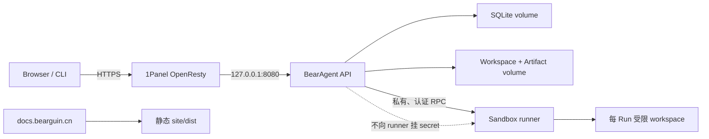

# 本地开发与自托管

## 1. 现在怎样运行

P1 全部在本地开发和验证，Runtime 不开放 HTTP。F-0015 文档站也只在本地与 CI 构建。P1 完成后
可以发布静态文档；P2 完成后建立私有服务器 staging；只有 P3 的权限、认证、runner 和备份恢复
全部通过，Agent 服务才通过公网子域名提供给项目所有者。

不需要新域名：

- `docs.bearguin.cn`：P1 完成后发布静态文档；
- `agent.bearguin.cn`：P3 后的单用户 Agent API，未来 Web UI 与 `/api` 同源。

暂不增加 `api.*`，避免 CORS、cookie 和证书管理复杂度。

## 2. 为什么不能一直只测本地

服务器会暴露 Windows 本地开发看不到的问题：Linux 路径和权限、容器 volume 的 UID/GID、SQLite
WAL 与备份、时区和重启、SSE 代理缓冲、TLS timeout，以及 runner 的网络和 secret 隔离。

因此部署分三步：

```text
Local       快速开发和全部自动测试
Staging     私有 Linux/Compose/重启与恢复演练
Production  P3 安全门通过后才启用公网 hostname
```

## 3. 每个阶段允许什么

### P0–P1：只在本地

- CLI 直接运行；
- SQLite 和 workspace 放在项目外的数据目录；
- 不开放 HTTP，不提供 host shell；
- secret 只在本机环境或 secret store；
- 文档站本地预览和 CI 构建，不部署。

### P1 完成后：公开静态文档

构建 `site/dist/` 并发布到 `docs.bearguin.cn`。服务器只接收静态产物，不在 Web 请求中运行文档
生成器。托管、HTTPS、发布权限和回滚需单独确认。

### P2：私有服务器 staging

- 使用一台 Docker Compose 主机；
- 通过 SSH 运行 CLI；临时 API 只能绑定 `127.0.0.1`；
- 通过 SSH tunnel、Tailscale 或 WireGuard 访问；
- 每个 release 做 kill/restart 和 restore drill；
- 不需要公网 DNS。

### P3：单用户生产 beta

- `agent.bearguin.cn` 指向服务器；
- 1Panel/OpenResty 终止 TLS，反向代理到 loopback API；
- 应用自己完成单用户认证，1Panel 密码访问只能作为第二层；
- runner 位于独立私有 network，不接受公网入站；
- 定期备份 SQLite、Artifact 和非 secret 配置；
- P3 仍以 CLI/API 为主，Web UI 属于 P4。

## 4. 服务器连接方式



P3 Compose 只需要 Runtime API 和 runner。OpenResty 和证书继续由现有 1Panel 管理。不为“标准架构”
加入 PostgreSQL、Redis、队列或独立观测服务。

## 5. DNS 和 1Panel

在现有 DNS 服务商添加 `agent` 和 `docs` 指向服务器。Agent 的 SSE、上传大小和长请求 timeout 必须
确认代理支持；第一版建议直连服务器并限制访问，减少 CDN 变量。

1Panel 配置重点：

1. `agent.bearguin.cn` 反向代理到 loopback 端口；
2. 申请独立或 wildcard 证书，并强制 HTTP 跳转 HTTPS；
3. SSE 路径关闭 buffering/cache，proxy read timeout 大于 heartbeat 间隔；
4. 限制请求体和上传大小；
5. 容器端口不绑定 `0.0.0.0`；
6. `docs.bearguin.cn` 只托管构建后的静态文件。

1Panel 管理面板不和 Agent 共用域名或路径，并继续使用 MFA、授权 IP 等保护。

## 6. API、SSE 和会话

- Web 与 API 同源；cookie 使用 Secure、HttpOnly 和合适 SameSite；
- SSE 禁止代理缓存和缓冲，并发送 heartbeat；
- 重连从最后 Event sequence 补齐，不只依赖内存 token 流；
- 代理 timeout 与 Run deadline 分开；
- 上传先进入受限 staging 目录，并限制大小、类型和解压；
- CORS 默认只允许同源；
- 开启 HSTS 前先确认所有子域的 HTTPS 策略。

## 7. 数据和备份

必须备份 SQLite、Artifact、非外部 Git 仓库的 workspace、非 secret 配置，以及 P4 以后启用的
Memory。采用 secret store 后，还要备份加密数据和独立恢复密钥。

SQLite 使用 online backup API 或受控 checkpoint/停写流程。不能在 WAL 模式运行时只复制一个
`.db` 文件。每份备份记录 hash，并定期在空目录执行真实恢复。

初始保留建议为 7 份日备份、4 份周备份和 3 份月备份；最终根据 Artifact 大小调整。至少一份加密
备份离开主服务器。

## 8. Secret 边界

- Provider key 只给 Runtime API，不给 runner；
- `.env` 不进 Git，也不复制到 workspace；
- Event、日志和 Artifact 写入前脱敏；
- 以后 MCP/远程 Tool 的凭据由服务端注入，模型只看到引用；
- 轮换 key 不需要重写历史，因为历史 Event 本来就不应包含密钥。

## 9. Runner 最低限制

- rootless/unprivileged；只读 rootfs 和受限 tmpfs；
- `cap_drop: ALL`、`no-new-privileges`；
- CPU、内存、PID、总时间和 stdout/stderr 上限；
- 每 Run 独立目录，网络默认关闭；
- 不挂宿主根目录、用户 home、Docker socket、1Panel、主数据库和 secret；
- runner API 只在私有 network，并验证调用身份、request ID 和 nonce；
- 任务后清理临时目录，Artifact 通过受控复制返回。

runner 不可用时，shell/code Tool 必须不可用，不能回退到主 Runtime subprocess。

## 10. 发布和回退

```text
CI：测试、文档和安全检查
  -> 构建不可变镜像 tag
  -> 备份当前数据
  -> staging 应用 migration
  -> 运行恢复 smoke test
  -> 部署 production
  -> 健康检查 + 一个只读 canary Run
```

数据库 migration 必须先验证前进恢复。如果 migration 不可逆，回退方式是旧镜像加部署前完整备份，
不能假装可以安全 downgrade schema。

## 11. 什么时候才需要新域名

只有 BearAgent 成为独立品牌、需要独立 SEO/邮箱/社区、准备作为独立资产转让，或现有主域的 DNS/
备案策略不适合 Agent 服务时，才考虑新域名。当前新增域名只会增加续费、证书和维护成本。

## 参考

- [1Panel 网站配置](https://1panel.cn/docs/v2/user_manual/websites/website_config_basic/)
- [DeepTutor 部署说明](https://github.com/HKUDS/DeepTutor/blob/main/README.md)
- [Manus Sandbox](https://manus.im/blog/manus-sandbox)
