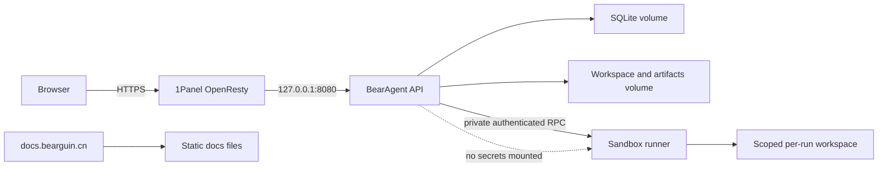

# 本地开发、服务器部署与域名方案

## 1. 直接结论

- **先本地开发，但不要等全部做完才碰服务器。**
- P1 全部本地，包括 F-0015 的 Starlight 文档站；P1 完成后再部署 `docs.bearguin.cn`。P2 完成后建立 Agent 私有 staging，只通过 SSH 或私有网络操作；P3 完成 Policy、认证、HTTP API 和 runner 后再通过公网子域名开放给自己。
- 你 **不需要再注册一个域名**。使用现有 `bearguin.cn` 的子域名即可：
  - `docs.bearguin.cn`：公开文档；
  - `agent.bearguin.cn`：Agent Web UI 和同源 `/api`；
  - 暂时不要增加 `api.*`，减少 CORS、cookie 和证书复杂度。

只有将来想建立完全独立品牌、出售项目或隔离声誉/SEO 时，才值得买新域名。

## 2. 为什么不是“全本地做完再部署”

本地适合快速开发和调试，但服务器会暴露不同问题：

- Linux/Windows 路径和文件权限；
- container volume UID/GID；
- SQLite WAL、备份和磁盘持久化；
- 时区、重启、健康检查和日志轮转；
- reverse proxy、SSE buffering、TLS 和超时；
- runner 网络和 secret 隔离。

因此采用双轨：

```text
Local: fastest development and full tests
Staging: early Linux/Compose/restart verification, not public
Production: public hostname only after P3 security gate
```

## 3. 各阶段部署方式

### P0-P1：Local only

- CLI 直接运行；
- SQLite 和 workspace 在项目外的开发数据目录；
- 不暴露 HTTP；
- 不提供 host shell；
- secrets 只在本机环境/secret store。

### P2：Private server staging

- 一台 Docker Compose 服务；
- 通过 SSH 运行 CLI；如为了 P3 预研存在临时 API，也只绑定 `127.0.0.1`；
- 仅通过 SSH tunnel 或 Tailscale/WireGuard 访问；
- 每次 release 做 kill/restart 和 restore drill；
- 不创建公网 DNS 也可以先测试。

### P3：Private production beta

- `agent.bearguin.cn` 指向服务器；
- 1Panel/OpenResty 终止 TLS 并反向代理到 loopback API 端口；P3 仍是 headless API/CLI，Web UI 属于 P4；
- Agent 自身单用户认证；可额外用 1Panel 密码访问作为第二道门，但不能替代应用会话安全；
- runner sidecar 在独立 network，禁止公网入站；
- 定时备份数据库、artifacts、配置和 Memory。

### P1 完成后：Public docs

- `docs.bearguin.cn` 发布 F-0015 产生的 Starlight 静态构建；
- 文档公开，Agent 仍保持认证；
- CI 构建 docs，服务器只接收静态产物，不在 Web 请求时运行文档生成器。

## 4. 推荐服务器拓扑



Compose 初期只需要 `bearagent-api` 和 `bearagent-runner` 两个服务；OpenResty 和证书由现有 1Panel 管理。不要为了“标准架构”加入 PostgreSQL、Redis、消息队列和独立 observability stack。

## 5. DNS 与 1Panel

### 5.1 DNS

在 `bearguin.cn` 当前 DNS 服务商中添加：

```text
agent  A/AAAA   <server public IP>
docs   A/AAAA   <server public IP>
```

如果主域已通过 CDN/代理，也可以使用合适的 CNAME；Agent 的 SSE、上传大小和长请求超时需确认 CDN 支持。第一版建议先直连服务器并限制访问，减少变量。

### 5.2 1Panel 网站

1Panel 官方文档支持网站域名、反向代理、密码访问和 HTTPS/ACME。建议：

1. 为 `agent.bearguin.cn` 新建反向代理网站，upstream 指向 `http://127.0.0.1:<host-port>`；
2. 通过证书模块申请独立证书或 `*.bearguin.cn` wildcard；
3. HTTP 自动跳转 HTTPS；
4. 调大 SSE/长任务相关 proxy read timeout，并关闭 SSE 路径的 buffering/cache；
5. 配置请求体大小，限制上传；
6. Agent 容器端口不要绑定 `0.0.0.0`；
7. P1 完成后，为 `docs.bearguin.cn` 新建静态网站，站点目录只放 `site/dist/` 构建产物。

不要将 1Panel 管理面板和 Agent 应用共用同一域名/路径。管理面板应继续使用独立端口或管理子域，并开启 MFA、授权 IP 或其他访问限制。

## 6. TLS、SSE 与反向代理注意项

- Web UI 和 API 同源，cookie 使用 `Secure`、`HttpOnly`、合适的 `SameSite`；
- SSE response 禁止代理缓存和缓冲，设置 heartbeat；
- 每次连接可从最后 event sequence 恢复，而不是只依赖活跃内存流；
- 代理 timeout 大于 heartbeat 间隔，但 Run 本身仍有独立执行 deadline；
- 上传先落到受限 staging 目录，做大小、类型和解压限制；
- CORS 默认只允许同源；
- 开 HSTS 前先确认所有子域 HTTPS 策略，避免误锁。

## 7. 数据持久化与备份

### 7.1 必须备份

- SQLite 数据库；
- artifacts；
- user workspace（若它不是外部 Git repo）；
- Memory（P4 启用后）；
- 非 secret 配置；
- 加密后的 secret store 及其独立恢复密钥（采用后）。

### 7.2 SQLite 备份

不要在运行时简单复制单个 `.db` 文件并忽略 WAL。使用 SQLite online backup API 或受控 checkpoint/停写流程。备份完成后记录 hash，并定期在空目录执行真实恢复测试。

推荐保留：

```text
daily: 7
weekly: 4
monthly: 3
```

这是初始建议，最终根据 Artifact 体积和服务器容量调整。至少一份加密备份应离开该服务器，避免磁盘/主机同时损坏。

## 8. Secrets

- Provider key 只提供给 API/runtime，不提供给 runner；
- `.env` 不进 Git，也不复制进 workspace；
- event/log/artifact 写入前做 redaction；
- MCP/remote tool 凭据后续通过 credential broker 或 server-side injection 使用，模型只看到引用；
- 轮换 key 后不需要重写历史 Event；历史中本来就不应有 key。

## 9. Runner 硬化清单

- rootless/unprivileged user；
- `read_only` rootfs、临时 `tmpfs`；
- `cap_drop: ALL`，按需最小添加；
- `no-new-privileges`；
- CPU、memory、PID、wall-time、stdout/stderr 限制；
- 每 Run 独立工作目录；
- network deny default，按域/代理受控放行；
- 不挂宿主 `/`、用户 home、Docker socket、1Panel 目录和 secret 目录；
- runner API 仅 private network，可验证调用身份和 request nonce；
- 任务结束清理临时目录，Artifact 通过受控复制输出。

## 10. 发布与回滚

最小发布流程：

```text
CI test/docs/security checks
  -> build immutable image tag
  -> backup current data
  -> apply migration in staging
  -> recovery smoke tests
  -> deploy production
  -> health + one read-only canary Run
```

数据库 migration 必须先验证向前恢复路径。若 migration 不可逆，回滚方案是旧镜像 + 部署前完整备份，而不是假装可以 downgrade schema。

## 11. 文档站方案

F-0015 已选择 Starlight。它以 Markdown/MDX 组织学习内容，提供静态搜索、导航和 Mermaid 集成，构建结果仍是容易由 1Panel 托管的静态文件。站点源文件位于 `site/`，P1 期间只在本地运行：

```powershell
npm --prefix=site ci
npm run dev --prefix=site
npm run build --prefix=site
```

建议导航：

```text
Home
Getting Started
Concepts
  Run and Event
  Tools and Grants
  Recovery semantics
Architecture
Guides
  Local install
  Self-host with 1Panel
  Backup and restore
Reference
  CLI
  Configuration
  Event schema
Development
  SOP
  ADRs
Roadmap
```

文档从 P0 就写，F-0015 在 P1 建立本地站点；P1 完成后再上线 `docs.bearguin.cn`。先保证内容与代码一致，再花时间做主题和品牌视觉。

## 12. 何时需要新域名

继续使用子域名，除非至少满足一项：

- BearAgent 成为独立品牌，名称不再依赖 BearGuin；
- 需要独立 SEO、邮箱、社区和发行身份；
- 计划将项目/服务作为独立资产转让；
- 主域 DNS/CDN/备案策略不适合 Agent 服务。

现阶段注册新域名只增加续费、证书、DNS、备案和品牌维护成本，没有技术收益。

## 参考资料

- [1Panel 网站配置：域名、反向代理、密码访问和 HTTPS](https://1panel.cn/docs/v2/user_manual/websites/website_config_basic/)
- [DeepTutor README: secret scopes and multi-container deployment](https://github.com/HKUDS/DeepTutor/blob/main/README.md)
- [Manus Sandbox: per-task isolation and lifecycle](https://manus.im/blog/manus-sandbox)
