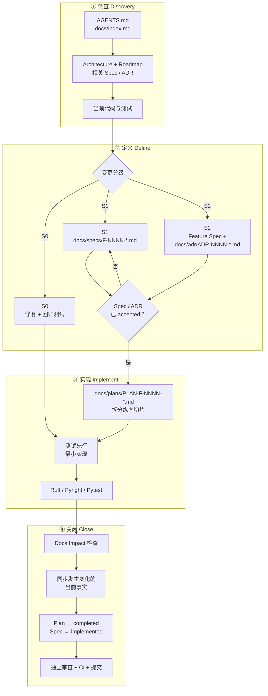

# AI 辅助开发 SOP

## 1. 先回答核心问题

Vibe coding 最大的风险不是 AI 偶尔写错一行，而是每次对话都重新解释系统，导致概念、边界、数据模型和错误语义逐步分叉。

解决方法不是让每个小改动都写一篇长文，而是建立 **轻重分级、仓库内持久化、验收驱动** 的 SOP：



聊天记录是工作台，不是数据库。ChatGPT/Codex 可以帮助调查、写文档、实现和验证，但长期事实必须进入 Git。

## 2. 文档税要与风险相称

| 级别 | 例子 | 必需产物 |
|---|---|---|
| S0 | typo、格式、明显 bug、内部机械重构 | 回归测试；用户行为变化时同步相关文档 |
| S1 | 新 CLI、Tool、状态或可观察行为 | Feature Spec、测试、用户文档 |
| S2 | 数据库 schema、安全边界、跨模块抽象、新生产依赖、公开 API | Feature Spec、ADR、失败/安全测试、迁移与回滚说明 |

不要把 ADR 用成日记。ADR 只记录代价高、跨模块、以后难以反转的决定及其理由。

## 3. Source of Truth 规则

| 内容 | 权威位置 |
|---|---|
| 当前 milestone 与阶段完成线 | `docs/project/roadmap.md` |
| 目标、非目标、场景、验收 | `docs/specs/F-NNNN-*.md` |
| 当前 Feature 的实现切片 | `docs/plans/PLAN-F-NNNN-*.md` |
| 跨模块选择及取舍 | `docs/adr/ADR-NNNN-*.md` |
| 当前系统分层和契约 | `docs/architecture/*.md` |
| AI/贡献者稳定工作约定 | `AGENTS.md` |
| 实际类型、schema、CLI/API | 代码、迁移、自动生成 reference |
| 行为是否成立 | 自动化测试和可复现验收记录 |

同一事实不要在五份手写文档中重复。架构文档描述稳定边界；Feature Spec 描述一个行为；代码 reference 尽量自动生成。

Feature ID `F-NNNN` 在全项目内稳定递增，所属阶段由 Spec 的 `milestone: P<n>` 声明。阶段变化不得导致 Feature 重编号。`related_adrs` 只表达设计依赖；进度以 Spec 状态、Implementation Plan 切片、代码和测试为准，不能通过统计 ADR 推断。

## 4. 在 ChatGPT/Codex 中如何执行

### 4.1 一个功能一个任务上下文

建议每个 Feature/修复对应一个 Codex 任务和一个小 diff。任务开始时明确关联 Spec；跨功能的“顺便重构”拆开。需要隔离时使用 Git worktree，普通小改动可在本地工作区完成。OpenAI Docs 说明 Codex 会在工作前读取并按目录层级合并 `AGENTS.md`，所以稳定规则放在那里，而不是每次复制到 prompt。

### 4.2 第 0 步：任务合同

第一次发给 AI 的内容只需要包含：

```text
目标：解决什么用户问题
范围：允许修改哪些模块
约束：兼容性、安全、时间或依赖限制
成功：最关键的可验证结果
非目标：本次明确不做什么
```

若这些信息缺失，AI 的第一个动作应是仓库调查和列出假设，不是创建一套自认为合理的架构。

### 4.3 第 1 步：Discovery，禁止写代码

推荐 prompt：

```text
先不要修改代码。
读取 AGENTS.md、总体架构、相关 Spec/ADR、实现和测试。
输出：
1. 当前行为和证据路径；
2. 与目标之间的差距；
3. 受影响的领域对象、持久化、权限和公开契约；
4. 失败场景与安全风险；
5. 仍需我决定的问题。
不要根据聊天记忆猜测仓库事实。
```

Discovery 结束后，先核对 AI 引用的文件和当前行为是否真实。

### 4.4 第 2 步：写 Feature Spec

推荐 prompt：

```text
基于已确认的调查，为这个功能创建/更新 Feature Spec。
必须写清目标、非目标、术语、用户场景、功能需求、状态转换、
数据/接口变化、失败语义、安全、可观测性和可执行验收标准。
声明稳定 spec_id、所属 milestone 和 related_adrs。
此阶段仍不实现代码。若有开放问题，明确标记，不要自行定案。
```

Spec 的验收条件必须可以转换成测试，不使用“更智能”“更稳定”“体验良好”这类无法判断的形容词。

### 4.5 第 3 步：设计与 ADR

只有 S2 需要独立 ADR。推荐 prompt：

```text
为已接受的 Spec 给出 2-3 个可行设计，比较复杂度、恢复语义、
安全边界、迁移成本和可测试性。推荐一个最小方案。
如果改变跨模块边界、schema 或生产依赖，创建 ADR；否则把实现说明
留在 Spec，避免多余文档。
```

ADR 必须记录 rejected alternatives，防止数周后另一个 AI 再次建议已否决的方案。

### 4.6 第 4 步：实现计划

计划以可以独立验证的纵向切片组织，而不是“先写全部 model，再写全部 API”。例如：

```text
1. 领域类型 + reducer 单元测试
2. SQLite event append + projection transaction 集成测试
3. application command + fake adapter 端到端测试
4. 一个真实 adapter
5. CLI 接入
6. recovery/failure injection
7. 文档和验收检查
```

每一步都要能运行测试并留下可工作的中间状态。

计划保存在 `docs/plans/PLAN-F-NNNN-<slug>.md`，通过 `related_spec` 关联 Feature。开始实现时将 Plan 标记为 `active`；同时最多只有一个主 Plan 为 `active`。

### 4.7 第 5 步：实现

推荐 prompt：

```text
只实现计划中的下一纵向切片。
保持现有边界，不引入未被 Spec/ADR 接受的新概念或生产依赖。
先写/更新能证明验收条件的测试，再完成最小实现。
遇到 Spec 缺口时暂停设计决策，在 Spec 中记录，不要用代码偷偷决定。
完成后运行范围匹配的验证，并报告实际命令和结果。
```

一个 diff 过大时，先停在可验证切片，而不是让 AI 一次性生成几千行后再整体调试。

### 4.8 第 6 步：验证与反向审查

实现者完成后，再执行一次以找问题为目标的 review pass：

```text
把当前 diff 当成他人提交的代码审查，不要继续实现新功能。
逐条对照 Spec 验收条件和 AGENTS.md，重点检查：
- 状态/事件不一致；
- 崩溃窗口和重复副作用；
- 权限绕过、路径逃逸和 secrets；
- provider/framework 类型泄漏；
- timeout、取消和输出上限；
- 文档是否描述了尚不存在的行为；
- 测试是否只验证 mock 而没验证真实边界。
按严重度给出证据；没有问题也要说明验证覆盖和剩余风险。
```

对 S2 变更，最好在新任务中执行这次 review，减少同一上下文的确认偏差。

### 4.9 第 7 步：关闭功能

关闭前：

- Spec `status` 从 `accepted` 改为 `implemented`；
- Implementation Plan 从 `active` 改为 `completed`，未完成切片不得勾选；
- 补上 `implemented_in` commit/PR（有后填写）；
- 更新架构文档中已经改变的当前事实；
- 添加 migration/rollback 说明；
- 把验证命令和结果写进 PR/变更记录，不把瞬时测试输出长期复制进架构文档；
- 未完成项回到 roadmap/issue，不写成“已经支持”。

## 5. 防止文档漂移的具体机制

### 5.1 文档写稳定契约，不抄实现

不在手写文档维护完整函数签名、每个配置默认值或目录中每个文件的清单。这些最容易漂移，应从代码 schema、CLI `--help`、OpenAPI 或配置模型自动生成。

手写文档重点写：为什么、边界、状态、失败语义、安全和用户流程。

### 5.2 每份文档有生命周期

Spec/ADR 使用 `draft / accepted / implemented / superseded`；架构文档带 `last_verified`。被替代文档不删除，添加指向新文档的链接。

### 5.3 PR 必须回答 Docs Impact

每次变更明确选择：

```text
[ ] No observable or architectural documentation impact
[ ] Feature Spec updated
[ ] ADR added/updated
[ ] Architecture updated
[ ] User/deployment docs updated
[ ] Generated reference refreshed
```

“没有文档影响”也是一个显式判断，不能默认为遗漏。

### 5.4 CI 做机械检查

P0/P1 建立：

- Markdown lint 和内部链接检查；
- `mkdocs build --strict`（开始发布站点后）；
- Ruff、Pyright、pytest；
- migration 能从空库升级；
- architecture import boundary test；
- CLI/OpenAPI/config reference 生成后 `git diff --exit-code`；
- 公共 Event/Tool schema 的 snapshot/compatibility test。

CI 不能判断设计是否正确，但可以阻止最常见的格式、链接、生成物和契约漂移。

### 5.5 每个里程碑做一次 Reality Check

让 AI 从代码反向生成“当前系统图”，再与架构文档比较。只修事实差异，不趁机扩范围。检查：

- 是否出现重复概念和 Manager/Service；
- core 是否依赖外围框架；
- 事件是否覆盖所有状态变化；
- 文档是否写了未来功能却没标注；
- roadmap 已完成项是否有测试证据。

## 6. 测试金字塔适配 Agent Runtime

| 层 | 重点 |
|---|---|
| Unit | reducer、budget、policy match、path validation、context selection |
| Contract | 每个 ModelProvider、Tool、SandboxBackend 的统一契约 |
| Integration | SQLite transaction、migration、artifact、API/CLI |
| Recovery | 在每个持久化边界 kill/restart；幂等与 `UNKNOWN` |
| Security | traversal、symlink、approval tamper、SSRF、secret redaction |
| Eval | 固定任务集上的答案、工具轨迹、成本、延迟和权限行为 |

Eval 不是 unit test 的替代品。可确定行为使用普通测试；模型质量和 trace 变化才使用 eval。

## 7. 分支与提交建议

- 一项 Feature 一个短分支/工作树。
- 先提交 accepted Spec/ADR，再提交实现；个人项目也可以在同一 PR 中分 commit。
- 不把大规模格式化、依赖升级和行为变化混在同一 diff。
- 每个 commit 尽量保持测试通过；schema migration 与读取新 schema 的代码同批提交。
- 合并前从干净环境执行完整验证。

## 8. 个人开发的 Definition of Done

一个功能只有同时满足以下条件才算完成：

1. 用户场景从真实入口可运行；
2. 所有验收条件有自动化或清晰的人工验证证据；
3. 失败、重启、取消、超时和权限路径得到与风险匹配的验证；
4. 数据迁移和回滚/恢复策略明确；
5. Spec、ADR、架构和用户文档没有把未来写成现在；
6. AI 对 diff 做过独立问题导向审查；
7. 没有将秘密、临时调试代码或未使用抽象留在仓库。

## 9. 推荐的日常节奏

```text
每日开始：读取 roadmap + 当前 Spec，选一个最小验收切片
开发中：每个切片实现、测试、提交
每日结束：更新 Spec 的进度/开放问题，不重写架构大纲
每个 Feature：独立 review + docs impact + 完整测试
每个里程碑：reality check + recovery drill + 文档站预览
```

这套流程的目标不是让个人项目变成大公司流程，而是用最少文字保留最昂贵的信息：边界、理由、失败语义和验收证据。

## 参考

- [OpenAI Docs: Custom instructions with AGENTS.md](https://learn.chatgpt.com/docs/agent-configuration/agents-md)
- [OpenAI Docs: Codex environments](https://learn.chatgpt.com/docs/environments/modes)
- [OpenAI Docs: Code review](https://learn.chatgpt.com/docs/code-review)
