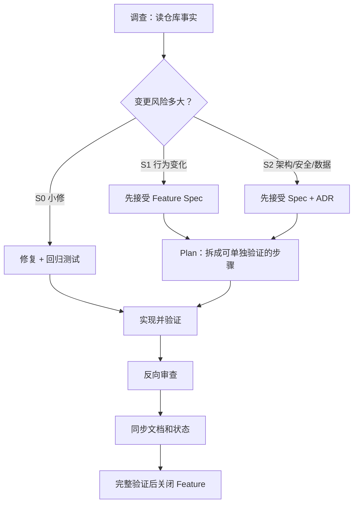

# AI 辅助开发流程

## 1. 这套流程解决什么问题

AI 可以快速写代码，真正昂贵的问题却常发生在多次对话之间：每次任务重新解释系统，结果是术语、
模块边界、数据格式和失败处理逐渐出现多个版本。

BearAgent 不要求每个小改动写长文。它要求把高成本信息留在仓库：用户要得到什么、哪些边界不能
破坏、失败时怎样表现、为什么选择这个方案，以及什么证据说明已经完成。



聊天是工作台，不是项目数据库。结论只有进入 Git 后才会影响后续开发。

## 2. 先判断改动风险

| 级别 | 典型改动 | 必需结果 |
|---|---|---|
| S0 | typo、格式、明确 bug、小型内部重构 | 修复和回归测试；用户行为变化时更新文档 |
| S1 | 新 CLI、Tool、状态或用户可观察行为 | Feature Spec、测试和相关文档 |
| S2 | 持久 schema、安全边界、多个模块共用的接口、新生产依赖 | Feature Spec、ADR、失败/安全测试、迁移和回退 |

ADR 只记录影响多个模块、以后难以反转的决定，不用来记录每日实现细节。

## 3. 先找到仓库里的事实

| 你要确认什么 | 首选位置 |
|---|---|
| 当前阶段和退出条件 | `docs/project/roadmap.md` |
| Feature 必须做到什么 | `docs/specs/F-NNNN-*.md` |
| 为什么选择当前方案 | `docs/adr/ADR-NNNN-*.md` |
| 当前实施顺序 | `docs/plans/PLAN-F-NNNN-*.md` |
| 模块如何连接 | `docs/architecture/` + 代码 |
| 行为是否成立 | 测试和可复现命令 |
| 开发约束 | `AGENTS.md` |
| 面向读者的解释 | `site/`，必须能追溯到以上事实 |

Feature ID 全项目稳定，阶段写在 Spec 的 `milestone` 中。ADR 的 accepted 不能用来推断 Feature 已
完成；进度由 Spec、Plan、代码和测试共同确认。

## 4. 一个 Feature 从开始到结束

### 4.1 第一步：写清任务边界

交给 AI 的任务至少包含：

```text
目标：用户或开发者最终得到什么
范围：允许修改哪些模块
约束：兼容性、安全、依赖和时间边界
成功：最关键的可验证结果
不做：本次明确排除什么
```

信息不足时，AI 先调查和列出假设，不直接创建新架构。

### 4.2 第二步：只调查，不修改

读取 `AGENTS.md`、架构、路线图、相关 Spec/ADR/Plan、代码和测试，回答：

1. 当前行为在哪里实现，有什么测试；
2. 目标与当前状态之间差什么；
3. 哪些 ID、Event、状态、持久化、权限和公开入口会受影响；
4. 失败、恢复和安全场景有哪些；
5. 哪些问题需要项目所有者决定。

聊天记忆不能替代当前 Git 状态。

### 4.3 第三步：接受 Spec

S1/S2 先写 Feature Spec。Spec 从具体场景开始，然后说明本次交付、不做什么、状态与数据、失败时
用户看到什么、安全边界和二值验收条件。

验收条件不能使用“更智能”“更稳定”“体验良好”等无法判断的词。开放问题不由实现代码暗中决定。

### 4.4 第四步：必要时写 ADR

S2 比较 2–3 个可行方案，重点看维护成本、失败恢复、安全、迁移和测试。ADR 标题直接说出决定，
正文先给具体冲突，再写选择、代价和验证。

例如不要只写“Provider-neutral schema”；写成“BearAgent 模块之间只交换 BearAgent 数据类型”，
再说明 SDK 响应在 adapter 处翻译。

### 4.5 第五步：Plan 拆成可验证步骤

每一步都写：交付结果、代码落点、谁调用谁、重点测试、验证命令和回退方式。例如：

```text
1. 用 Event 算出 Run 状态，并通过 Reducer 单元测试
2. SQLite 追加 Event，同时更新 projection，并通过 transaction 测试
3. Application command 接入内存实现，通过端到端测试
4. 接入一个真实 adapter，并运行同一组行为测试
5. CLI 接通用户路径
6. 加入故障注入和文档关闭
```

Plan 不能只按技术层横向分成“先写全部 model，再写全部 API”。同时最多一个主 Plan 为 active。

### 4.6 第六步：一次只实现下一步

先补能证明验收条件的测试，再写最小实现。不得引入 Spec/ADR 没有接受的新概念或生产依赖。遇到
需求缺口时回到 Spec，而不是让代码自行做出跨模块决定。

每一步完成后运行范围匹配的检查，并报告实际命令和结果。diff 过大时停在可用的中间结果，不一次
生成几千行再整体调试。

### 4.7 第七步：从找问题的角度审查

把 diff 当成别人提交的代码，逐条检查：

- Event 和状态是否会分叉；
- 哪个崩溃窗口可能重复副作用；
- 路径、权限和 secret 是否能绕过；
- SDK 或框架类型是否进入核心；
- timeout、取消和输出上限是否缺失；
- 文档是否把计划写成当前实现；
- 测试是否只验证 mock，而没有验证真实边界。

S2 最好在独立任务中做这次审查，减少同一上下文的确认偏差。

### 4.8 第八步：关闭 Feature

- Spec 改为 `implemented`，Plan 改为 `completed`；
- 填入实际 PR/commit；
- 更新发生变化的架构事实；
- 学习页用一个具体场景解释功能为什么存在；
- 开发者页写代码入口、连接关系、失败边界和验证；
- 状态页只增加已有代码和测试支持的能力；
- 迁移、回退和已知限制写清；
- 完整验证通过后提交。

关闭整个阶段时，再更新 Roadmap、学习地图、架构总结和阶段结果。

## 5. 怎样写清文档

### 5.1 先讲行为，再给术语命名

术语不是问题，只有术语而没有行为才是问题。Runtime、port、adapter、Event、Reducer、schema 和
Provider 都可以保留；第一次出现时，用一句普通话说明它做什么。

例如：

> 同一组测试分别跑在内存和 SQLite store 上。两种实现对追加、冲突和读取顺序给出相同结果，
> 所以调用方换用 SQLite 时不用改代码。

如果后文需要，可以再说这组测试叫 `contract suite`。不要反过来先写“contract suite 证明 port
语义不由 adapter 决定”，更不要把它机械替换成长中文短语。

### 5.2 不同文档承担不同问题

- Architecture 写稳定模块关系和当前/未来边界；
- Spec 写可验收行为；
- ADR 写跨模块决定、代价和验证；
- Plan 写实施顺序；
- Site 学习页用连续例子教学；
- Site 开发者页提供代码和测试入口；
- 状态页只回答现在能否使用。

同一事实不要在多份文档中逐字复制。手写文档也不要长期维护完整函数签名、每个默认值和所有文件
清单；这些尽量由 schema、CLI help 或生成文档提供。

### 5.3 连续阅读，不能只检查局部语法

全文搜索适合发现术语和重复，但不能代替上下文审查。文档改完后，从标题到段落连续阅读，检查：

- 标题是否直接说出问题或决定；
- 段落是否有明确主语；
- 一句话是否承担了太多判断；
- 是否堆叠斜杠、缩写和双语同义词；
- 前后页面是否重复同一批内容；
- 当前实现和未来计划是否清楚分开。

## 6. CI 能检查什么

P0/P1 自动检查：

- Markdown 内部链接；
- Starlight 生产构建和本地搜索；
- Ruff、Pyright、pytest；
- import boundary；
- schema snapshot；
- 后续数据库 migration 和生成 reference 的未提交差异。

CI 能阻止格式、链接、生成物和契约漂移，不能判断一段解释是否自然，因此仍需人工连续阅读。

## 7. 测试与风险匹配

| 测试 | 主要回答什么 |
|---|---|
| Unit | Reducer、预算、Policy、路径和上下文选择是否按规则工作 |
| Contract | 不同 Provider、Tool、Store、Sandbox adapter 是否给调用方相同行为 |
| Integration | SQLite transaction、migration、Artifact、CLI/API 是否接通 |
| Recovery | 在持久化边界中断后是否重复副作用，`UNKNOWN` 是否正确 |
| Security | 路径逃逸、批准篡改、SSRF 和 secret 泄漏是否被阻止 |
| Eval | 固定任务的结果、工具路径、成本、延迟和权限行为是否回归 |

可确定的规则用普通测试，不用模型 eval 代替。Eval 只处理模型质量和执行路径变化。

## 8. 分支、提交和完成标准

- 一个 Feature 一个短分支或 worktree；
- accepted Spec/ADR 可先提交，实现按可验证步骤提交；
- 不把大规模格式化、依赖升级和行为变化混在同一 diff；
- migration 与读取新 schema 的代码同批提交；
- 合并前从干净环境运行完整验证。

一个 Feature 只有在真实入口可运行、验收有证据、失败/恢复/权限测试与风险相称、迁移回退清楚、
工程事实与站点同步、独立审查完成、没有 secret 和临时代码时才算完成。

## 9. 日常节奏

```text
开始：读 Roadmap 和当前 Spec，选择一个可单独验证的步骤
开发：测试 -> 最小实现 -> 范围检查
结束：记录剩余问题，不重写整份架构
Feature：反向审查 -> docs/site/status 同步 -> 完整验证
阶段：真实任务 + 故障演练 + Reality Check + 阶段文档
```

目标不是增加流程，而是用尽量少的文字保留最难重建的信息：边界、理由、失败方式和验收证据。

## 参考

- [OpenAI Docs: Custom instructions with AGENTS.md](https://learn.chatgpt.com/docs/agent-configuration/agents-md)
- [OpenAI Docs: Codex environments](https://learn.chatgpt.com/docs/environments/modes)
- [OpenAI Docs: Code review](https://learn.chatgpt.com/docs/code-review)
- [DeepTutor 中文文档](https://docs.deeptutor.info/zh-cn/)
- [《深入理解 AI Agent》](https://bojieli.github.io/ai-agent-book/)
