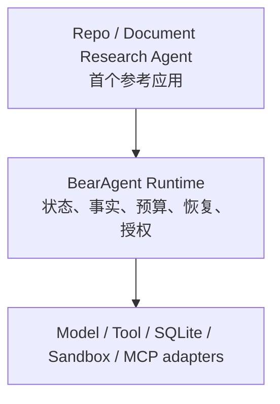

# BearAgent 产品定位

## 1. 定位结论

一句话：

> BearAgent 是面向本地长任务的、失败语义诚实的 local-first Agent Runtime：它把模型与工具动作记录为持久事实，由模型外的确定性 Policy 强制授权；崩溃后只在结果可确认时继续，无法确认的外部副作用停在 `UNKNOWN` 等待 reconcile。

英文短句：

> A failure-honest, inspectable and authority-governed local Agent Runtime.

BearAgent 不用“支持多少模型、工具和角色”定义自己，而要持续回答三个问题：

1. **发生了什么？** 每个模型与工具 Activity 都有结构化事实、结果、成本和 Artifact。
2. **这件事允许发生吗？** 权限来自运行时 Grant 与 Policy，不来自 Prompt、模型或 Tool 输出。
3. **失败后从哪里继续？** Runtime 只从已持久化的安全边界恢复；不能确认的副作用进入 `UNKNOWN`，不伪装成 exactly-once。

这三个问题分别由 P1 的真实纵向执行、P2 的失败语义恢复、P3 的模型外授权与隔离逐步证明。

BearAgent 不声称自己是首个拥有 transcript、checkpoint、approval 或 sandbox 的 Agent。成熟产品和 Runtime 已经以不同粒度提供这些能力；BearAgent 的差异化假设是：把它们统一到 Activity/Attempt/Event/Receipt 契约中，并用故障注入公开证明“何时可以重试、何时必须停在 `UNKNOWN`”。在证据完成前，这仍是待验证的项目主张。

## 2. 目标用户与首个任务

### 2.1 首要用户

- 希望在自己的电脑或服务器上运行 Agent 的个人开发者、研究者和高级用户；
- 愿意用 CLI 和可读配置换取本地控制、可调试性与可扩展性；
- 需要让 Agent 处理仓库、文档和技术研究任务，但不能接受无边界文件访问或不可解释的后台动作；
- 希望通过代码、事件、测试和故障演练真正理解 Agent Runtime，而不是只组装一个聊天界面。

### 2.2 首个 Job to be Done

> 在一个明确限定的 workspace 中，让 Repo/Document Research Agent 连续完成仓库理解、资料检索与文档生成；任务中断后仍能解释已经发生的动作，只有结果可确认时才自动继续，危险动作只有得到精确授权后才能执行。

首个参考应用不是临时 Demo，而是验证 Runtime 价值的产品楔子：同一组真实任务会依次用于 P1 的执行检查、P2 的崩溃恢复和 P3 的授权/隔离演练。P1-P3 不以非技术普通消费者、企业多租户管理员或无代码工作流搭建者为首要用户。

### 2.3 产品分层

Runtime 回答“任务怎样被可靠地执行和约束”；参考应用回答“用户究竟能交付什么任务”。二者必须一起验收，避免只完成基础设施却没有真实使用价值。

## 3. BearAgent 属于什么，也不属于什么

| 类别 | 主要竞争点 | BearAgent 的选择 |
|---|---|---|
| Agent 应用 | UI、渠道、开箱即用功能和场景覆盖 | P1-P3 不争应用功能数量，先做可信执行底座 |
| Coding Agent harness | 代码检索、补丁、终端、模型路由和开发体验 | 首个任务域包含仓库，但不把 BearAgent 限定成编码产品 |
| 垂直 Agent | 教学、研究、客服等领域效果和专有数据 | 不在早期绑定单一垂直业务；用稳定 Runtime 承载后续 Skill/Workflow |
| Agent framework / SDK | 让开发者快速组装 Agent | BearAgent 不是通用编排库优先，而是一个可直接运行、持久化和治理执行的 Runtime |
| BearAgent | 持久执行事实、失败语义诚实、模型外强制授权和本地所有权 | 用同一参考应用上的可复现故障与安全证据证明，而不是用功能清单证明 |

因此，BearAgent 的产品楔子不是“另一个万能 Agent”，而是：

> **面向本地长任务、失败语义诚实的 Agent Runtime，并以 Repo/Document Research Agent 作为首个参考应用。**

## 4. 为什么很多人仍在写自己的 Agent

模型 SDK 已经让基础 `model -> tool -> model` 循环变得容易，但真正的产品差异已经转移到循环之外：

- **任务域**：教学、编码、研究、运营各自需要不同 Tool、Context 和完成标准；
- **执行环境**：本机、容器、远程 VM、浏览器或企业系统决定可做什么以及风险多大；
- **上下文与数据所有权**：文件、会话、Memory、凭据和合规要求无法由同一种托管方式满足；
- **权限与恢复语义**：审批、幂等、receipt、未知提交结果和崩溃恢复很难由 Prompt 代替；
- **交互与分发**：CLI、桌面、Web、IM、IDE 和 API 面向不同工作习惯；
- **工程与社区动机**：Agent 是理解模型、工具、系统和产品交界面的高密度项目。

所以“自己写 Agent”本身不是差异化。真正的差异在于选定一个值得负责的系统边界，并拿出可验证证据。BearAgent 选择对**执行事实、失败语义和模型外授权**负责，并要求每个 Runtime 阶段都在同一个真实参考应用上交付可复现结果。

## 5. 从参考项目吸收什么

外部项目用于发现需求与比较设计，不能证明 BearAgent 已经实现对应能力。

| 参考 | 它重点优化什么 | BearAgent 吸收 | BearAgent 不复制 |
|---|---|---|---|
| [Proma](https://github.com/proma-ai/Proma) | local-first 桌面工作区、Provider/Skill/MCP 集成与交互体验 | workspace 所有权、Adapter 思维、后台任务和权限交互需要产品化 | Electron 全栈、渠道广度和“集成数量”优先级 |
| [DeepTutor](https://github.com/HKUDS/DeepTutor) | 教育场景中的统一 Agent Loop、多阶段 Capability、Memory 与评测 | Tool 与多阶段 Workflow 分层、来源链、领域评测思维 | 教学产品表面、多 RAG 引擎和大量业务 Capability |
| [Manus](https://manus.im/blog/manus-sandbox) | 每任务隔离计算机与文件系统外部上下文 | 隔离执行、文件作为可恢复上下文、失败证据保留 | P1 就引入完整云 VM、浏览器和大而全工具环境 |
| [CodeWhale](https://github.com/Hmbown/CodeWhale) | Coding Agent 的多模型控制面、授权层级与并行工作流 | 授权优先级必须明确、并行/分支工作区需要可审计 | 在持久语义尚未统一时先扩张模型 fleet 和并行宽度 |
| Claude Code 2.1.88 source-map snapshots（[Janlaywss](https://github.com/Janlaywss/cloud-code) / [Rito-w](https://github.com/Rito-w/claude-code)） | 成熟 Coding Agent 的查询循环、权限、沙箱和 JSONL 会话工程 | Adapter、权限 UX、会话检查和兼容性测试的工程细节 | 把 SDK 类型、CLI 产品形态或 transcript 启发式恢复变成 Runtime 内核 |
| [Claw Code](https://github.com/ultraworkers/claw-code) | 以 Rust 重实现 Claude Code 行为的兼容性与 parity 工程 | 机器可读输出、行为对照和小步 parity 验证 | 以复刻另一个产品为 BearAgent 的产品目标 |

两个公开的 `cloud-code` / `claude-code` 仓库围绕同一 2.1.88 source-map 提取快照，不应当作两个独立 Agent 样本；Claw Code 则明确是 Rust 重实现项目。它们适合代码阅读和行为对照，不是 BearAgent 的官方上游或事实来源。

## 6. 差异化必须变成证据

| 阶段 | 用户可感知价值 | 必须公开的旗舰证据 |
|---|---|---|
| P1：Reference Execution | Repo/Document Research Agent 能完成一组固定真实任务，过程与失败可检查 | CLI 任务集；非法路径与预算耗尽被明确拒绝；完整 Activity/Event/Artifact 视图 |
| P2：Failure-honest Recovery | 同一任务在进程退出后只从可确认边界继续 | 多个 kill point；删除 Checkpoint 后重建；receipt/reconcile；`UNKNOWN` 人工处置路径 |
| P3：Governed Self-hosting | 同一任务只能在授予的权限和隔离环境中行动 | 审批参数篡改被拒绝；runner 读不到宿主/secrets；空目录备份恢复演练 |
| P4：Extension Proof | 内核可以承载受控扩展而不绕过原有语义 | 一个只读 MCP 或版本化 Skill 经同一 Policy/Event/ToolResult 路径运行 |

没有这些证据时，只能说“设计为”或“规划中”，不能说 BearAgent 已经可靠、可恢复或安全。

## 7. 产品边界与取舍

P1-P3 坚持：

- 单用户、单 Agent、单进程、SQLite、CLI-first；
- 一个真实 Provider、最小 ContextBuilder、串行 Tool 调用、有限的 workspace 工具和内置参考 Agent 配置；
- Event 是事实，projection 与 Checkpoint 可重建；
- 所有副作用经统一 ToolExecutor 与 Policy；
- host runtime 永不执行模型生成 shell；
- 不以 exactly-once、全自动恢复或“完全安全”作为宣传语。

明确后置到稳定内核之后：Web UI、Memory、任意 HTTP、浏览器/电脑控制、Multi-Agent、多用户、插件市场和分布式 worker。P4 先用一个只读 MCP 或版本化 Skill 验证扩展接缝，再决定是否扩张生态宽度。

## 8. 对外表达规范

推荐表达：

- “面向本地长任务、失败语义诚实的 Agent Runtime”；
- “以 Repo/Document Research Agent 验证持久执行事实、失败恢复与模型外授权”；
- “崩溃后只在结果可确认时继续；无法确认的副作用停在 `UNKNOWN` 等待 reconcile”；
- “当前能力见状态页；定位描述的是架构优先级，不暗示其他 Agent 没有检查、恢复或权限控制”。

避免表达：

- “开源 Manus / Claude Code 替代品”；
- “全能个人助理”或“支持所有模型和工具”；
- “绝对安全”“永不丢任务”“exactly-once”；
- 把 Roadmap、已接受 ADR 或参考项目能力写成当前实现。

## 9. 与路线图的关系

本文件回答“为谁解决什么问题、为什么值得存在”；[总体架构](../architecture/overview.md)回答“哪些技术边界长期成立”；[路线图](roadmap.md)回答“按什么顺序交付并如何验收”。任何新增功能都应先说明它强化了哪条定位证据，还是仅增加了能力宽度。
