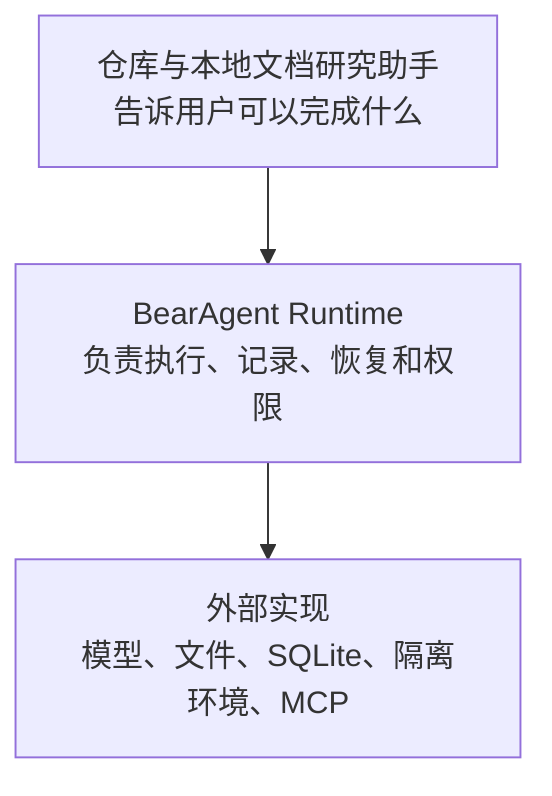

# BearAgent 产品定位

## 1. 一句话说明

> **BearAgent 是一个本地优先的个人 Agent 运行时：它先让仓库与文档类长任务真正跑通，再确保每一步可查看、失败后不乱重试、危险操作必须获得授权。**

这里的“本地优先”表示任务、记录和产物默认由用户自己的电脑或服务器保存；“运行时”表示 BearAgent 负责执行和约束 Agent，而不是只提供一组让开发者自行拼装的函数。

BearAgent 遵守一个简单原则：

> 知道操作结果时才继续；无法确认时就停下来说明情况，不把猜测当成成功。

我们把这称为“失败语义诚实”。它不是宣传口号，而是 P2 必须用进程中断和重复执行测试证明的行为。

## 2. BearAgent 解决什么问题

一次模型调用很容易演示。任务持续几分钟、调用多个工具并修改文件后，系统必须回答：

1. **做过什么？** 用户能看到模型调用、工具操作、错误、消耗和最终产物。
2. **失败后怎么办？** 已确认完成的操作不重复；能安全重试的操作才重试；无法判断的操作停下来等待处理。
3. **允许做什么？** 模型只能提出请求，真正的权限由运行时检查。

P1、P2、P3 分别证明这三件事。没有代码、测试和可复现演练支持时，只能说“计划这样做”，不能说已经可靠、可恢复或安全。

## 3. 为谁做，先做什么

首要用户是愿意在本机或自己的服务器上运行 Agent 的个人开发者、研究者和高级用户。他们需要处理仓库、文档和技术资料，也在意数据所有权、调试能力和文件访问边界。

第一个可用场景是“仓库与本地文档研究助手”：

> 在一个明确限定的工作区中，阅读仓库和本地文档，查找相关内容，比较多个来源，并把报告或说明写入 `outputs/**`。

P1 不包含联网搜索。相同的本地任务集会继续用于 P2 的中断恢复测试和 P3 的授权、隔离测试。这样，Runtime 的建设始终对应一个用户能理解的结果，而不是一组互不相连的底层模块。

## 4. 产品怎样分层

几个容易混淆的概念在 BearAgent 中有明确边界：

| 概念 | 简单解释 |
|---|---|
| Agent | 一份包含模型、可用工具、说明和限制的配置；运行时可以根据当前情况选择下一步 |
| Workflow | 由代码预先确定顺序的多阶段流程 |
| Skill | 可复用的说明和知识，不会自动获得权限 |
| Tool | 真正执行读取、写入或其他动作的接口 |
| Runtime | 运行上述内容，并负责限制、记录、恢复和授权的系统 |

BearAgent 第一版只有一个 Agent，不做多个角色互相聊天。需要稳定步骤时使用 Workflow，需要复用说明时使用 Skill，需要改变外部世界时必须通过 Tool。

## 5. 为什么不直接使用另一个 Agent

不同 Agent 的差异已经不只在模型循环，而在它们愿意为哪一部分结果负责：

- [Proma](https://github.com/proma-ai/Proma)、Claude Code 和 [Manus](https://manus.im/blog/manus-sandbox) 更靠近完整产品，重视工作区、工具和交互体验；
- [DeepTutor](https://github.com/HKUDS/DeepTutor) 针对教学任务组织流程、资料和评测；
- [CodeWhale](https://github.com/Hmbown/CodeWhale) 与 [Claw Code](https://github.com/ultraworkers/claw-code) 更关注编码 Agent 的控制面或行为兼容；
- [LangGraph](https://docs.langchain.com/oss/python/langgraph/overview)、[Pydantic AI](https://pydantic.dev/docs/ai/overview/) 等框架帮助开发者更快搭建和编排 Agent；
- [Inspect](https://inspect.aisi.org.uk/)、[E2B](https://www.e2b.dev/docs) 和 [MCP](https://modelcontextprotocol.io/) 分别解决评测、隔离执行或工具连接的一部分问题。

BearAgent 不需要重复它们已经做好的产品表面，也不声称“持久化、审批或沙箱只有 BearAgent 才有”。它选择负责一个更窄的边界：

> **在个人可维护的本地系统里，用同一份执行记录说明任务做过什么、为什么继续或停下，以及每个动作为什么被允许。**

因此，BearAgent 与 LangGraph 的差异不能只写成“支持持久执行”。LangGraph 已经提供持久状态、恢复和人工介入。BearAgent 要用更具体的证据证明外部写入的结果判断、模型外授权和本地单机维护，而不是比较功能数量。

参考项目只用于发现问题和比较设计，不能证明 BearAgent 已经实现对应能力。完整来源与使用边界见[资料来源](../../site/src/content/docs/zh-cn/reference/sources.md)。

## 6. 每个阶段给用户什么

| 阶段 | 用户能感受到的变化 | 怎样证明 |
|---|---|---|
| P1 可检查执行 | 助手能完成固定的本地仓库与文档任务，过程和失败可查看 | 固定任务集、路径越界拒绝、预算终止、完整执行记录 |
| P2 失败恢复 | 进程中断后只从可确认的位置继续 | 多个中断点、状态重建、不重复已完成写入、不确定操作停住 |
| P3 权限与隔离 | 危险动作必须获准，代码只能在隔离环境运行 | 参数篡改被拒绝、隔离环境读不到密钥和宿主目录、备份恢复成功 |
| P4 日常使用 | 先加载版本化 Skill，再接受控 MCP，随后改善 Web 和 Memory 体验 | 所有扩展仍走同一权限和记录路径，Memory 可查看来源并删除 |
| P5 持续评测 | 模型、提示词和工具变化后，可以看到质量、成本和安全回归 | 固定数据集、执行路径断言、跨版本报告 |

评测不是到 P5 才开始。P1 记录任务基线，P2 增加恢复演练，P3 增加安全演练；P5 负责把已有证据变成可持续比较的平台。

## 7. 有意保持的边界

P1 至 P3 固定为：

- 单用户、单 Agent、单进程、SQLite 和命令行优先；
- 一个真实模型、有限的文件工具和 `outputs/**` 写入边界；
- 所有外部操作经过统一执行与权限检查；
- 主 Runtime 进程不直接执行模型生成的 shell 命令；
- 不承诺无法证明的 exactly-once，也不宣传“绝对安全”。

Web UI、Memory、任意联网、浏览器控制、Multi-Agent、多用户、插件市场和分布式 worker 都放在稳定内核之后。P4 先验证 Skill，再验证 MCP；两者不是同一种扩展，也不能互相替代。

## 8. 对外怎样表达

推荐：

- “让个人 Agent 在本地可靠地完成长任务”；
- “每一步可查看，失败后不乱重试，危险操作必须获得授权”；
- “首个场景是仓库与本地文档研究助手”；
- “当前能力以状态页、代码和测试为准”。

避免：

- “开源 Manus”或“Claude Code 替代品”；
- “全能个人助理”或“支持所有模型和工具”；
- “绝对安全”“永不丢任务”或“保证 exactly-once”；
- 把路线图、设计文档或参考项目的能力写成当前实现。

## 9. 与其他文档的关系

本文件回答“为谁解决什么问题”；[总体架构](../architecture/overview.md)回答“哪些技术边界长期成立”；[路线图](roadmap.md)回答“按什么顺序交付并怎样验收”。新增功能应先说明它强化了哪一项用户承诺，还是只增加了功能数量。
