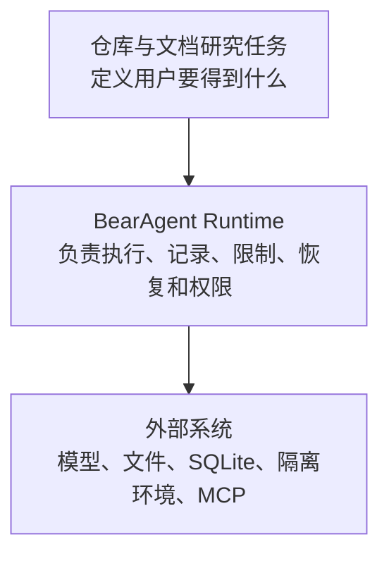

# BearAgent 产品定位

## 1. 一句话说明

> **BearAgent 是一个本地优先的个人 Agent Runtime：先让仓库与文档类长任务真正跑通，再把执行记录、失败处理和权限边界做可靠。**

本地优先表示任务记录和产物默认保存在用户自己的电脑或服务器。Runtime 表示 BearAgent 不只提供
几个可以拼装的函数，而是负责组织 Agent 的执行、限制、记录、恢复和权限判断。

## 2. 用户真正遇到的问题

一次模型回答失败，通常可以重新提问。一次持续几分钟并写文件的 Agent 任务失败后，系统必须先
回答更具体的问题：

1. 模型和工具已经做过什么，用户能否查看？
2. 一个写操作超时后，结果究竟是失败、成功，还是暂时无法确认？
3. 模型为什么有权读取或修改这个资源？

BearAgent 的原则是：结果能确认才继续；无法确认就停下并说明情况，不把猜测写成成功。P1 回答
“发生了什么”，P2 回答“下一步怎样做才安全”，P3 回答“动作是否获准、只能影响哪里”。

## 3. 先服务谁，先完成什么

首要用户是愿意在本机或自己的服务器运行 Agent 的开发者、研究者和高级用户。他们需要处理仓库、
文档和技术资料，也在意数据所有权、调试能力和文件访问范围。

第一个可用场景是仓库与本地文档研究：

> 在一个明确指定的工作区里查找和比较资料，并把报告或说明写入 `outputs/**`。

P1 不联网搜索，也不修改工作区中已有源码和输入文件。同一组本地任务会继续用于 P2 的中断恢复
演练和 P3 的授权、隔离测试。这样，每个 Runtime 模块都能对应到一个用户看得懂的结果。

## 4. 产品与 Runtime 的关系

长期还要服务研究者：让不同诊断、证据验证与恢复方法在同一 Runtime 上比较。算法提出假设和动作，
核心继续守住事实、预算和授权。先用固定文件任务与故障注入形成实验，再把确实需要替换的部分提取为
port；不因“框架”目标提前增加插件平台或通用编排。边界与步骤见[科研底座规划](research-runtime.md)。

Agent 是模型、工具、说明和限制的配置；Run 是处理一条用户请求的一次执行；Tool 真正读写外部
环境；Skill 只提供可复用说明；Workflow 是代码预先确定步骤的流程。Runtime 组织这些部分，但
不会把说明文本当成权限。

第一版只有一个 Agent。需要固定步骤时使用 Workflow，需要改变外部世界时通过 Tool，需要授权时
由 Runtime 检查 Grant，而不是增加一组会聊天的角色。

## 5. BearAgent 不靠功能清单证明差异

Proma、Manus、Claude Code 等完整产品重视工作区、工具和交互体验；DeepTutor 针对教学任务组织
流程和资料；LangGraph、Pydantic AI 帮助开发者搭建 Agent；Inspect、E2B 和 MCP 分别覆盖评测、
隔离执行和工具连接。

BearAgent 不声称这些项目没有持久化、审批或 sandbox，也不把它们的能力复制进自己的当前状态。
它选择负责一个更窄的边界：

> **在个人能够维护的本地系统里，用同一份执行记录说明任务做过什么、为什么继续或停下，以及每个外部动作为什么被允许。**

因此差异要用具体证据表达：中断后是否重复写入，结果不明时是否停住，篡改批准参数是否被拒绝，
runner 是否读不到宿主密钥。不能只写“支持持久执行”或“安全性更好”。

## 6. 每个阶段增加什么

| 阶段 | 用户看到的变化 | 主要证据 |
|---|---|---|
| P1 可检查执行 | 固定本地任务可以完成，过程和失败可查看 | 任务集、路径拒绝、预算终止、完整 Event |
| P2 可恢复执行语义 | 根据副作用证据选择复用、重试、reconcile 或停下 | kill point、Attempt、不重复写入、`UNKNOWN` |
| P3 授权与隔离执行 | 危险动作必须获准，并且只能在受控 runner 中运行 | 批准参数篡改、等待批准恢复、secret/资源隔离 |
| P4 接入与日常使用 | 安全自托管后，Skill、MCP、Web、Memory 依次接入 | 新入口仍经过 Event、恢复、Policy 和 runner 路径 |
| P5 持续评测 | 可以比较版本变化带来的回归 | 固定数据集、执行路径断言、跨版本报告 |

评测从 P1 开始记录。P5 负责把早期任务、恢复和安全演练变成持续比较系统，而不是第一次开始
验证 Agent 的行为。

## 7. 有意保持的边界

P1 至 P3 固定为单用户、单 Agent、单个 Runtime 进程、SQLite 和 CLI 优先。只接有限模型协议和文件
工具，所有外部动作都经过统一执行入口，主 Runtime 进程不执行模型生成的 shell。P4 才增加
HTTP/SSE、认证和公网自托管。

项目不承诺任意外部写入 exactly-once，也不使用“绝对安全”“永不丢任务”等表达。通用语义死循环
检测、Routing、Web UI、Memory、任意联网、浏览器控制、多个 Agent、多用户和分布式 worker 都在
核心闭环以后；P1 的 hard budget 继续作为失控执行的最终兜底。

## 8. 对外表达

推荐直接说明：

- 让个人 Agent 在本地可靠地完成长任务；
- 每一步可查看，结果不明时不乱重试，危险操作必须获准；
- 首个场景是仓库与本地文档研究；
- 当前能力以状态页、代码和测试为准。

不要写成“开源 Manus”“Claude Code 替代品”“全能个人助理”，也不要把路线图或参考项目的能力
写成 BearAgent 已经实现。

## 9. 与其他文档的分工

本文件回答“为谁解决什么问题”。[总体架构](../architecture/overview.md)说明 Runtime 各部分怎样连接，
[项目路线图](roadmap.md)说明按什么顺序交付和验收。新增 Feature 应先说明它强化了哪一项用户结果，
而不是只增加了多少功能。
