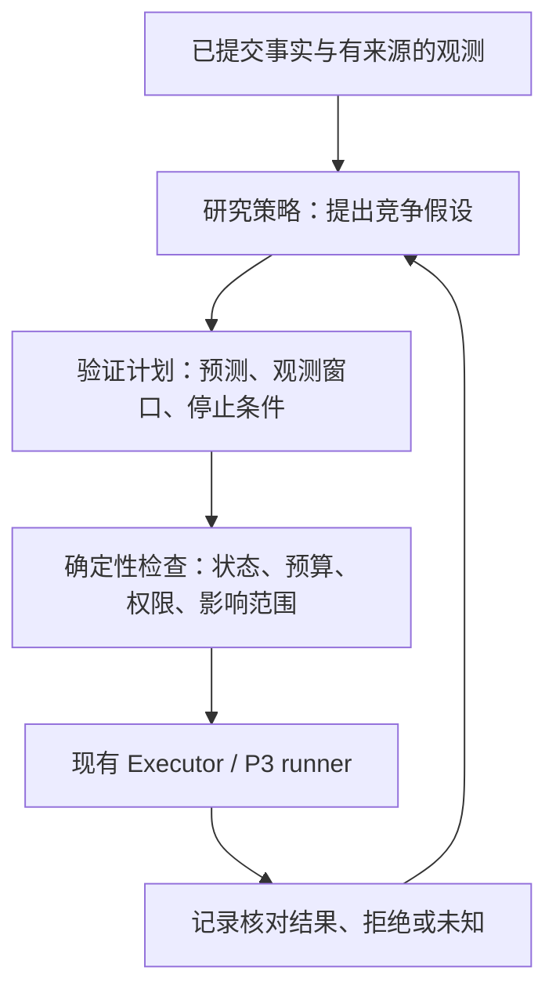

# 怎样让 BearAgent 逐步成为科研实验底座

假设两次文件任务都报告“写入超时”。第一次还没有替换文件；第二次已经替换，只是完成 Event 尚未
保存。直接重试可能得到相同的最终文件，却掩盖第二次多执行了一次写入。一个研究算法如果只看最终
答案或总成功率，就分不清这两种恢复质量。

BearAgent 可以先把这件小事做成可重复实验：在明确边界注入中断，保留事实，让不同策略提出下一步，
再用同一套规则检查它们是否安全、是否有效、代价多少。扩展接口应该从这些实验长出来。

## 1. 研究动机与适用范围

本规划参考项目所有者在 Future 中可读取的“比较两个RP”和“分析RP写作结构（王涌豪RP）”讨论。
读取日期为 2026-09-05；接口没有提供附件正文，因此这里只提炼讨论中一致出现的研究主线，不宣称
核对了最终 RP 的每个论断：阶段感知、依赖关系约束的故障假设、通过小规模干预验证、受控恢复。

可以迁移的是研究方法：**恢复有效，不等于诊断正确；诊断置信度也不等于执行权限。**
不能直接迁移的是系统范围。BearAgent 的模型请求、Tool、文件和持久化边界，不是 LLM serving 的
prefill、decode、KV transfer、GPU 或网络拓扑。只调用模型 API 也看不到服务内部的跨层因果。

因此先定位为“可检查、可恢复、可约束的 Agent 实验 Runtime”。LLM serving 是未来可接入的一个独立
实验环境，要有自己的 telemetry、故障注入器和 ground truth，不能由 BearAgent 的成功率代替其验证。

## 2. 先分清四种判断

| 判断 | 它能说明什么 | 它不能说明什么 |
|---|---|---|
| 执行事实 | 某个请求或结果 Event 已提交 | Event 缺失不证明外部动作没发生 |
| 副作用核对 | Receipt 或目标状态与预期结果吻合 | read-after-write 不能单独证明超时的根因 |
| 故障诊断验证 | 干预后出现预先预测的中间信号，竞争解释受到检验 | 服务恢复本身不证明因果解释唯一正确 |
| 授权与隔离 | 当前动作可以在指定资源和预算内执行 | 获批不保证算法判断正确 |

`UNKNOWN` 只用于外部副作用结果不明。诊断证据不足应表达为“假设未验证/无法区分”，不能把所有
不确定性塞进同一个 Run 状态。

## 3. 不可替换的规则与可替换的研究策略

研究策略可以替换假设排序、证据选择、验证计划或恢复提议。Event 的追加规则、预算、Policy、
Executor 和隔离边界继续由 Runtime 控制。即使策略写出“已获批准”或给出 99% 置信度，也只是数据。

未来可按需引入 `DiagnosisStrategy`、`VerificationStrategy`、`RecoveryStrategy` 等 port；这些名称是
设计草案，不是当前 SDK。先用规则基线与一个候选算法证明接口能替换，再稳定公开 API。暂不需要插件
市场、通用 Workflow engine、多个 Agent、分布式 worker 或依赖注入框架。

## 4. P2：先建立能比较恢复方法的实验

现有 F-0021 至 F-0024 的 ID 和主要职责保留，每个 Feature 都交付可运行的小切片：

| 顺序 | 范围 | 最小验收实验 |
|---|---|---|
| F-0021 | Event-only 状态重建、非终态检查、版本兼容；Checkpoint 作为可选加速 | 删除/破坏 projection 后从 Event 得到等价状态；未知版本拒绝继续 |
| F-0022 | Activity/Attempt、失败分类、有界 retry、明确的阶段与因果引用 | 同一逻辑操作的两次尝试分别可查，重试消耗同一 Run 预算 |
| F-0023 | 幂等键、Receipt、reconcile、`UNKNOWN` 与受限核对操作 | replace 前后中断时分别重做或复用；无法核对时停止并可人工处理 |
| F-0024 | 控制命令、kill-point suite、实验清单与比较报告 | 同一故障集运行规则基线与候选策略，断言副作用次数和控制命令幂等 |

Checkpoint 不应成为最先解决的问题。先能完整重放，再根据实际重放成本决定是否需要缓存；一旦
加入 Checkpoint，缺失、损坏、版本不兼容都必须回退到 Event-only 路径。

P2 至少保存每次恢复提议的证据引用、理由码、选中的受限动作、检查结果和实际结果。`causation_id`
当前只是每条 Event 新生成的 ID，不代表已经建立了父子因果边；F-0022 应用版本化契约表达真实引用，
不能根据字段名称或相邻时间戳虚构依赖图。

P2 的验证范围先限于只读查询、目标 hash 核对和已声明的幂等接口。更改服务参数、重启进程、canary
流量等有影响的实验，要等 P3 的授权与隔离，或放在独立、受控的测试环境中。P2 不把复杂根因推断
设为恢复正确性的前置依赖。

## 5. P3：让验证动作本身也受到约束

F-0025 的 Grant/Approval 绑定规范化参数、目标、有效期和次数。诊断干预也是 Tool 动作，要受同样的
限制。验证计划还应声明最大延迟、探测次数、允许扰动和提前终止条件。批准某个 canary 不能授权全量
流量切换；诊断结论也不能续期或扩大批准。

F-0026 的 runner 限制文件、进程、资源、输出和网络。每个实验使用隔离环境；模型密钥、主数据库与
用户目录不进入 runner。恢复执行依赖 P2 的 Attempt 和结果核对，runner timeout 不等于动作没发生。

P3 收口实验同时测两件事：错误提议是否被约束，以及合规验证能否减少错误恢复。第一项是必须通过的
工程安全门；第二项是可被实验否定的科研假设，不能预先写成必然优于基线。

## 6. 最小实验契约要在 P2 开始建立

不把研究所需的可比较数据全部推迟到 P5。P2 的实验清单至少记录：

- 数据集与 fixture 版本、输入 hash、故障注入位置、注入时刻与实际触发结果；
- Runtime、模型、Prompt、Tool、Policy、策略版本与可用观测；
- 相同的预算、timeout、停止条件和初始环境；
- 只对实验评估器可见的 ground truth，不能提前泄漏给诊断算法；
- Event/Attempt、假设与证据引用、预测的中间信号、验证结果、最终文件和副作用次数；
- 答案质量、延迟、额外 token/费用与环境扰动；缺失的 usage/定价单独标记，不计作零成本。

先比较“仅规则恢复”“诊断后直接行动”“诊断后先验证”三组。复合故障、相同症状的不同原因、短暂
故障、永久故障、错误归因和无故障控制组都要覆盖。危险基线只能在测试环境运行，不能为得到比较数据
而关闭正常 Runtime 的安全门。

| 研究问题 | 要看的指标 | 必须控制的偏差 |
|---|---|---|
| 是否减少错误恢复 | 有害/无效动作率、重复副作用数、最终任务成功率 | 各组使用同一允许动作集合 |
| 是否更会区分原因 | 假设排序、误归因率、拒判率与覆盖率 | ground truth 由注入器/独立观测提供 |
| 验证是否值得 | 增加的延迟、token/费用、扰动，换来的错误动作减少量 | 验证成本纳入总预算，不只报告恢复后的延迟 |
| 是否泛化 | 留出故障、留出任务与复合故障的结果 | 不在报告集上调参；记录失败和缺失数据 |

干预前必须写下可推翻的预测，例如“如果主要问题来自 X，信号 A 应先改变，再影响最终结果 B；信号 C
应保持”。结果只改善 B 时，假设仍未被充分验证。观察窗口、对照组与停止阈值应在实验前确定。

先运行确定性 Fake 回放，再运行真实模型重复试验。对模型实验报告样本量、配对条件、方差或置信区间；
相同 seed 也不承诺网络模型逐字重现。5/5 功能 gate 说明链路可用，不是算法优越性的统计证据。

## 7. P4/P5 怎样演进

P4 保持服务入口与日常使用，但按实验需求选择 Skill、MCP、Memory 等接入，避免它们抢占恢复验证主线。
LLM serving 接入可以是单独的、经过授权的环境 adapter，先对接一个环境，不把 GPU scheduler 写进
BearAgent 核心。需要的观测应通过新的有界契约提供，不扩充 P1 stderr 日志来暗中保存敏感内容。

P5 负责跨版本持续回归、报告聚合与更完整的 trace。它复用 P2/P3 已经形成的实验契约，而不是那时才
开始考虑 reproducibility。只有实验需要真实并发、长 timer 或跨进程协调时，才讨论 P6+ 的扩展。

## 8. 参考与证据边界

- [AI Agents in Depth 第 1 章](https://bojieli.github.io/ai-agent-book/book/chapter1/)：参考从具体工具
  例子引出概念、再安排消融实验的叙述顺序；不把书中的能力写成 BearAgent 当前实现。
- [该书第 7 章：Agent 的评估](https://bojieli.github.io/ai-agent-book/book/chapter7/)：参考把评估问题与
  实验安排连接的写法。2026-09-05 读取，首页显示最近更新日期为 2026-09-03。
- [AIOpsLab 官方仓库](https://github.com/microsoft/AIOpsLab)：作为环境、故障和评估器分开的对照。
  2026-09-05 检查[提交记录](https://github.com/microsoft/AIOpsLab/commits/main)，最近可见提交为
  2026-08-19 的 `ddf7e40`，有近期维护活动；这不代表维护承诺，也不在此引入该项目作为依赖。

当前实现证据见[审查记录](p1-closure-review.md)。这份文件的策略接口、因果验证算法和 serving 接入均为
规划，开始实施仍需独立接受 Feature Spec、相关 ADR 和 Plan。
