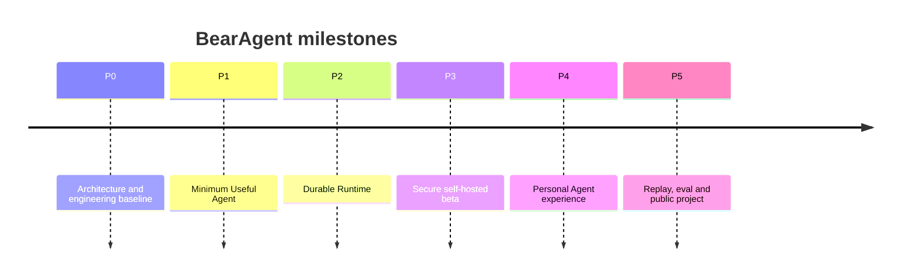

# BearAgent 项目启动大纲与路线图

## 1. 为什么做一个个人 Agent

### 1.1 产品价值

通用聊天产品擅长回答，但个人长期工作还需要：访问自己的 workspace、使用自己的工具、保留可审计状态、在中断后继续、按自己的权限规则行动，并能部署在自己控制的环境里。

BearAgent 不追求“所有能力都有”，而追求一个可以真正托付本地文件和长任务的最小产品。

### 1.2 学习与技术价值

直接调用一个 Agent framework 可以很快得到 demo，但很难真正理解：

- Agent Loop、streaming 和 context budget；
- tool protocol、调度、超时和取消；
- event sourcing、checkpoint 和恢复；
- 幂等、未知提交结果和补偿；
- capability security、审批和 sandbox；
- trace、replay、eval 和成本治理。

BearAgent 把这些系统问题变成可运行、可测试的工程。这比再做一个聊天 UI 更适合作为长期 AI Infra / Agent Systems 项目。

### 1.3 个人可维护性

这个项目从一开始限制为单用户、单进程、SQLite、CLI-first。只有出现真实指标或使用场景，才增加 Web、MCP、Memory、多用户或分布式组件。这样一个人可以理解整个系统，也可以逐层替换 adapter。

## 2. 要做什么样的 Agent

一句话：

> BearAgent is a lightweight, local-first and self-hostable runtime for safely and reliably executing long-running, tool-intensive personal AI tasks.

首个目标用户是项目作者本人，首个任务域是 **工作区文件与技术研究/编码辅助**：

- 读取和检索项目资料；
- 生成或修改限定目录内的文档/代码；
- 多轮调用工具完成一个可交付 Artifact；
- 在危险动作前申请批准；
- 进程重启后从已确认的安全边界继续；
- 查看每一步模型、工具、审批、成本和错误。

第一版“完整”的定义不是功能多，而是以下闭环全部成立：

```text
request -> plan/act -> tool -> durable state -> failure/restart
        -> resume -> result/artifact -> trace/eval
```

## 3. 成功指标

### 3.1 P3 项目完成线

- 10 个固定端到端任务中至少 8 个无需修改代码完成；
- 在三个安全边界强制杀进程后，Run 可以恢复且不重复已确认副作用；
- workspace 逃逸、审批参数篡改和 host shell 三类安全测试全部阻断；
- 所有 Run 可导出 event/trace，失败能定位到 Activity；
- 新开发者或新 AI 任务只靠仓库文档可解释核心术语、边界和验证命令；
- Docker Compose 能在一台干净 Linux 服务器上部署并从备份恢复。

### 3.2 需要持续观察

- 任务成功率、人工接管率；
- 每 Run token/cost、P50/P95 时长；
- Tool 调用成功/重试率；
- Approval 数量与等待时间；
- 恢复次数、恢复延迟和 `UNKNOWN` 活动；
- 文档/测试遗漏导致的回归数。

## 4. 推荐总节奏

对于一个人、AI 辅助、每周有稳定开发时间的情况，可把 **P0-P3 规划为 6-8 周 / 25-35 个专注开发日**。这是范围控制参考，不是交付承诺；每个阶段以验收门槛而不是日期结束。



## 5. P0：项目基线（3-5 个专注开发日）

**状态：已完成（2026-08-09）。** 实现范围与验证证据见 [F-0000 P0 Engineering Baseline](../specs/F-0000-p0-engineering-baseline.md)。

### 目标

让仓库具备可持续 AI 开发的最小骨架，所有人对术语和边界达成一致。

### 功能/产物

- README、Architecture、SOP、Roadmap、Deployment、Spec/ADR 模板；
- 首批 5 个 ADR；
- Python/uv 工程骨架和 lockfile；
- domain/runtime/ports/adapters/interfaces 目录；
- Ruff、Pyright、pytest、pre-commit（可选）和 CI；
- 文档链接检查；
- `bearagent --help`、`bearagent doctor`；
- fake model、fake tool、in-memory store，为后续测试打底。

### 验收

- 干净机器按 README 可安装并运行检查；
- CI 运行 lint/type/test/docs checks；
- import boundary test 能阻止 runtime import FastAPI/provider SDK；
- 新功能能从模板创建 Spec 并按 SOP 走完一次小修复。

## 6. P1：Minimum Useful Agent（7-10 个专注开发日）

**状态：未开始。** 第一个 Feature Spec 尚未创建。

### 目标

本地 CLI 可以完成一次真实、受限、可追踪的文件任务。

### 功能

- 内部 Message/ModelRequest/ModelEvent；
- 一个真实 ModelProvider adapter；
- bounded Agent Loop：max iterations、tokens、wall time、tool calls；
- ToolRegistry、ToolSpec、ToolRequest、ToolResult；
- `list_directory/read_file/search_files/write_file`；
- workspace path boundary、字节上限、timeout；
- SQLite sessions/runs/events/activities/artifacts；
- CLI streaming、inspect、events、JSON output；
- 结构化错误分类和日志关联 ID。

### 明确不做

- shell、任意 HTTP、MCP、Memory、Web UI；
- 任意并行 tool calls；先串行证明语义。

### Demo

```text
bearagent run "阅读 docs 下的架构和 SOP，生成一份不超过 800 字的项目介绍到 outputs/intro.md"
```

### 验收

- 真实模型成功完成 demo 并生成 Artifact；
- 模型请求非法路径时被拒绝，并收到结构化 Tool error；
- 每个模型/工具 Activity 可在 `run inspect` 中查看；
- 预算耗尽时 Run 以明确错误终止，不无限循环；
- Event schema 有 snapshot/compatibility test。

## 7. P2：Durable Runtime（7-10 个专注开发日）

**状态：未开始。**

### 目标

让 BearAgent 与普通 while-loop demo 拉开差距：重启、取消、重试和未知副作用有真实语义。

### 功能

- 纯 reducer 从 Event 重建 RunState；
- Checkpoint + event tail recovery；
- `pause/resume/cancel/retry` commands；
- Activity idempotency key、receipt 和 `UNKNOWN`；
- 原子 workspace write 和 content hash；
- startup recovery coordinator；
- fault injection hooks；
- golden trace export/import；
- schema migration from empty and previous version。

### 故障演练

在以下位置 kill runtime：

1. ModelCallRequested 后、Completed 前；
2. ToolCallCompleted 已提交后、下一次 ModelCall 前；
3. 等待审批时；
4. workspace 临时文件写入后、rename 前；
5. cancellation 发出时。

### 验收

- 重启后 Run 恢复到正确边界；
- 已确认成功的写文件不重复；
- 无法确认的外部写不会自动重试，而是 `UNKNOWN`；
- 删除 Checkpoint 后仍能从 Event 重建同一状态；
- cancel 后没有新的 Activity 被调度。

P2 完成后即可部署一个 **仅自己通过 SSH tunnel 使用的服务器 staging**，尽早发现 Linux、volume、时区、进程重启和文件权限差异。

## 8. P3：Secure Self-hosted Beta（7-10 个专注开发日）

**状态：未开始。**

### 目标

在自己的服务器上安全运行单用户 beta，而不是把本地开发进程直接暴露到公网。

### 功能

- PolicyEngine 与 Grant；
- `allow/ask/deny`、绑定精确参数的一次性 Approval；
- FastAPI + SSE；
- 单用户认证、session/CSRF 基线、rate limit；
- Docker/Podman SandboxBackend 和 runner sidecar；
- shell/code tool 仅在 runner 可用时注册；
- runner CPU/memory/PID/time/output/network 限制；
- API secrets 与 runner/workspace 隔离；
- Docker Compose、healthcheck、restart、volume、backup；
- 1Panel reverse proxy、HTTPS 和访问日志；
- security/recovery runbook。

### 验收

- `agent.bearguin.cn` 通过 HTTPS 和认证访问；
- API 端口只监听服务器 loopback 或 private Docker network；
- runner 内不可读取 provider key、宿主根目录和 Docker socket；
- 高风险命令修改参数后旧 Approval 失效；
- 备份 SQLite + artifacts 后能在空目录恢复；
- 服务重启后非终态 Run 得到正确恢复处理。

### 里程碑意义

P3 就是第一个“完整项目”：本地和服务器均可运行、有真实安全边界、有恢复和审计，并且不是只在 happy path 上工作的 demo。

## 9. P4：Personal Agent Experience（10-15 个专注开发日）

**状态：未开始。**

### 目标

在不破坏内核的前提下，让它变成每天能用的个人 Agent。

### 功能

- 最小 Web UI：session/run、stream、approval、artifact、trace；
- Skill loader 和版本化 manifest；
- MCPToolProvider，按 server/tool 授权；
- 文件型 episodic/profile Memory，带 provenance/confidence/expiry；
- SQLite FTS5 检索；
- ContextBuilder token budget、可恢复压缩和 todo recitation；
- 基础 HTTP fetch/search（单独 Grant、SSRF 防护）；
- Provider 配置体验和成本显示。

### 验收

- 新 Skill 不改 runtime 代码即可被加载；
- MCP tool 与内置 tool 走同一 Policy/Event/ToolResult；
- 用户能查看某条 Memory 的来源并删除；
- 长任务压缩后仍可通过文件/event reference 恢复关键证据；
- Web 和 CLI 操作的是同一 Run，不存在两套业务逻辑。

## 10. P5：Trace、Replay、Eval 与公开项目（持续）

**状态：未开始。**

### 目标

把 BearAgent 从个人可用工具升级为有工程/研究说服力的 Agent Infra 项目。

### 功能

- OpenTelemetry traces 和 metrics；
- eval dataset、grader、trace assertions；
- 模型/Prompt/Skill/Tool 版本对比；
- replay with fake adapters；
- cost/latency/success dashboard；
- chaos/recovery benchmark；
- 文档站、architecture deep dives、tutorial、release notes；
- public security model 和 responsible disclosure。

### 验收

- 固定 eval 在 CI/nightly 可复现；
- 修改 Prompt/模型/Tool schema 时能看到答案与执行轨迹回归；
- 文档中每个核心承诺有代码/测试证据链接；
- `docs.bearguin.cn` 可公开访问并随 release 构建。

## 11. P6+：只有需求证明后再做

**状态：候选范围，未排期。**

- Child Run 形式的 Multi-Agent：独立 budget、Grant、Checkpoint 和 trace；
- schedules/webhooks/long timers；
- browser/computer use；
- hybrid/vector RAG；
- 消息渠道；
- PostgreSQL、多 worker、queue、lease；
- Temporal 或其他 durable workflow engine；
- 多用户和租户隔离。

进入任一项前都要给出触发证据，例如“SQLite 写入争用达到阈值”“有跨天 timer”“需要三台 worker”，而不是因为参考项目已经支持。

## 12. 第一批 Feature Backlog

`F-NNNN` 是全项目稳定 ID；下面是尚未创建 Spec 的规划映射。创建 Spec 时必须在 Front Matter 写入对应 `milestone`。如果 Feature 调整阶段，只修改 `milestone` 和本节归组，不修改 Feature ID。

### P1

1. F-0001 Domain IDs, messages and errors
2. F-0002 Run reducer and budgets
3. F-0003 EventStore contract and SQLite adapter
4. F-0004 ModelProvider contract and first adapter
5. F-0005 Tool contract and registry
6. F-0006 Workspace boundary and read tools
7. F-0007 Atomic write tool and artifacts
8. F-0008 CLI run/inspect/events

### P2

1. F-0009 Checkpoint and startup recovery
2. F-0010 Cancel/retry/idempotency/unknown

### P3

1. F-0011 Policy and approval
2. F-0012 Sandbox runner
3. F-0013 HTTP API/SSE/auth
4. F-0014 Compose/self-host backup and restore

不要并行铺开全部 backlog。始终只维护 1 个主 Feature 和至多 1 个小修复在进行中。

## 13. 项目名称与对外叙事

项目名继续使用 **BearAgent**；底层 package 使用 `bearagent`。暂时不拆出 BearRuntime 子品牌，避免早期命名和仓库分裂。

对外 README 的核心叙事：

1. 普通 Agent demo 在失败、权限和副作用上有什么缺口；
2. BearAgent 如何用 Event、safe-boundary recovery、Policy 和 runner 解决；
3. 一个从 crash 到 resume 的真实 demo；
4. 如何本地运行和自托管；
5. 哪些功能故意没有做。

这比“支持 30 个模型、20 个工具”更能体现项目价值。
