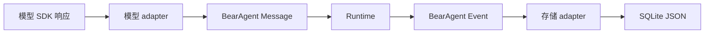

真实模型返回一个 SDK 对象，SQLite 最终保存 JSON，命令行又要显示错误。如果三处直接交换任意
字典，很快就会出现三种 `run_id`、三套消息字段和互不兼容的错误格式。

F-0001 的解决办法很朴素：进入 Runtime 之前，把外部数据翻译成 BearAgent 自己定义的数据类型；
离开 Runtime 时，再由对应 adapter 翻译出去。

:::tip[这部分已经实现]
类型化 ID、Message、Error、通用 Event 外壳和 JSON schema 快照已有代码与测试。F-0003 与 F-0004
已经分别让 SQLite 和 OpenAI Responses adapter 在边界完成显式翻译；F-0006 的 Registry、Policy 和
Executor 也只交换 BearAgent 的 ToolSpec、请求、结果和 Error。完整 Agent Loop 仍未实现。
:::

## 几类核心数据各解决一个具体问题

### ID 防止把对象认错

`RunId` 和 `ActivityId` 最终都能写成 UUID 字符串，但它们不是同一个概念。使用不同类型后，
代码和静态检查可以发现把 Run ID 传到 Activity 参数中的错误。排序依靠 Event sequence 或时间，
不依赖 UUID 文本。

### Message 表示模型真正需要看到的内容

Message 区分 system、user、assistant 和 tool 四种角色。内容目前只有文本、工具请求和工具结果。
某个 Provider 使用什么响应类、字段名或流式事件，由它自己的 adapter 处理。

### Error 只保存可以安全传播的信息

错误包含稳定分类、代码、是否可重试和经过筛选的详情。原始异常、堆栈、认证头和密钥不会直接
进入可序列化错误。这样 CLI、Event 和日志可以共享错误含义，同时减少意外泄露。

### Event 说明一条事实属于哪里

每条 Event 都有自身 ID、Run ID、sequence、类型、版本、带时区时间和 JSON payload。F-0001 只
建立这个通用外壳；“模型调用完成”或“Run 失败”等具体 payload 由后续 Feature 增加。

### Tool 数据把模型请求和执行结果分开

`ToolRequest` 保存模型提出的名称和参数，`PreparedToolRequest` 表示 Tool 已经完成校验和规范化，
`ToolResult` 只允许明确成功或明确失败。`ToolSpec` 则来自受信任的注册代码，声明副作用、timeout 和
输入输出上限。Policy 因此不需要读取某个模型 SDK 的 function-call 对象。

## 这条数据边界不承诺什么

BearAgent 模块之间只交换 BearAgent 自己的数据类型，模型 SDK 对象在 adapter 边界完成翻译。
这没有要求所有外部系统使用相同格式，也没有把这些内部类型承诺为第三方 Python SDK。

## 验证入口

- 代码：`src/bearagent/domain/`
- JSON schema 快照：`tests/contract/snapshots/domain_schemas.json`
- 单元与安全测试：`tests/unit/`、`tests/security/`
- 进一步阅读：[从数据边界开始读代码](../development/domain-contracts.md)
