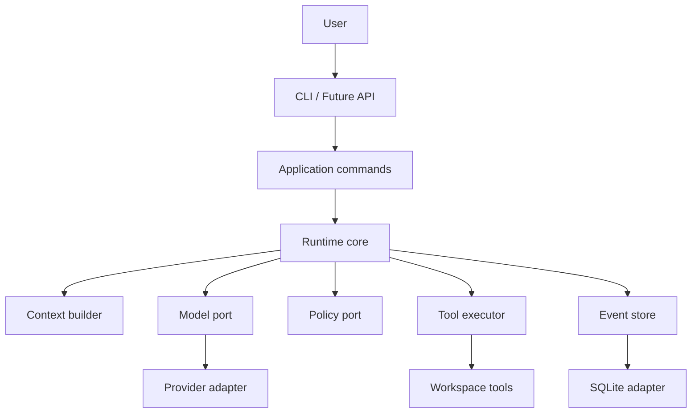

BearAgent 将不可预测的模型决策放在一个有明确边界的 Runtime 中。核心领域只使用 BearAgent
自己的类型；模型 SDK、数据库、CLI 和未来的 HTTP API 都位于 Adapter 或 Interface 边界。

:::caution[内容状态：已接受架构，不等于全部实现]
当前只完成工程基线和 F-0001 领域契约。下图展示 P1-P3 的目标分层。
:::



## 依赖方向

```text
interfaces -> application -> domain/runtime ports
adapters   --------------------^
```

外层实现依赖内层契约。Runtime Core 不 import Provider SDK、Starlight、数据库 Adapter、FastAPI
或 UI。外部对象必须在 Adapter 边界翻译为内部领域类型。

## 四条主线

1. **Durable execution**：Run、Activity、Event、Checkpoint、恢复和幂等。
2. **Authority and isolation**：Grant、Policy、Approval、Workspace 和 Sandbox。
3. **Trace and replay**：持久事实、可重建状态和可比较轨迹。
4. **Context and memory**：可追溯的上下文压缩与长期记忆，而不是先堆检索组件。

下一步可以阅读 [F-0001：为什么先建立领域契约](domain-contracts.md)。
