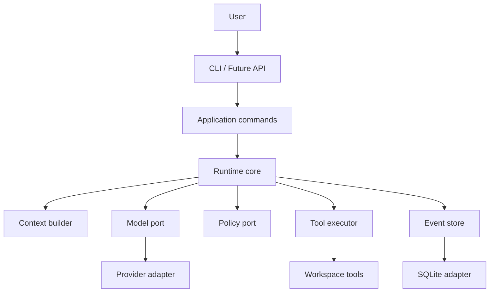

BearAgent 将不可预测的模型决策放在一个有明确边界的 Runtime 中。核心领域只使用 BearAgent
自己的类型；模型 SDK、数据库、CLI 和未来的 HTTP API 都位于 Adapter 或 Interface 边界。

:::caution[内容状态：已接受架构，不等于全部实现]
当前只完成工程基线和 F-0001 领域契约。下图展示 P1-P3 的目标分层。
:::



## 依赖方向

```text
interfaces -> application -> domain/runtime ports
adapters   --------------------^
```

外层实现依赖内层契约。Runtime Core 不 import Provider SDK、Starlight、数据库 Adapter、FastAPI
或 UI。外部对象必须在 Adapter 边界翻译为内部领域类型。

## 四条架构主线

1. **Inspectable execution**：Run、Activity、Event、预算和 Artifact 让执行可解释。
2. **Honest recovery**：Checkpoint、幂等、receipt 和 `UNKNOWN` 让恢复语义真实。
3. **Authority outside the model**：Grant、Policy、Approval、Workspace 和 Sandbox 约束副作用。
4. **Local ownership**：单用户、单进程、SQLite、CLI-first，复杂度按证据增加。

Trace/replay/eval 是这些主线的验证面；Context、Skill、MCP 与 Memory 后置到 P4。下一步可以阅读
[产品定位](../project/positioning.md)或 [F-0001：为什么先建立领域契约](domain-contracts.md)。
