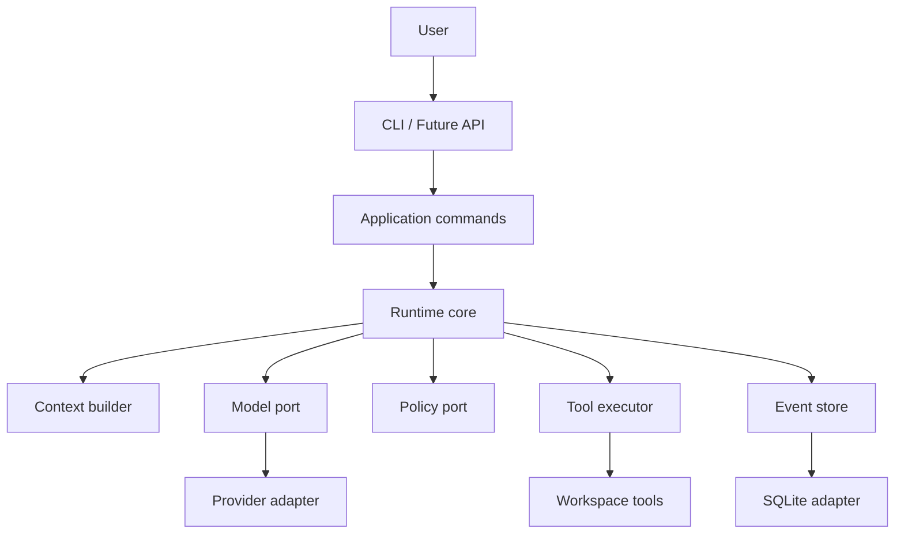

BearAgent 将不可预测的模型决策放在一个有明确边界的运行时中。核心层只使用 BearAgent
自己的类型；模型 SDK、数据库、CLI 和未来的 HTTP API 都位于适配器（Adapter）或外部入口
（Interface）边界。

:::caution[内容状态：已接受架构，不等于全部实现]
当前已完成工程基线、F-0001 内部数据格式、F-0002 reducer/预算、F-0003 SQLite EventStore 与
F-0004 ModelProvider boundary。
下图其余模块仍展示 P1-P3 的目标分层。
:::



## 依赖方向

```text
interfaces -> application -> domain/runtime ports
adapters   --------------------^
```

外层实现依赖内层规则。运行时核心不导入模型服务 SDK、Starlight、数据库适配器、FastAPI
或 UI。外部对象必须在适配器边界翻译为内部类型。

## 四条架构主线

1. **Inspectable execution**：Run、Activity、Event、预算和 Artifact 让执行可解释。
2. **Honest recovery**：Checkpoint、幂等、receipt 和 `UNKNOWN` 让恢复语义真实。
3. **Authority outside the model**：Grant、Policy、Approval、Workspace 和 Sandbox 约束副作用。
4. **Local ownership**：单用户、单进程、SQLite、CLI-first，复杂度按证据增加。

Trace/replay/eval 是这些主线的验证面；Context、Skill、MCP 与 Memory 后置到 P4。下一步可以阅读
[产品定位](../project/positioning.md)、[F-0001：为什么先统一内部数据格式](domain-contracts.md)或
[持久事实与安全恢复的边界](../learn/durable-events.md)。
