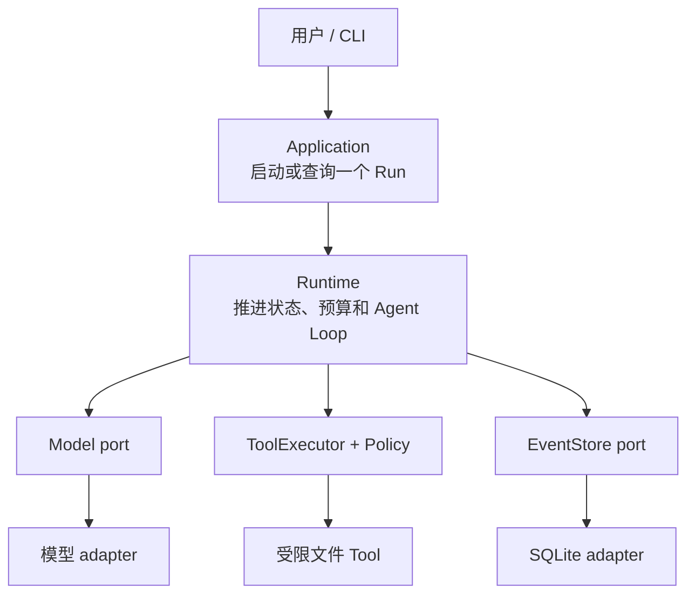

BearAgent 的架构不是从“需要多少服务”开始，而是从一次任务的责任开始：谁理解目标，谁能接触外部
环境，谁决定权限，谁保存事实，进程中断后又能依据什么继续。

假设用户要求：读取 `docs/` 下几份文件，把结论写入 `outputs/report.md`。理想的完整路径是：

:::caution[完整路径尚未全部接通]
当前已实现内部数据、Run/Activity 状态、Reducer、预算、SQLite EventStore、OpenAI Responses adapter，
以及 Registry、固定 Policy、ToolExecutor 和四个 workspace Tool。ContextBuilder、Agent Loop 和 Run
CLI 尚未实现；恢复、用户 Approval 和 sandbox 属于后续阶段。
:::

## 六个区域分别回答什么问题

| 区域 | 它回答的问题 | 当前代码位置 |
|---|---|---|
| Domain | 模块之间允许交换什么数据？ | `src/bearagent/domain/` |
| Runtime | 下一步能不能发生，状态怎样变化？ | `src/bearagent/runtime/` |
| Port | 核心需要外部系统提供什么行为？ | `src/bearagent/ports/` |
| Adapter | SQLite、OpenAI 或具体 Tool 怎样满足行为？ | `src/bearagent/adapters/` |
| Application | 一个用户用例怎样编排这些能力？ | `src/bearagent/application/`，尚待建设 |
| Interface | CLI 或未来 API 怎样接收和展示请求？ | `src/bearagent/interfaces/` |

这套划分不是为了让目录显得“企业级”。它的实际效果是：Reducer 不需要知道 Event 存在 SQLite，
Tool Policy 不需要知道请求来自 CLI 还是 Web，模型 adapter 也不能把 SDK response 类型带进 Runtime。

## Port 和 adapter 的区别

`port` 是核心代码提出的内部接口。例如 `ModelProvider` 只要求：给它一个 `ModelRequest`，返回一条
`ModelEvent` 异步流。它不提 OpenAI 的 SSE class。

`adapter` 是一种具体翻译实现。OpenAI adapter 把 BearAgent request 翻成 Responses API 参数，再把
SDK event 翻回 BearAgent event；Fake adapter 则回放测试预设事件。

EventStore 也相同：内存 adapter 和 SQLite adapter 内部做法完全不同，但同一组 contract test 要求
它们对追加、冲突和读取顺序给出一致结果。

## 三条边界比“用了什么框架”更重要

### 数据边界：外部对象先翻译

Model、Tool、数据库和用户输入都先进入 BearAgent domain model。未知字段、非法 JSON、重复 ID、
不匹配的消息 role 和超大输入在这里被拒绝。核心不接收某个 SDK 的便利对象。

### 权力边界：Model 只能请求，不能授权

Model output、文件内容和 Tool result 都是不受信任数据。ToolRequest 必须经过精确 Registry、参数
准备、Policy 和统一 Executor。Prompt 或 Tool schema 不能授予运行权限。

### 事实边界：状态来自 Event，不来自猜测

Event 保存已发生的事实，Reducer 逐条计算 `RunState`。SQLite 中的 Run/Activity 表只是 projection，
用于快速查询；它们不能绕过 Event 直接改变事实。

## 为什么第一版保持单进程和 SQLite

BearAgent 当前面向单用户、本地文件任务。单进程、串行 Activity 和 SQLite 让 transaction、顺序、
超时和恢复语义更容易验证。过早加入 queue、多 worker 和分布式 lease，会先增加不确定性，却不直接
提高旗舰任务完成质量。

架构并不禁止以后扩展。它要求先出现真实压力或用例，再在保持 Event、Policy 和 adapter 边界的前提
下扩展。

## 从哪条路线继续读

- 想跟一次未来完整调用：读[一次请求怎样穿过 BearAgent](runtime-flow.md)；
- 想理解失败、安全和恢复：读[可靠性与安全边界](reliability-boundaries.md)；
- 想理解内部数据：读[模块之间为什么只传 BearAgent 数据](domain-contracts.md)；
- 想直接进入实现：读[怎样顺着代码读懂 BearAgent](../development/)；
- 想核对现在能否使用：读[当前实现状态](../project/status.md)。
