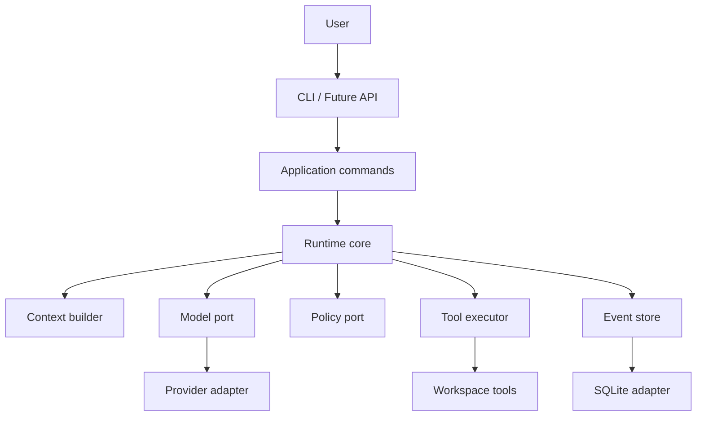

BearAgent 将不可预测的模型决策放在一个有明确边界的 Runtime 中。核心领域只使用 BearAgent
自己的类型；模型 SDK、数据库、CLI 和未来的 HTTP API 都位于 Adapter 或 Interface 边界。

:::caution[内容状态：已接受架构，不等于全部实现]
当前只完成工程基线和 F-0001 领域契约。下图展示 P1-P3 的目标分层。
:::



## 依赖方向

```text
interfaces -> application -> domain/runtime ports
adapters   --------------------^
```

外层实现依赖内层契约。Runtime Core 不 import Provider SDK、Starlight、数据库 Adapter、FastAPI
或 UI。外部对象必须在 Adapter 边界翻译为内部领域类型。

## 架构先解决四件事

1. **过程可查**：每次模型和工具操作、预算、错误和输出文件都能关联起来。
2. **恢复有依据**：已确认的操作不重复，无法确认的操作明确停住。
3. **权限在模型之外**：模型只能提出请求，运行时负责允许、询问或拒绝。
4. **数据由用户掌握**：第一版使用单用户、单进程、SQLite 和命令行，复杂度按真实需求增加。

最小上下文组装属于 P1；复杂压缩、Skill、MCP 与 Memory 后置到 P4。评测从 P1 的固定任务开始，
P2 增加恢复演练，P3 增加安全演练，P5 再形成跨版本比较平台。下一步可以阅读
[产品定位](../project/positioning.md)或 [F-0001：为什么先建立领域契约](domain-contracts.md)。
