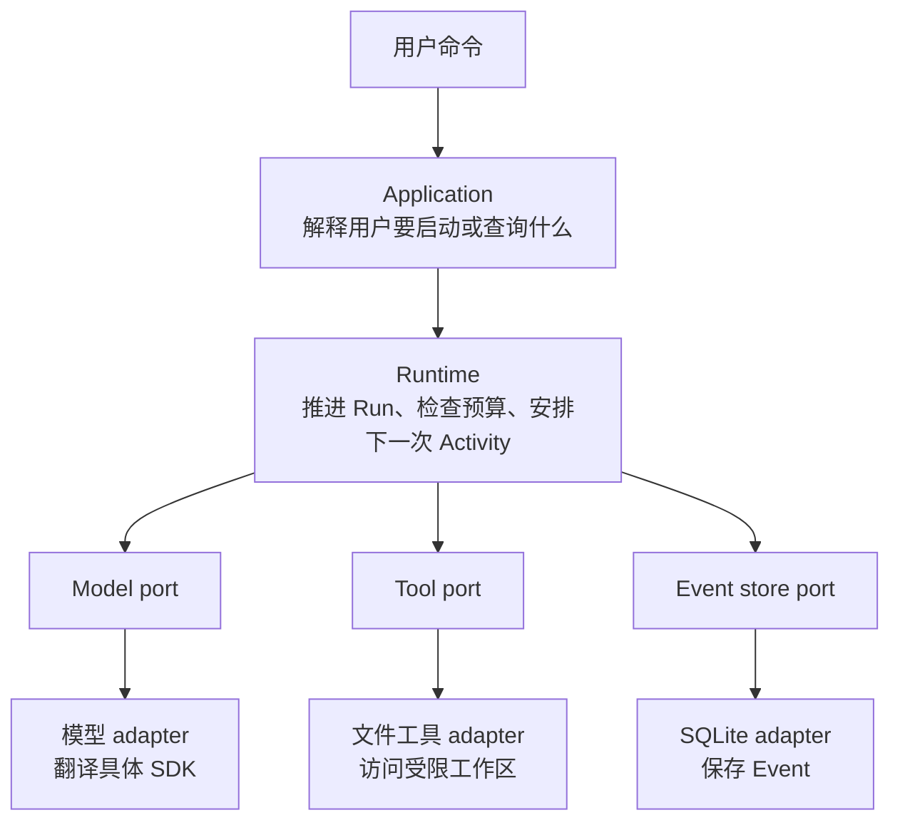

模型请求读取 `docs/architecture/overview.md` 时，BearAgent 需要检查路径、调用文件工具、保存结果，
再把内容交给下一次模型调用。这条路径跨过多个模块，但每个模块只负责其中一段。

:::caution[图中同时包含当前连接和后续能力]
当前已实现领域类型、Run/Activity 状态、Reducer、预算检查、SQLite EventStore、三种显式模型协议
adapter、Registry、固定 Policy、workspace 读写、Artifact、ContextBuilder 和 application Agent Loop。
`run/inspect/events` 已接通 catalog/profile 与 production composition，DeepSeek V4 suite v1.1.1
真实 gate 已通过 5/5；Attempt 与安全恢复属于 P2，用户审批和隔离环境属于 P3。
:::

## 先理解 port 和 adapter

`port` 是 Runtime 向外部能力提出的要求，例如“发送模型请求”或“按顺序保存 Event”。它只描述
Runtime 需要什么，不包含 OpenAI SDK 或 SQLite 的具体做法。

`adapter` 是满足该要求的一种实现。真实模型 adapter 调用模型服务，测试 adapter 返回预设内容；
SQLite adapter 写数据库，内存 adapter 只在测试里保存数据。

这两个词保留下来，是因为它们能准确区分“核心需要的行为”和“外部系统怎样做到”。它们不是为了
给普通函数换一个更高级的名字。

## 同一组测试怎样约束不同实现

假设 Event store 规定：同一个 Run 的 sequence 必须从 1 连续增加。测试会把完全相同的用例分别
跑在内存实现和 SQLite 实现上：

- 追加 sequence 1、2、3，两种实现都应成功；
- 跳过 2 直接追加 3，两种实现都应拒绝；
- 读取时，两种实现都按同样顺序返回 Event。

这样，调用方换用 SQLite 后不用改变使用方式。所谓 `contract suite`，就是这组所有实现都必须
通过的测试。它检验可观察行为，而不是检验实现内部写得是否相似。

## 依赖为什么只能朝里面

Runtime 只能使用 BearAgent 自己的 ID、Message、Error、Event 和 port。具体模型 SDK、数据库连接、
CLI 框架和未来的 Web API 都在外层。外层可以导入核心，核心不能反过来导入外层。

因此更换模型服务或存储方式时，需要修改的是 adapter；Run 状态、预算和权限规则不会被某个 SDK
的数据类型带着一起变化。

## Runtime 长期负责什么

1. 记录每次模型和工具操作，使过程可以查询；
2. 根据 Event 计算状态，并在下一次 Activity 前检查预算；
3. 所有外部操作都经过同一个工具执行和权限入口；
4. P2 中断后只根据已保存事实继续，结果不明时停下；
5. P3 让危险动作同时通过参数绑定授权和隔离 runner；
6. 第一版保持单用户、单个 Runtime 进程和 SQLite，直到实际压力要求更复杂的部署。

先沿[一次请求怎样穿过 BearAgent](runtime-flow.md)看完整顺序，再用
[P1 为什么这样设计](p1-decisions.md)理解单进程、Event、默认拒绝 Policy、相对路径、原子输出和
串行 Loop 的取舍。准备修改实现时，从[开发者入口](../development/)进入代码。
