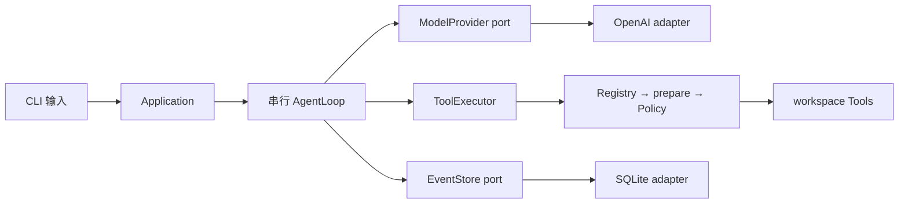

P1 的目标不是“接一个模型，再给它几个函数”。它要让一次本地文件任务完成后，用户能回答：
执行了什么、为什么允许、用了多少资源、结果保存在哪里、失败时哪些事实仍可信。

为此，BearAgent 有意牺牲了并行度、工具数量和界面丰富度。下面每项取舍都从同一个任务出发：

> 阅读 workspace 中的文档，把报告写到 `outputs/report.md`。

## 先看边界放在哪里



依赖从外层指向内部。Runtime 核心只认识 BearAgent 的数据和 port；SDK、SQLite、Typer 和文件系统细节
停在 adapter/interface 层。

## 1. 先用 CLI、单进程和 SQLite

**选择：** P0–P3 保持单用户、单 Agent、单进程；P1 只提供 CLI，并用 SQLite 保存 Event。

**为什么：** 当前真正需要验证的是一次 Run 的状态、预算、文件边界和失败记录。HTTP、队列、多个
worker 和分布式 lease 会增加并发与部署问题，却不会自动让这些语义更正确。SQLite 的 transaction
足以把一条 Event 和对应 projection 原子提交，也便于用户在本地保管数据。

**代价：** 没有 Web UI、后台 daemon、多用户或水平扩展。同一 Run 的 Activity 也不会并行。

**以后怎样扩展：** P3 的 HTTP API 仍应调用同一 application command；只有实测写竞争或跨进程调度
需求出现后，才考虑新的存储与协调组件。

## 2. 核心只交换 BearAgent 数据

**选择：** Model、Tool、EventStore 与 CLI 之间使用 BearAgent 自己的 ID、Message、Error、Event 和
query result。Provider SDK response、SQLite row 和 Typer 类型不能进入 Runtime 核心。

**为什么：** 如果 AgentLoop 直接读取某个 SDK 的 stream 对象，Provider 的事件名、错误和 tool call
身份会扩散到状态机、数据库和 CLI。更换 Provider 时就会连带修改所有模块。

**代价：** 每个 adapter 都要写显式翻译，并维护 contract test 和 JSON Schema 快照。

**得到什么：** Fake Provider 与 OpenAI adapter 可以遵守同一个 ModelProvider contract；内存和
SQLite Store 也能运行同一组 EventStore 行为测试。

## 3. Event 保存事实，Reducer 计算状态

**选择：** Run/Activity 状态和预算 usage 从有序 Event 计算。Run table 和 Activity table 是
projection，不是第二份事实来源。

**为什么：** `RunSucceeded`、`ToolCallFailed` 和“准备调用 Tool”不是同一类东西。只有已经接受并
保存的事实才能改变状态。纯 Reducer 不访问数据库、时钟、模型或文件系统，同一串 Event 因而总能
得到同一结果。

**代价：** 需要维护 Event version、合法转换和 projection transaction；查询不能只随意更新一行状态。

**重要边界：** Event 已持久化不等于 Runtime 会自动恢复。P1 可以重开数据库查询事实，但启动扫描、
Checkpoint、Attempt 和恢复决定属于 P2。

## 4. 权限不来自模型或 Prompt

**选择：** 模型只能提出 `ToolRequest`。真正执行必须经过：

```text
Registry 精确查找
  -> Tool.prepare 校验并规范化参数
  -> FixedToolPolicy 默认拒绝并检查可信 ToolSpec
  -> ToolExecutor 在 timeout 与输出上限内调用一次
```

**为什么：** workspace 文件和 Tool result 都可能包含 Prompt Injection。即使模型被诱导请求一个
危险动作，这个请求仍只是外部不可信数据，不能修改 Registry、Policy 或 ToolSpec。

**代价：** P1 只有固定 allowlist，不支持运行时用户 Approval；新增 Tool 必须先定义副作用、输入、
输出和失败边界。

**以后怎样扩展：** P3 的 Grant/Approval 会替换更细的决策来源，但不能绕过同一条执行路径。

## 5. workspace 只接受相对路径，而且不跟随链接

**选择：** Tool 输入先统一为 `a/b/c` 形式，拒绝绝对路径、`..`、盘符、UNC 和设备路径；执行时逐段
检查真实目录项，拒绝 symlink、junction 和特殊文件。

**为什么：** Policy 必须在文件打开前看到唯一、可移植的资源表示。只做字符串清理挡不住链接逃逸；
只在 adapter 内检查又会让 Policy 对实际资源没有稳定认识。

**代价：** 即使链接指向 workspace 内部也不能读取，一些常见 monorepo 布局会不方便。

**得到什么：** Windows 和 Unix 上，同一个规范化路径表示同一类权限判断；模型也不会看到宿主绝对
根目录。

## 6. 输出只写 `outputs/**`，先完整写完再原子替换

**选择：** `workspace.write` 只接受有限 UTF-8 文本和 `outputs/**` 目标。内容先写到同目录临时文件，
再用一次 `os.replace` 提交；成功结果返回路径、字节数和 SHA-256 Artifact 元数据。

**为什么：** 直接打开目标并覆盖，进程中断时会留下半份文件。同目录 replace 可以保证观察者看到
旧完整文件或新完整文件，不会看到中间内容。

**代价：** P1 不修改源码，也不管理 Artifact 删除、版本和远程存储；所有输出必须适合一次性有限
写入。

**不要夸大：** 原子 replace 不等于 power-loss durability、事务性文件系统或 exactly-once。文件完成
后若 Event append 失败，目标可能已存在但数据库没有确认 Artifact；P2 才负责 reconcile。

## 7. Agent Loop 串行执行，并在外部调用前后保存事实

**选择：** P1 同时最多一个 active Activity。AgentLoop 先保存 requested/started，再调用 Model 或
Tool；返回后保存 completed/failed。

**为什么：** 串行顺序让 Context、预算和 Event sequence 容易检查。started 保存失败时可以确定外部
调用没有发生；completed 保存失败时则明确停下，不把外部动作重新做一遍。

**代价：** 无法并行读取多个文件，长任务吞吐量不是 P1 的优化目标。

**得到什么：** 每次模型调用、Policy 决定、ToolResult、usage 和 Artifact 都能回到同一条 Run 记录。

## 8. timeout 不会自动撤销或重试副作用

**选择：** Provider SDK 自动重试被禁用；ToolExecutor 对同一请求只调用 Tool 一次。timeout 和
`retryable=true` 只描述错误性质，不授权 adapter 立即重做。

**为什么：** timeout 只表示调用方没及时拿到结果。模型调用可能已经计费，文件写入也可能已经完成。
如果底层悄悄重试，Event 中的一次 Activity 就无法解释实际发生了几次外部操作。

**代价：** 一些短暂网络错误会直接让 P1 Run 失败，当前没有自动恢复体验。

**以后怎样扩展：** P2 用新的 Attempt、幂等键、Receipt、reconcile 和 `UNKNOWN` 表达恢复决定，而
不是把重试藏在 adapter 内。

## 9. CLI 只调用 application，查询同一份 EventStore

**选择：** Typer handler 只校验参数、调用 composition/application 并渲染结果。production 依赖只在
`bootstrap.py` 组装；`inspect/events` 通过 EventStore port 查询，不直接写 SQL。

**为什么：** 如果 CLI 自己计算状态或从 SQLite 表拼另一套结果，终端和 Runtime 会逐渐出现两种真相。
human 与 JSON 也必须读取同一个 Pydantic result。

**代价：** composition root 要显式组装 Provider、SQLite、Registry、Policy、Tools 和 AgentLoop；
查询服务还要验证分页与 Event 前缀完整性。

**得到什么：** 未来增加 API 时可以复用 application command；修改 renderer 不会改变已提交的 Run。

## 这些取舍共同保护什么

| 用户关心的问题 | P1 由什么回答 |
|---|---|
| 这次请求真的执行了吗 | requested/started/completed/failed Event |
| 当前 Run 到哪里了 | Reducer projection |
| 为什么可以读写这个路径 | prepare + FixedToolPolicy + workspace boundary |
| 文件是否完整出现 | 同目录原子 replace |
| 结果怎样核对 | Artifact 路径、大小和 SHA-256 |
| 预算是否允许下一步 | Event-derived usage + BudgetLimits |
| 中断后哪些信息可信 | 已提交 Event；不自动猜测未提交结果 |

继续阅读[一次请求怎样穿过 BearAgent](runtime-flow.md)，把这些取舍放回实际执行顺序；需要操作命令时
回到[P1 命令行完整使用手册](../guides/cli.md)。
