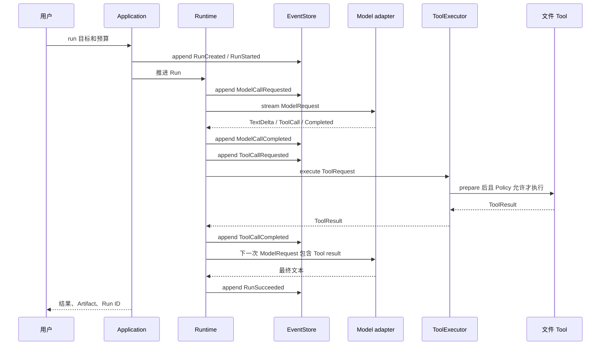

下面沿一个未来完整任务走一遍：

```powershell
bearagent run "比较 docs 中的架构说明，把结论写到 outputs/report.md"
```

这条命令目前还不能运行。页面用它解释目标架构，并在每一步标出已经存在的基础和尚未接通的部分。
如果想先看字段值、Event 顺序和状态机，读[F-0016 前，BearAgent 已经完成什么](../learn/before-agent-loop.md)。

## 总路径先看一遍



## 第 1 步：用户入口建立 Run

Interface 负责解析 CLI 参数和显示结果，Application 负责启动“运行一次任务”这个用例。它们不应该
自己维护状态，也不应该直接调用 OpenAI 或文件系统。

Application 会创建 `RunId`、初始预算和 `RunCreated` / `RunStarted` Event，再通过 EventStore 保存。
Reducer 从这两条事实得到 RUNNING 状态。

**当前状态：** ID、Event、RunState、Reducer 和 SQLite append 已实现；`bearagent run` 与 Application
用例尚未实现。

## 第 2 步：Runtime 构造一次有限模型请求

ContextBuilder 将来会选择这次模型需要的内容：Runtime 规则、用户目标、必要消息、可用 Tool schema
和最近 Tool result。它还要记录 prompt/config version，并限制字符或 token。

Runtime 在请求新 Model Activity 前检查预算，保存 `ModelCallRequested` 和 `ModelCallStarted`，再通过
`ModelProvider` port 调用 adapter。

**当前状态：** `ModelRequest`、五类预算和 OpenAI Responses adapter 已实现；ContextBuilder 与调用
编排尚未实现。

## 第 3 步：adapter 把外部流翻译成内部事件

OpenAI adapter 处理 SSE，产出文本 delta、完整 Tool call 和唯一 completion。SDK 类型、HTTP 异常和
Provider 特有状态都停在 adapter 内。

完成后 Runtime 才有足够信息保存模型用量和停止原因。中途失败不会伪造 completion。

**当前状态：** 翻译、上限、安全错误和 contract/security 测试已实现；这些结果尚未由 Agent Loop
写成 Model Activity Event。

## 第 4 步：Tool 请求穿过独立权限路径

如果模型要求读取文件，Runtime 将内部 `ModelToolCall` 转成 `ToolRequest`，再交给 ToolExecutor：

```text
精确查 Registry
    -> Tool.prepare 解析并规范化参数
    -> Policy 使用可信 ToolSpec 和 PreparedToolRequest
    -> timeout 内调用 Tool.execute 一次
    -> 检查 ToolResult 大小和终态形状
```

Model 只能提出 name 和 arguments。实际 ToolSpec 来自启动时注册的可信对象，Policy 也不读取模型对
权限的描述。

**当前状态：** Tool 数据、port、Registry、固定 Policy、Executor、`workspace.list/read/search` 和
只写 `outputs/**` 的 `workspace.write` 已实现；Agent Loop 尚未调用它们。

## 第 5 步：Tool result 回到下一次 Context

Runtime 保存 Tool Activity 的 requested/started/completed 或 failed Event。成功或安全错误再转成
`ToolResultPart`，通过同一个内部 `tool_call_id` 与之前模型请求关联。

下一次 ModelRequest 只加入需要的信息。超大 Tool 结果未来应截断或保存为 Artifact 引用，不能无限
塞回 Context。

**当前状态：** Message 关联、ToolResult、Activity Event、Reducer 和 Artifact 元数据已实现；把它们
串起来的 Loop、完整 Event 持久化和 Context 上限策略尚未实现。

## 第 6 步：明确结束并让用户查询

模型给出最终答案且没有 Tool call 后，Runtime 保存完成 Activity 和 `RunSucceeded`。失败、预算耗尽
或无法继续时保存明确错误，不能把非终态 Run 显示为成功。

CLI 将来返回 Run ID、最终文本和 Artifact；`inspect` 查询 projection，`events` 按 sequence 展示事实。

**当前状态：** 终态 Event、Reducer、SQLite 查询都已实现；用户命令尚未实现。

## 这条路径中谁不能绕过谁

- Interface 不能直接改 Run projection；
- Runtime 不能拿 SDK response 当内部状态；
- Model 不能直接执行 Tool；
- Tool 不能跳过 Policy；
- adapter 不能返回包含密钥或原始响应的公开错误；
- projection 不能取代 Event 成为事实来源。

这些限制让未来增加 Web、MCP 或更多 Provider 时仍沿同一条执行和记录路径。下一页解释当这条路径
遇到恶意输入、timeout 或进程中断时，[可靠性与安全边界](reliability-boundaries.md)怎样分工。
