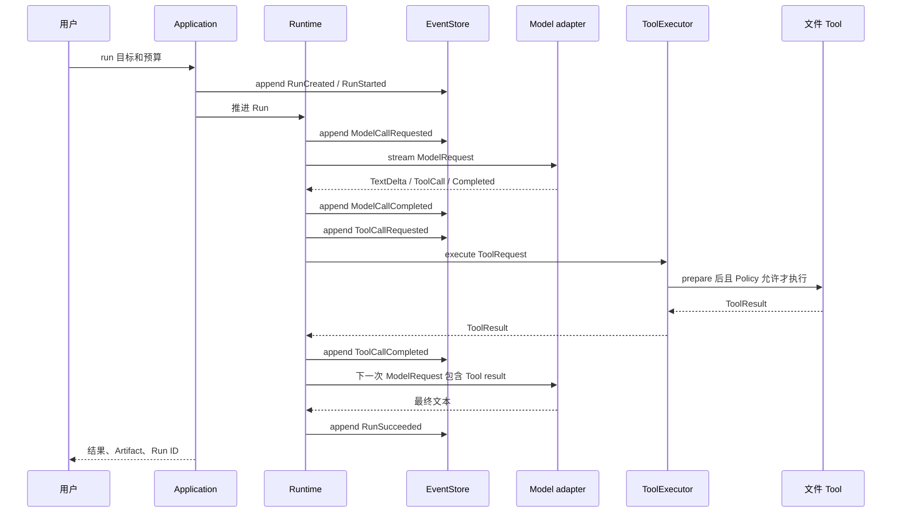

下面沿一个当前已经接通的 P1 文件任务走一遍：

```powershell
bearagent run "比较 docs 中的架构说明，把结论写到 outputs/report.md"
```

命令需要有效的 config v1 和 RunProfile v2；完整准备步骤见
[P1 命令行完整使用手册](/BearAgent/zh-cn/guides/cli/)。这里聚焦请求怎样穿过各模块，以及每个边界为什么存在。

<figure class="chapter-illustration">
  
  <figcaption>概念插画只帮助建立整体印象；下面的时序图才描述 BearAgent 当前的精确调用顺序。</figcaption>
</figure>

:::tip[读图时只追一件事]
第一次阅读只看“谁把什么交给谁”。第二次再看每个外部调用前后保存了什么 Event。这样比同时记住
所有类名更容易建立稳定的执行画面。
:::

## 总路径先看一遍



## 第 1 步：用户入口建立 Run

Interface 负责解析 CLI 参数和显示结果，Application 负责启动“运行一次任务”这个用例。它们不
自己维护状态，也不直接调用 OpenAI 或文件系统。

CLI 先分配 `RunId`，bootstrap 读取 profile 并组装 production 依赖。AgentLoop 随后保存
`RunCreated` / `RunStarted`；Reducer 从这两条事实得到 RUNNING 状态。预分配 ID 只写 stderr，
不冒充已经提交的 Event。

**当前状态：已实现。** `bearagent run` 通过 bootstrap/Application 调用 AgentLoop；CLI 不直接改
projection，也不直接读写任务文件。

## 第 2 步：Runtime 构造一次有限模型请求

ContextBuilder 从该 Run 已提交的 v2 Event 选择这次模型需要的内容：Runtime 规则、用户目标、必要
消息、可用 Tool schema 和 Tool result。它记录 prompt/config/context version，并限制总字符与
Tool result preview。

Runtime 在请求新 Model Activity 前检查预算，保存 `ModelCallRequested` 和 `ModelCallStarted`，再通过
`ModelProvider` port 调用 adapter。

**当前状态：已实现。** ContextBuilder、五类预算、ModelProvider port 与串行 AgentLoop 已接线。
五个 Fake 任务提供确定性证据；DeepSeek V4 suite v1.1.1 另通过 production composition 真实 5/5。

## 第 3 步：adapter 把外部流翻译成内部事件

Responses、Chat Completions 或 Anthropic Messages adapter 处理各自的流式协议，产出文本 delta、
完整 Tool call 和唯一 completion。SDK 类型、HTTP 异常和 Provider 特有状态都停在 adapter 内。

完成后 Runtime 才有足够信息保存模型用量和停止原因。中途失败不会伪造 completion。

**当前状态：已实现。** AgentLoop 保存 Model requested/started/completed/failed Event；三种 production
adapter 运行共享的离线契约。一次 DeepSeek V4 真实验证不代表其他服务或协议已付费联调。

## 第 4 步：Tool 请求穿过独立权限路径

如果模型要求读取文件，Runtime 将内部 `ModelToolCall` 转成 `ToolRequest`，再交给 ToolExecutor：

```text
精确查 Registry
    -> Tool.prepare 解析并规范化参数
    -> Policy 使用可信 ToolSpec 和 PreparedToolRequest
    -> timeout 内调用 Tool.execute 一次
    -> 检查 ToolResult 大小和终态形状
```

Model 只能提出 name 和 arguments。实际 ToolSpec 来自启动时注册的可信对象，Policy 也不读取模型对
权限的描述。

**当前状态：已实现。** Tool 数据、Registry、prepare、固定 Policy、Executor 与四个 workspace Tool
已经通过 AgentLoop 运行；用户 Approval 与 sandbox 仍未实现。

## 第 5 步：Tool result 回到下一次 Context

Runtime 保存 Tool Activity 的 requested/started/completed 或 failed Event。成功或安全错误再转成
`ToolResultPart`，通过同一个内部 `tool_call_id` 与之前模型请求关联。

下一次 ModelRequest 只加入需要的信息。超大 ToolResult 进入 Context 时使用确定性 preview，并记录
原始字节数；完整、有限的 ToolResult 仍保存在 Event 中。

**当前状态：已实现。** Tool call 关联、Context 上限、Activity Event、Reducer 和 Artifact 元数据
都在同一条 Loop 中；P1 不做自动摘要 Memory。

## 第 6 步：明确结束并让用户查询

模型给出最终答案且没有 Tool call 后，Runtime 保存完成 Activity 和 `RunSucceeded`。失败、预算耗尽
或无法继续时保存明确错误，不能把非终态 Run 显示为成功。

CLI 返回 Run ID、最终文本和 Artifact；`inspect` 查询 projection，`events` 按 sequence 分页展示
已提交事实。

**当前状态：已实现。** human 与 JSON renderer 使用同一 application result。进程中断后只可查询
已提交事实，不会自动 resume 或把非终态 Run 显示为成功。

## 这条路径中谁不能绕过谁

- Interface 不能直接改 Run projection；
- Runtime 不能拿 SDK response 当内部状态；
- Model 不能直接执行 Tool；
- Tool 不能跳过 Policy；
- adapter 不能返回包含密钥或原始响应的公开错误；
- projection 不能取代 Event 成为事实来源。

这些限制让未来增加 Web、MCP 或更多 Provider 时仍沿同一条执行和记录路径。下一页用
[P1 的关键架构取舍](/BearAgent/zh-cn/architecture/p1-decisions/)解释为什么先选择这条窄路径，再看恶意输入、timeout 或中断时
[可靠性与安全边界](/BearAgent/zh-cn/architecture/reliability-boundaries/)怎样分工。
