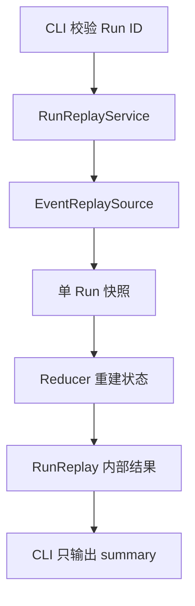

同一个数据库里，`inspect` 可能因 projection 损坏而失败，`replay` 却仍能返回 Event 推导的状态。
要理解它为什么安全，先沿 `uv run bearagent run replay RUN_ID --json` 读一遍代码，再看 `check`
怎样重复这一过程。输出解读见[进程中断后的检查](/zh-cn/learn/replay-and-check/)。

## 先跟一个 Run，不急着读扫描循环

下表中的源码路径都相对于 `src/bearagent/`：

| 顺序 | 入口 | 在这里回答什么问题 |
|---|---|---|
| 1 | `interfaces/cli/main.py` 的 `replay_run` | Run ID 怎样校验，为什么只输出 summary？ |
| 2 | `bootstrap.py` 的 `build_run_replay_service` | 为什么不构建 Provider、Tool 或可写 Store？ |
| 3 | `application/run_replay.py` 的 `RunReplayService._replay` | 读取和计算怎样共享剩余期限？ |
| 4 | `ports/replay.py` 与 `domain/replay.py` | adapter 必须返回怎样的内部快照？ |
| 5 | `adapters/sqlite/replay.py` | 怎样在一个只读事务中读取 Event 与 projection？ |
| 6 | `runtime/replay.py` 的 `reconstruct_run` | 怎样复用 Reducer、对照状态并生成摘要？ |
| 7 | `interfaces/cli/contracts.py`、`renderers.py` | 哪些字段允许离开内部结果？ |



## 为什么另开 EventReplaySource

原来的 `EventStore` 提供追加、projection 查询和 Event 分页。它在数据不一致时拒绝继续使用，
这条契约没有因 F-0021 放宽。新的 port 只要求两个读取方法：

```text
read_run_events(run_id, limits)           一个 Run 的完整快照
list_event_run_ids(after_run_id, limit)   从 Event 枚举一页 Run ID
```

`RunReplayService` 只依赖这个 port；它没有 Provider、ToolExecutor、append 或 repair 接口。
SQLite 实现以独立 reader 提供快照；内存 Store 同时实现只读 port，供共用契约测试调用。
核心收到的是 BearAgent 的 `EventReplaySnapshot`，不接收 SQLite connection 或 row。

快照中的 Event 必须属于同一 Run，Event ID 不能重复，sequence 必须从 1 连续到当前末尾。
`projection_availability` 和可选的 `projection` 必须对应。这个类型检查只确认快照结构，
具体 Event 语义仍须交给 parser 与 Reducer，不能只通过类型构造就宣布历史有效。

## SQLite 在哪一刻固定读取视图

`SqliteEventReplaySource._transaction` 打开已有文件，使用 `mode=ro`、`query_only=ON` 和
`trusted_schema=OFF`，随后开启读事务。它不调用普通 Store 的 `initialize()`，也不运行 migration。
`verify_store_schema(require_projections=False)` 仍校验 migration ledger 与已知 schema，
只是允许 projection 表缺失；Event 或 migration 不可读时仍然失败。

`_snapshot` 在同一 connection 和事务中完成三件事：先预查 Event 数量与原始列字节，再按 sequence
读取和解析 Event，最后尝试读取 projection。这样 writer 在读取过程中提交下一条 Event，也不会
把旧 Event 和新 projection 拼到同一个结果里。事务结束后，即使 writer 又前进了，报告仍描述
`last_sequence` 所在的那个已提交前缀；它不是执行锁。

projection 读取有自己的降级结果：缺少 Run 行或所需表为 `missing`；结构、字段或资源检查失败为
`unreadable`；可以读取时留给核心做完整状态比较。Event 读取失败则没有可返回的完整重建状态。
这两条失败路径必须保持分开。

## Reducer 怎样避免产生另一套状态规则

`reconstruct_run` 逐条检查 Run ID、累计序列化字节和期限，再把 Event 交给现有 `reduce_events`。
它复用原有的 payload parser、状态转换与 `validate_event_history`，而不是按最后一种 Event 类型猜状态。
例如 v2/v3/v4 Tool completed evidence 中的原始请求，仍必须与 requested Event 一致。

重建成功后，用完整 `RunState` 与可读 projection 比较；比较不只看 `status` 或 sequence。
即使二者都显示 `succeeded`，用量或 Activity 字段不一致仍是 `mismatch`。内部 `RunReplay` 保留
重建状态，以及 RunCreated v4 中的历史 fingerprint；v1-v3 缺少 fingerprint 时继续返回 `None`，
不读取当前 Registry 或 config 反推历史。

`state_hash` 的格式 v1 将 `state_format_version` 与完整 RunState 一起编码：键排序、紧凑 JSON、
UTF-8、UTC 六位微秒时间和小写 UUID，最后计算 SHA-256。它不涵盖所有 Event payload，也不包含
内部结果中另行保存的 fingerprint。不要把状态相同解释成 Event 内容相同，或用这个 hash 授权恢复。

## check 为什么可能返回空 items 和下一页

`RunReplayService.check` 先从 Event 取得一页 Run ID，再串行调用 `_replay`。每次只保留 summary 或
安全错误码，不让整页历史同时留在内存。`ReplaySummary.needs_attention` 只把 queued/running
或 projection 异常列入结果；正确记录的 failed 终态也会被省略。

`scanned_count` 和下一页游标来自候选 Run 页，不能由过滤后的 `items` 重新计算。否则一整页都是
健康终态时，调用方会提前停止或重复扫描。列表查询与各 Run 的重建使用各自的读事务；它们不是
一个跨页的全局快照。UUID 的字符串顺序只用于分页，不能当作执行时间或恢复优先级。

单个 Run 的 `EventReplayError` 会成为 `RunCheckItem.error_code`，其他 Run 继续检查。候选页读取
失败或整条命令的期限耗尽时，返回命令错误，不交付一个看似完整的成功页。

## 限时为什么还要管理工作线程

CLI 默认给整条 replay/check 命令 30 秒。Application 使用单调时钟记录 deadline，每次读取与重建
只获得剩余时间；check 不能给每个 Run 重新分配 30 秒。

SQLite 使用 50 ms busy timeout，并通过 progress handler 检查停止条件。Event 解码和 Reducer
在条目之间也检查期限。`_bounded_read.py` 的 `run_bounded_read` 用工作线程执行同步计算；协程
取消时先设置取消信号，再等待线程收尾，最后传播取消。SQLite connection 在 `finally` 中关闭。
只取消等待的协程而遗留查询线程，会使取消后的连接继续占用资源。

这是协作式停止，不会强行打断单条 Python 解析。单 Run 10,000 条、16 MiB 的输入上限也用于约束
解析成本。达到数量上限并不承诺能在期限内完成；[现有 benchmark](https://github.com/CherryYang05/BearAgent/blob/main/docs/evidence/F-0021-replay-benchmark-v1.json)
中的 10,000 条合成历史触发了期限，当前没有 Checkpoint 加速路径。

## 最后检查哪些内容能够输出

内部 `RunReplay.state` 可能包含历史错误信息，不能直接 `model_dump_json()` 作为 CLI 输出。
`replay_run` 显式取 `.summary`；check 只保留 summary 或错误码。两条路径只输出 ID、状态、
最后边界、格式版本、state hash 和 projection 对照，不复制目标、模型消息或 Tool 参数/结果。

检查失败使用固定安全错误信息。已有 `inspect/events` 的 JSON 契约保持原样；特别是
`events --json` 仍是完整历史内容导出，不能把它的隐私边界套到 replay 摘要上。

## 用测试逐个验证这些边界

| 测试入口 | 重点观察 |
|---|---|
| `tests/contract/test_event_replay_contract.py` | 内存和 SQLite 的 v1-v4 状态/hash、空结果分页、精确输入边界 |
| `tests/integration/test_event_replay.py` | projection 删除/篡改、错误终态不漏检、坏历史、双连接快照、取消与超限预检 |
| `tests/integration/test_replay_cli.py` | 无配置读取、内容不泄漏、缺库不创建、退出码 0/1/2 |
| `tests/recovery/test_crash_observability.py` | K1-K6 中断后新进程检查最后 committed fact，额外模型/Tool/replace 为零 |

```console
uv run pytest tests/contract/test_event_replay_contract.py tests/integration/test_event_replay.py tests/integration/test_replay_cli.py -q
uv run pytest tests/recovery/test_crash_observability.py -q
```

故障测试修改的是临时 SQLite 数据库，随后比较逻辑记录。不要用数据库文件字节完全相同来代替
零业务写入断言：SQLite 自身可能管理 WAL/SHM 和锁，这与追加 Event 或修复 projection 是不同的事。

修改这条链路前，读 [F-0021 Spec](https://github.com/CherryYang05/BearAgent/blob/main/docs/specs/F-0021-event-replay-startup-check.md)
和 [ADR-0020](https://github.com/CherryYang05/BearAgent/blob/main/docs/adr/ADR-0020-event-replay-before-recovery.md)。
新增修复、重试或恢复执行会改变这里的只读边界，需要另行设计；现有实现没有承担这些行为。
