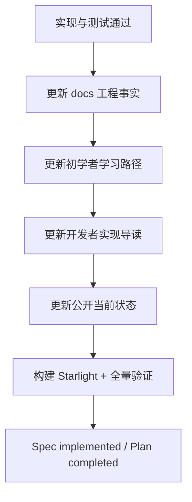

BearAgent 把文档视为 Feature 的一部分，而不是代码完成后的可选整理工作。

## 两条公开阅读路径

| 路径 | 回答的问题 | 典型内容 |
|---|---|---|
| 初学者学习路径 | 为什么需要这个能力？它在 Agent 系统中处于哪一层？ | 前置概念、简图、最小例子、与后续模块的关系 |
| 开发者文档 | 它如何实现？怎样安全修改并证明没有破坏接口或数据规则？ | 代码地图、接口、失败行为、安全边界、测试和命令 |

两条路径共享同一份工程事实，但表达方式不同。不能把 Spec 原文复制两次，也不能让站点成为第二套
Feature 状态数据库。

## 代码阅读问题如何回流

项目所有者在阅读实现时提出的“为什么这样命名”“几个对象怎样协作”“失败时究竟发生什么”，
应当作为学习文档的可用性反馈处理：

1. 用 `docs/`、代码和测试确认答案，不把聊天记录当作事实来源；
2. 提炼读者真正缺少的前置概念，而不是逐句复制问答；
3. 用最小例子列出输入、Event sequence、状态变化和失败边界；
4. 把内容放进最相关的已有页面，只有形成独立学习单元时才新建页面；
5. 同步侧边栏、学习索引和交叉链接；实现事实未改变时不改当前状态。

## Feature 关闭流程

每个 Feature 至少要说明：

- 新增或改变了哪个 Agent 原理与 BearAgent 概念；
- 代码和测试证据在哪里；
- 失败、安全、恢复或资源边界是什么；
- 当前哪些内容已经实现，哪些仍然只是 Roadmap；
- 使用了哪些外部资料，它们只提供了什么解释或对照。

如果不需要新建独立文章，也必须更新相关索引、已有专题页和当前状态页。

## P 阶段关闭流程

关闭 `P<n>` 前，在 Feature 级同步之外还要更新：

1. Roadmap 的阶段状态、完成线和已知限制；
2. 初学者学习地图中已经可以连成闭环的知识层次；
3. 开发者架构总结、真实入口和完整验证方式；
4. [阶段与里程碑](../project/milestones.md)中的结果、证据与下一阶段边界。

## 外部资料如何使用

优先查看《深入理解 AI Agent》、DeepTutor 和高关注 Agent 项目的官方资料。选择资料时依次判断：

1. 是否是论文、规范、官方文档或官方仓库；
2. 是否能解释当前 Feature 的真实问题；
3. 是否符合 BearAgent 的 local-first 与轻量范围；
4. 是否明确记录了没有采用的复杂度；
5. 是否在[资料来源](../reference/sources.md)留下链接。

社区关注度帮助发现项目，但不能替代代码、测试、威胁模型或 ADR。
