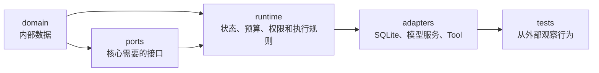

第一次打开 BearAgent，不必先把所有文档读完。先选一个具体问题，例如：

> 模型提出 `workspace.read` 后，参数在哪里校验？谁决定允许执行？如果失败，错误怎样保存？

然后沿着数据经过的方向阅读。BearAgent 的目录名字就是依赖方向：内部数据在 `domain/`，Runtime
规则在 `runtime/`，外部能力的接口在 `ports/`，SQLite、OpenAI 和测试替身等具体实现在
`adapters/`。



箭头表示阅读时可以怎样追踪概念，不表示 Python import 必须完全按这个方向出现。真正的架构限制是：
核心代码不能依赖 OpenAI SDK、SQLite 连接或未来的 Web 框架。

## 五条代码阅读路线

| 你想弄懂什么 | 建议从哪里开始 | 最后看什么测试 |
|---|---|---|
| 为什么内部数据不能随意修改 | [从数据边界开始读代码](domain-contracts.md) | `tests/unit/test_messages.py`、`tests/security/test_domain_errors.py` |
| 一串 Event 怎样变成当前状态 | [沿 Event 读懂状态与预算](run-reducer-and-budgets.md) | `tests/unit/test_run_reducer.py` |
| Event 和查询状态怎样一起落库 | [从一次 append 读持久化](sqlite-event-store.md) | `tests/contract/test_event_store_contract.py` |
| OpenAI SSE 怎样变成内部事件 | [跟一次 SSE 读模型 adapter](model-provider.md) | `tests/contract/test_model_provider_contract.py` |
| Tool 为什么不能直接执行 | [跟一次 ToolRequest 读执行边界](tool-execution-boundary.md) | `tests/integration/test_tool_executor.py` |

这些页面按问题组织，但每一页都会标出相应的实现文件。Feature 编号只用于回到工程记录，不作为
理解代码的前置知识。

## 目录不是层级称号，而是责任边界

### `domain/`：模块之间传什么

这里放 BearAgent 自己的数据类型，例如 `RunId`、`Message`、`Event`、`RunState`、`ModelRequest`
和 `ToolResult`。它们验证边界输入、拒绝未知字段，并尽量保持不可变。外部 SDK 对象进入系统前，
必须先翻译成这些类型。

### `ports/`：核心需要外部世界做什么

`ModelProvider`、`EventStore`、`Tool` 和 `ToolPolicy` 是很薄的接口。它们不说明 OpenAI 请求怎样发，
也不说明 SQLite 表怎样建，只说明核心代码可以依赖哪些行为和返回值。

### `runtime/`：做决定的地方

Reducer 决定 Event 是否能改变状态，预算模块决定能否请求下一个 Activity，`ToolExecutor` 保证
Tool 先完成参数准备和 Policy 检查再执行。这些规则不应该散落到 CLI、数据库或具体 Tool 中。

### `adapters/`：把外部协议翻译回来

这里目前包括 SQLite EventStore、OpenAI Responses adapter、四个 workspace Tool，以及测试用的
Fake model、Fake tool 和内存 EventStore。Adapter 可以依赖外部库，但返回核心时只能交付 BearAgent
数据。

### `interfaces/` 与 `application/`：用户入口和用例编排

`interfaces/cli/` 目前只有基础命令。完整 `run/inspect/events` 和 Agent Loop 尚未接通。
`application/` 也仍是待建设的用例层，所以现在阅读代码时不要期待已经存在一条从 CLI 到模型、
Tool、EventStore 的完整生产调用栈。

## 一次修改应该从哪一层开始

假设要给模型请求增加一个字段，先问这个字段属于谁：

- 如果每个模型 Provider 都需要理解它，先修改 `domain/model.py` 和 `ports/model.py`；
- 如果它只是 OpenAI Responses 的请求选项，只留在 `adapters/model/`；
- 如果它会改变 Run 的可观察状态，还要设计对应 Event 和 Reducer 规则；
- 如果它能扩大外部副作用，不能只靠模型字段，必须进入 Policy 和 Tool 执行边界。

这个判断比“把字段放在哪个类最方便”更重要。它决定更换 Provider 或存储后，核心是否仍然稳定。

## 测试也按边界阅读

BearAgent 的测试目录回答不同问题：

| 测试类型 | 阅读时问什么 |
|---|---|
| `unit/` | 一个数据类型或纯函数在边界值下怎样表现？ |
| `contract/` | 多个 adapter 是否对调用方表现一致？ |
| `integration/` | 几个模块接起来后，顺序、transaction 和并发是否正确？ |
| `security/` | 恶意输入、敏感错误、超时和越权请求会不会穿过边界？ |
| `architecture/` | 核心是否误导入外部 SDK 或框架？ |

读实现卡住时，直接找与函数同名或行为同名的测试。测试通常比类型签名更快说明“为什么这里有这条
判断”。例如 `_validate_completion_tool_calls` 看起来只是比较字段，对应测试会展示它在阻止什么：
流式 Tool call 不能在最终 completion 中被删除或悄悄改参数。

## 当前代码能连到哪里

目前五块基础能力都可以单独验证，但还没有完整 Agent Loop 把它们串成用户任务：

```text
内部数据       已实现
状态与预算     已实现
SQLite 持久化  已实现
模型 adapter   已实现
Tool 执行边界  已实现
文件 Tool      已实现：list/read/search/write
ContextBuilder 未实现
Agent Loop     未实现
Run CLI        未实现
```

先用[F-0016 前，BearAgent 已经完成什么](../learn/before-agent-loop.md)把这些模块放进同一条示例路径。
读到某个接口没有生产调用方，不一定是漏实现；再到[当前实现状态](../project/status.md)核对边界。
如果代码行为变化，按[代码变了，站点怎样跟着变](feature-documentation.md)同步面向读者的说明。
如果准备把一个版本交给没有源码 checkout 的用户，再按
[怎样把 BearAgent wheel 发布到 PyPI](publish-python-package.md)检查 distribution、发布门槛和隔离安装。
