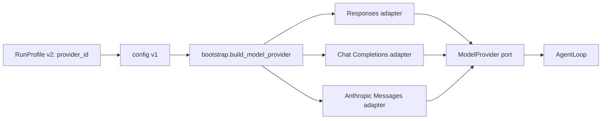

一次 `bearagent run` 不会把“OpenAI 兼容”当成足够的配置。它先从 RunProfile 取得
`provider_id`，再从 catalog 取得明确的 wire protocol，最后只创建那个协议的 adapter。Runtime
核心始终只认识 `ModelProvider` 和 BearAgent 自己的数据。

F-0004 建立 port 与首个 Responses adapter；F-0017 增加可复用配置、Chat Completions、Anthropic
Messages、Event v3 和默认关闭的真实模型验收入口。三个 protocol 是产品边界，厂商名不是分支条件。
F-0018 的新 Run 改写 v4，在同一个 RunCreated payload 中保留这份 Provider selection 并增加 contract
fingerprint；v3 作为历史读取格式不变。

## 一次选择怎样进入模型调用

factory 只按 `ModelProtocol` 枚举分支。它不检查 base URL 属于哪个厂商，不从 model 名猜协议，
也不在一次失败后创建第二个 adapter。

## 代码地图

| 范围 | 入口 | 责任 |
|---|---|---|
| catalog | `src/bearagent/configuration.py` | 校验条目、HTTPS URL、直接 key、SecretStr 和配置版本 |
| Run profile | `src/bearagent/domain/agent.py` | 保持 v1 可读；v2 用 `provider_id` 选择 catalog 条目 |
| 选择事实 | `src/bearagent/domain/providers.py` | `ModelProtocol` 与非敏感 `ProviderSelection` |
| production factory | `src/bearagent/bootstrap.py` | 解析唯一选择，延迟创建对应 SDK client |
| Responses | `src/bearagent/adapters/model/openai_responses.py` | Responses 请求与 SSE event 翻译 |
| Chat Completions | `src/bearagent/adapters/model/openai_chat_completions.py` | chunk、ToolCall fragment、wire 名称和 thinking 翻译 |
| Anthropic Messages | `src/bearagent/adapters/model/anthropic_messages.py` | message/content block 生命周期翻译 |
| 共用限制 | `src/bearagent/adapters/model/_common.py` | 有界文本、参数、usage 和完成结果 |
| 内部接口 | `src/bearagent/ports/model.py` | 流式接口与安全 `ModelProviderError` |
| live gate | `src/bearagent/evaluation/p1_live.py` | preflight、隔离 attempt、查询复核与脱敏报告 |

## 三种 adapter 分别翻译什么

| protocol | 主要外部形状 | BearAgent 处理 |
|---|---|---|
| `openai_responses` | typed Responses stream event | 文本 delta、完整 function call、response completed |
| `openai_chat_completions` | chat completion chunk | 按 index 重组 ToolCall fragment，接受标准 usage-only 尾块 |
| `anthropic_messages` | message/content-block event | 严格校验 block 生命周期，重组 text 与 tool JSON delta |

每个 adapter 最终只能产生文本增量、完整 ToolCall 和唯一 `ModelCompleted`。一次响应可以带多个
ToolCall；adapter 全部翻译，AgentLoop 再逐个重新检查预算、Policy 和 workspace 边界。

Chat function name 只允许有限字符，但 BearAgent 的内部 Tool 名称可以是 `workspace.read`。adapter 发送前
确定性映射为 wire-safe 名称，收到 ToolCall 后再恢复；Runtime、Policy 和 Event 始终看到内部名称。参数
仍由 BearAgent 校验，不依赖 Provider 的 `strict` 扩展。

Model 配置可以对 Chat Completions 显式设置 `thinking_mode: "disabled"`。默认仍是
`provider_default`。P1 不保存或回放隐藏推理；如果 Provider 返回无法安全表示的非空 reasoning，adapter
返回 `provider_protocol_error`，不会静默丢弃，也不会写进 Event。

production adapter 必须取得服务报告的实际 usage。缺失或格式错误会成为
`provider_protocol_error`，不能写成 0。Anthropic 的 cached input tokens 计入输入总量。完整
ToolCall 之前结束、完成后又出现关键事件、未知关键 event 或 JSON 参数不是有界 object 也会失败。

## 配置与 secret 怎样分开

`config.json` 保存 `provider_id`、厂商显示名、protocol、HTTPS base URL、直接填写的 `api_key`、模型列表、
可选 thinking mode 和 `default_model`，并拒绝 pricing；RunProfile v2 只保存 `provider_id`、Agent 行为和预算。`SecretStr`
防止 key 出现在配置 model 的 repr/JSON；factory 只在创建选定 adapter 时解封。

Bootstrap 从默认模型构造 `unpriced` 的 `AgentConfig`；真实 gate 单独注入 pricing snapshot。新 Run 使用
RunCreated v4 保存 `provider_id`、由非密钥 Provider/model 字段计算的 config version、protocol、配置
model、pricing version 和 contract fingerprint。它不保存 base URL 或 key。旧 RunCreated v1/v2/v3 与
RunProfile v1 继续可读，SQLite 不需要新增表或列。

缺少、空白或非法 key 会在数据库和 Run 创建前返回安全的 `invalid_input`。有效 key 不进入
AgentConfig、Event、SQLite、CLI 输出或 live report。零预算仍会在创建 SDK client 前停止。

## 失败为什么不触发 fallback

三个 SDK 都配置 `max_retries=0`，每个请求显式设置 timeout，生产 HTTP client 不跟随 redirect。
取消原样传播；认证、限流、连接、timeout 和协议错误转换成有限的 `ErrorInfo`，不复制响应 body、
header、Prompt、输出、endpoint 或原始异常文本。

一次 Run 只使用选中的协议与 endpoint。自动 fallback 可能把同一个 Prompt 和 key 发往另一处，还会
让 Activity 次数和费用无法从 Event 解释。P1 因此既不自动 retry，也不自动 fallback；P2 才定义带
Attempt 的恢复与重试语义。

## 测试证据在哪里

- `tests/contract/test_model_provider_contract.py`：Responses 的真实 SDK + 内存 SSE；
- `tests/contract/test_openai_chat_completions_provider.py`：Chat chunk、usage-only 尾块和多 ToolCall；
- `tests/contract/test_anthropic_messages_provider.py`：Messages 生命周期、tool JSON 与 cached usage；
- `tests/unit/test_provider_config.py`、`tests/unit/test_run_profile_versions.py`：catalog/profile 边界；
- `tests/unit/test_provider_composition.py`：三种 protocol 的唯一 factory 选择与延迟缺 key；
- `tests/integration/test_provider_selection_events.py`：RunCreated v4、fingerprint、SQLite 重开与旧 Event 兼容；
- `tests/unit/test_p1_live_eval.py`、`tests/integration/test_p1_live_eval.py`：默认关闭的 preflight、
  五个隔离任务、SQLite 重开、rubric、canary 和脱敏 report；
- `tests/architecture/test_import_boundaries.py`：SDK 不能进入 core。

这些测试不需要账号、key 或网络。真实账号与模型的 gate 是单独的手工验收：项目所有者必须确认
Provider、model、独立 pricing snapshot、commit 与费用上限，然后由 `scripts/run_p1_live_eval.py` 执行。
2026-08-23 的 suite v1.1.1 使用 DeepSeek V4 经 production composition 通过 5/5，脱敏证据见
[F-0017 P1 live report v1](https://github.com/CherryYang05/BearAgent/blob/main/docs/evidence/F-0017-p1-live-report-v1.json)。
这份证据关闭 F-0017/P1，但不证明其他 endpoint、model 或 protocol 已付费联调。
