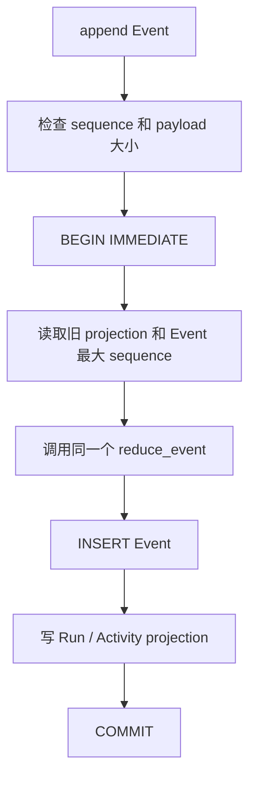

从 `SqliteEventStore.append(event)` 开始读，比从建表 SQL 开始更容易理解这层代码。调用方希望一次
操作同时得到两个结果：新 Event 成为不可变事实，`get_run()` 也能立刻读到由它计算出的新状态。
这两个结果必须一起成功或一起失败。



## 先分清事实和 projection

`events` 表保存已经发生的事实。`run_projections` 和 `activity_projections` 保存当前查询视图，避免每次
`get_run()` 都从第一条 Event 重算。

Projection 不是第二套业务状态。`append` 会把数据库中的旧 projection 还原为 `RunState`，然后调用
`runtime/reducer.py` 的 `reduce_event`。因此内存计算和 SQLite 写入使用同一套转换规则。

## Port 为什么只有三个主要方法

`ports/store.py` 中的 `EventStore` 很小：

```text
append(event)             追加一条事实并返回新 RunState
list_events(run_id, ...)  分页读取有序 Event
get_run(run_id)           读取已验证的当前 projection
```

没有更新或删除 Event 的方法，也没有“直接改 projection”的方法。调用方不能绕过 Reducer 把 Run
状态改成 succeeded。

`validate_event_query` 对 `after_sequence` 和 `limit` 做严格整数及范围检查。查询边界放在 port 中，
所以测试内存 adapter 和 SQLite adapter 时，调用方式保持一致。

## 初始化不只是“如果没有表就建表”

`initialize()` 在工作线程中执行同步 SQLite 代码。它会：

1. 建立父目录并读取打包的 `0001_initial.sql`；
2. 计算 migration 文件 SHA-256；
3. 打开连接并启用 WAL；
4. 在 `BEGIN IMMEDIATE` 中建立或读取 migration ledger；
5. 校验 version、文件名、checksum 和必需表；
6. 全部通过后 commit。

如果数据库记录的 schema 比当前程序新，或同一个 migration 文件已经被改写，初始化会拒绝继续。
这能避免较旧代码误读新结构，也能避免“版本号没变但 SQL 悄悄变了”。

## append 的 transaction 里发生了什么

入口先在数据库外检查两个资源边界：SQLite 有符号整数能否容纳 sequence，以及 payload 的 UTF-8
大小是否超过 4 MiB。

进入 `_append_sync` 后：

1. `_open_initialized` 重新确认 schema、checksum、必需表和 WAL；
2. `BEGIN IMMEDIATE` 提前取得写锁，让并发 writer 明确竞争；
3. `_load_run_projection` 恢复之前的 `RunState`；
4. `_maximum_sequence` 检查 Event 是否从 1 连续到最大 sequence；
5. `_validate_projection_sequence` 确认 projection 的 `last_sequence` 与事实相同；
6. `reduce_event` 拒绝非法新 Event 或生成新状态；
7. 插入 Event，再 upsert Run projection 并重写该 Run 的 Activity projection；
8. 最后 commit。

任何一步失败都会 rollback。代码特意记录 `event_inserted`：如果 Event insert 已成功、后续 projection
写入触发完整性错误，它报告普通持久化失败；如果 Event 自己与已提交事实冲突，则报告
`EventStoreConflictError`。两种情况对调用方的处理含义不同。

## 为什么每次操作都新开 connection

标准库 `sqlite3` 是同步接口，公开方法用 `asyncio.to_thread` 避免阻塞事件循环。每次操作在工作线程
内建立并关闭独立 connection，transaction 不跨线程共享。

连接启用：

- `foreign_keys=ON`，让关联约束生效；
- 有限 `busy_timeout`，锁竞争不会永久等待；
- `synchronous=FULL`，优先保证本地持久性；
- WAL，在单进程本地场景中改善读写配合。

锁或 busy 错误被归一化为 `retryable=True` 的安全持久化错误，但 adapter 自己不自动重试。重试是否
安全应由更高层根据操作语义决定。

## 读取为什么仍然可能失败

`list_events()` 不把数据库 JSON 当成可信数据。每行都会重新经过：

1. JSON object 解析；
2. `Event.model_validate`；
3. `parse_run_event_payload` 的具体类型和版本校验。

`get_run()` 也会把列重新组装成 `RunState` 和 `ActivityState`，让 Pydantic 检查组合约束。查询前还会
比较 Event sequence 和 projection sequence。

因此数据库被手工修改、文件损坏或旧程序写入非法数据时，adapter 返回
`EventStoreCorruptionError`，不会把“差不多能读”的状态继续交给 Runtime。

## Contract test 怎样帮助理解两个实现

`tests/contract/test_event_store_contract.py` 把相同用例分别跑在 `InMemoryEventStore` 和
`SqliteEventStore` 上。它检查合法追加、顺序冲突、全局 Event ID 冲突和有界查询。

这说明 port 的意义不是“定义了几个方法”，而是调用方能依赖的可观察行为。SQLite 可以使用 SQL
transaction，内存实现可以复制字典，但两者对合法与非法输入必须给出相同结论。

## 建议按失败类型读测试

| 文件 | 最值得看的场景 |
|---|---|
| `tests/contract/test_event_store_contract.py` | 两种 store 是否保持同一使用方式 |
| `tests/integration/test_sqlite_event_store.py` | WAL、重开、并发同 sequence、projection rollback、表和 sequence 损坏 |
| `tests/security/test_sqlite_event_store.py` | SQL-like payload 只作为数据、错误不泄漏内容和路径、锁超时、超大 payload |

```powershell
uv run pytest tests/contract/test_event_store_contract.py
uv run pytest tests/integration/test_sqlite_event_store.py
uv run pytest tests/security/test_sqlite_event_store.py
```

数据库重开后能查询已提交事实，不等于 Runtime 会自动继续未完成 Run。当前没有启动扫描、Checkpoint、
Attempt 或 `UNKNOWN` 处理。持久化解决“事实没有丢”，恢复还要解决“下一步怎样做才安全”。
