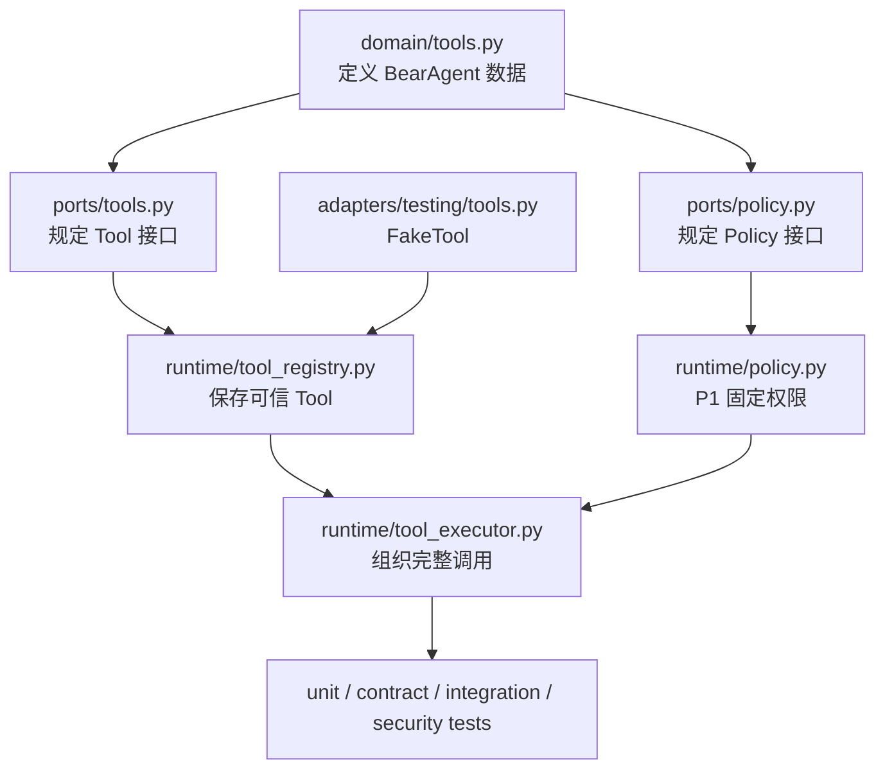

这组代码把原来的 P0 `FakeTool` 占位升级为一条可复用的执行路径。它解决的是“所有 Tool 怎样被安全地
调用”，不是“怎样读取某个真实文件”。

第一次看代码时，不建议从 `ToolExecutor` 的异常分支开始硬读。先认识请求和结果的数据类型，再看
Tool 接口、Registry 和 Policy，最后进入 Executor，调用顺序会清楚很多。

:::caution[这条路径还没有接进 Agent Loop]
当前只有测试代码会组装 Registry、Policy 和 Executor。这部分不注册真实文件 Tool，不写 Tool
Activity Event，也不提供 Run CLI。下面讲的是已经有测试支持的执行边界，而不是完整用户任务。
:::

## 一张图看清文件之间的关系



依赖方向很重要：Runtime 可以依赖 domain 和 port，但不能导入具体文件 adapter、Provider SDK、CLI 或
SQLite adapter。真实 Tool 将来从外层实现 `Tool` port，再由应用启动代码注册进去。

## 推荐的阅读顺序

| 顺序 | 文件 | 先回答什么问题 |
|---|---|---|
| 1 | `src/bearagent/domain/_base.py` | 所有边界数据怎样校验和冻结 |
| 2 | `src/bearagent/domain/tools.py` | ToolSpec、请求、结果和 Policy 决定长什么样 |
| 3 | `src/bearagent/ports/tools.py` | 一个具体 Tool 必须提供什么 |
| 4 | `src/bearagent/runtime/tool_registry.py` | Runtime 怎样保存和查找 Tool |
| 5 | `src/bearagent/runtime/policy.py` | P1 怎样允许或拒绝 |
| 6 | `src/bearagent/runtime/tool_executor.py` | 前面这些组件怎样串起来 |
| 7 | `src/bearagent/adapters/testing/tools.py` | 测试怎样稳定模拟成功和失败 |

## 第一步：先读公共数据类型

### DomainModel 先守住通用 JSON 边界

`ToolSpec`、`ToolRequest` 和 `ToolResult` 都继承 `DomainModel`。它的基础配置只有两条，却很关键：

```python
model_config = ConfigDict(
    extra="forbid",
    frozen=True,
    validate_default=True,
)
```

`extra="forbid"` 会拒绝未声明字段，避免拼错字段后被静默忽略。`frozen=True` 阻止顶层属性被替换；
辅助函数还会递归复制 JSON，把字典变成只读 mapping、把列表变成 tuple，防止调用方在校验后修改深层
参数。

通用 JSON 校验还限制：

- 根值必须是 JSON object；
- 最多 32 层嵌套；
- 最多 10,000 个节点；
- object key 必须是字符串；
- 浮点数必须有限，不能是 `NaN` 或无穷大；
- 不能混入文件句柄、自定义对象或其他 Python 值。

这部分在 `domain/_base.py`，不是 Tool 专用代码。模型请求、Tool 参数和 Tool 结果都复用同一套边界。

### ToolSpec 保存可信说明和资源限制

`ToolSpec` 包含：

```python
name
description
input_schema
output_schema
side_effect
timeout_ms
max_input_bytes
max_output_bytes
retry_safety
```

当前硬上限是：说明最多 4,096 个字符，单份 schema 最多 1 MB，timeout 最多 600,000 ms，输入配置
最多 1 MB，输出配置最多 4 MB。每个真实 Tool 通常应该选择比全局硬上限更小的值。

输入和输出 schema 的根类型必须是 `object`，并会进入公共 JSON Schema 快照。需要特别注意：通用
Executor 当前不会拿 `input_schema` 自动校验每个业务字段，也不会拿 `output_schema` 再跑一次完整
JSON Schema validator。具体输入含义由 Tool 的 `prepare` 检查，具体输出结构由 Tool 实现负责；
Executor 负责公共类型、关联 ID 和字节上限。

### 请求为什么分成两种类型

`ToolRequest` 表示还未经过 Tool 检查的模型请求：

```python
ToolRequest(
    tool_call_id=ToolCallId.new(),
    name="workspace.read",
    arguments={"path": "docs/./index.md"},
)
```

`PreparedToolRequest` 继承相同字段，但它的类型含义是“已经由具体 Tool 校验并规范化”。Policy 和
`execute` 只接收这种类型，代码评审时可以直接看出某段逻辑处理的是原始参数还是准备后的参数。

Executor 还会检查 `prepare` 没有替换 `tool_call_id` 或 `name`。Tool 可以整理 arguments，不能把一次
请求偷换成另一个 Tool 调用。

### ToolResult 只有两种终态形状

成功：

```python
ToolResult(
    tool_call_id=request.tool_call_id,
    status=ToolStatus.SUCCEEDED,
    data={"content": "BearAgent"},
)
```

失败：

```python
ToolResult(
    tool_call_id=request.tool_call_id,
    status=ToolStatus.FAILED,
    error=ErrorInfo(...),
)
```

模型验证器拒绝“成功同时带 error”“失败没有 error”和“失败仍携带部分 data”。这个规则让上层代码
只检查 `status` 就能确定结果形状。

`PolicyDecision` 也有类似不变量：`ALLOW` 必须搭配 `ALLOWED` reason；`DENY` 不能搭配 `ALLOWED`。

## 第二步：看 Tool 和 Policy port

`Tool` 使用 Python `Protocol` 定义，不要求真实实现继承某个基类：

```python
class Tool(Protocol):
    spec: ToolSpec

    def prepare(self, request: ToolRequest) -> PreparedToolRequest:
        ...

    async def execute(self, request: PreparedToolRequest) -> ToolResult:
        ...
```

`prepare` 是同步方法，因为它应该只进行有界的纯计算。`execute` 是异步方法，因为真实 Tool 以后可能
等待文件、网络或隔离 runner。

“prepare 不产生副作用”是一条受信任 Tool 实现必须遵守的契约，不是 Python 自动提供的沙箱。代码
评审和 Tool 合同测试必须继续守住这条边界。

`ToolPolicy` 更小，只要求：

```python
def evaluate(
    self,
    spec: ToolSpec,
    request: PreparedToolRequest,
) -> PolicyDecision:
    ...
```

它同时收到注册时的可信 Spec 和规范化请求。P1 只实现固定规则；以后增加 Grant 或 Approval 时可以
替换 Policy 实现，而不需要让 ToolExecutor 导入具体授权存储。

## 第三步：ToolRegistry 保存注册时快照

`ToolRegistry.__init__` 只做一次遍历：

1. 从每个 Tool 的 `spec.name` 取完整名称；
2. 重名时立即抛出 `ValueError`；
3. 保存 `name -> Tool`；
4. 另存 `name -> 注册时 ToolSpec`；
5. 按名称排序生成只读 `specs` tuple。

内部字典包成 `MappingProxyType`，传入的 Tool 列表之后被清空也不会影响 Registry。`get()` 和
`get_spec()` 都只是字典精确查找，没有别名、大小写转换、前缀匹配或 fallback。

为什么还要单独保存 Spec？Executor 交给 Policy 的必须是注册时可信说明，而不是 Tool 对象后来替换的
`tool.spec`。安全测试专门构造了“注册时是代码执行，注册后伪装成只读”的情况，确认 Policy 仍然拒绝。

## 第四步：FixedToolPolicy 默认拒绝

构造 Policy 时，允许名单会先完整读取和校验，再保存为 `frozenset`：

```python
policy = FixedToolPolicy(["workspace.read"])
```

因此下面两种方式都不能扩权：

- 构造后再向原始 list 追加名称；
- 在 Tool arguments 中放入 `allow`、`grant` 或类似字段。

`evaluate()` 的顺序是：

```text
Spec 名称与请求不一致，或名称不在 allowlist
  -> DENY / tool_not_allowed

副作用是 external_write 或 code_execution
  -> DENY / side_effect_denied

其余情况
  -> ALLOW / allowed
```

所以 P1 可以在明确列名后允许 `read_only` 和 `workspace_write`，但始终硬拒绝外部写入与代码执行。
当前 Policy 虽然接收 prepared arguments，却还没有参数级 Grant；不要把 P3 的 Approval 语义提前写进
这份固定 Policy。

## 第五步：逐段读 ToolExecutor.execute

`ToolExecutor` 构造时只接收 Registry 和 `ToolPolicy`。`execute(request)` 按下面顺序运行。

### 1. 查 Tool 和注册时 Spec

```python
tool = registry.get(request.name)
spec = registry.get_spec(request.name)
```

任意一个不存在，都返回 `tool_not_found`。这时 `prepare`、Policy 和 `execute` 都没有调用。

### 2. 在进入 Tool 前检查输入字节数

Executor 把 arguments 转回普通 JSON，使用紧凑、按 key 排序、保留 Unicode 的编码，再计算 UTF-8
字节数。超过 `spec.max_input_bytes` 时返回 `tool_invalid_input`，不会调用 `prepare`。

这里和 Domain 的 1 MB 总上限不是重复规则：Domain 阻止任意 ToolRequest 无界增长，Spec 上限让具体
Tool 选择更小的输入范围。

### 3. 调用 prepare，并检查运行时返回值

`prepare` 抛出的异常统一转换成安全的 `tool_invalid_input`，原始异常消息不会返回。随后 Executor 检查：

- 实际对象必须是 `PreparedToolRequest`；
- `tool_call_id` 必须和原请求相同；
- Tool 名称必须和原请求相同。

代码中的 `_runtime_value()` 看起来只是原样返回。它的作用是抹掉静态类型检查器对 adapter 返回类型的
承诺，提醒读者：Python 实现完全可能在运行时返回错误对象，所以这里必须再做 `isinstance` 防御。

### 4. 调用 Policy，拒绝时停止

Policy 抛异常或返回错误类型时，Executor 返回 `tool_error`，但不会继续执行 Tool。这是 fail closed：
权限系统异常时宁可停止，也不猜测为允许。

正常 `DENY` 转成 `tool_permission_denied`，并只附带稳定的 `policy_reason`。Policy 的内部异常、请求内容
和敏感数据不会进入错误详情。

### 5. 在 timeout 内执行一次

```python
async with asyncio.timeout(spec.timeout_ms / 1_000):
    result = await tool.execute(prepared)
```

`TimeoutError` 转成 `tool_timeout`，普通异常转成通用 `tool_error`。Executor 没有循环，也不读取
`retry_safety` 再调用一次，所以测试可以明确断言 timeout 和异常场景都只执行一次。

调用者取消产生的 `asyncio.CancelledError` 不属于普通 `Exception`，因此原样向上传递。不要新增一个
宽泛的 `except BaseException` 把取消错误包装掉。

timeout 只能协作式取消 coroutine，不能撤销 Tool 已经产生的外部副作用。真实写入 Tool 仍需要自己的
原子写、幂等键或恢复核对方案。

### 6. 检查结果和输出上限

Executor 最后检查：

- 返回值必须是 `ToolResult`；
- 结果 `tool_call_id` 必须匹配请求；
- 成功 data 的稳定 JSON 字节数不能超过 `max_output_bytes`。

超大结果会被整体替换成 `tool_output_too_large`，失败结果的 data 保持为空。Executor 是在 Tool 返回后
检查大小，因此真实 Tool 仍应在内部限制读取和生成量，避免先在内存中构造一个巨大对象。

Tool 主动返回的合法失败会被保留。它必须先通过 `ErrorInfo` 的类别、代码、长度和安全 details 校验；
Tool 实现不能把原始异常直接塞进 message。

## 错误分支怎样对应执行阶段

| 代码 | 产生位置 | prepare | Policy | execute |
|---|---|---:|---:|---:|
| `tool_not_found` | Registry 查找 | 0 | 0 | 0 |
| `tool_invalid_input` | 输入大小或 prepare | 0 或 1 | 0 | 0 |
| `tool_permission_denied` | Policy 决定 | 1 | 1 | 0 |
| `tool_timeout` | execute 等待 | 1 | 1 | 1 |
| `tool_output_too_large` | execute 返回后 | 1 | 1 | 1 |
| `tool_error` | Policy/execute 异常或非法返回 | 取决于位置 | 0 或 1 | 0 或 1 |

表里的数字是调用次数。它比只检查错误码更重要：参数错误和权限拒绝必须证明外部动作根本没有开始。

## FakeTool 为什么也属于正式设计证据

`FakeTool` 不访问文件或网络，但不是随便返回一个字典。它实现同一个 `Tool` port，并且可以配置：

- prepare 后的 arguments；
- 成功 data 或安全 failure；
- prepare 异常或 execute 异常；
- 固定延迟，用来触发 timeout；
- `prepare_requests` 和 `requests` 记录，用来断言每一步调用次数。

这让测试不用依赖真实文件系统，也能稳定复现“prepare 成功但 Policy 拒绝”“execute 已开始后 timeout”
等边界。以后接入真实 Tool 时，FakeTool 仍应保留，用来快速验证 Runtime 自身行为。

## 按行为查测试

| 想确认的行为 | 首先阅读 |
|---|---|
| JSON 限制、递归冻结、结果形状 | `tests/unit/test_tool_contracts.py` |
| 重名、精确查找、Spec 快照 | `tests/unit/test_tool_registry.py` |
| Tool port 的正常 prepare/execute | `tests/contract/test_tool_contract.py` |
| 正常调用顺序和 Policy 前后数据 | `tests/integration/test_tool_executor.py` |
| 默认拒绝、名单不可篡改、危险副作用 | `tests/security/test_tool_policy.py` |
| timeout、取消、异常脱敏、超大输入输出 | `tests/security/test_tool_executor.py` |
| 公共类型没有意外改变 | `tests/contract/test_domain_schemas.py` 和 schema 快照 |
| Runtime 没有反向导入 adapter | `tests/architecture/test_import_boundaries.py` |

建议先读集成测试里的成功路径，再读安全测试。成功路径能建立完整画面，安全测试再说明每个提前返回
为什么存在。

## 接入一个真实 Tool 时要改什么

以后新增 `workspace.read` 之类的 Tool，至少需要：

1. 创建准确、有限的 `ToolSpec`，声明副作用和资源上限；
2. 在 `prepare` 中校验业务字段并规范化路径，不做 I/O；
3. 在 `execute` 中只使用 prepared arguments，返回 `ToolResult`；
4. 由应用组装代码把 Tool 放进 Registry；
5. 由可信启动配置决定是否加入 `FixedToolPolicy` 允许名单；
6. 复用 Tool contract，并增加真实文件边界、安全和失败测试；
7. 确认没有 Agent Loop 或 adapter 直接调用 `tool.execute` 绕过 Executor。

不要让 `runtime/` 直接导入具体 Tool adapter，也不要在每个 Tool 内复制一套全局允许名单、timeout 和
错误转换。Tool 负责自身参数和外部操作；Executor 与 Policy 负责统一边界。

## 修改后怎样验证

只改这条 Tool 执行路径时，可以先运行：

```powershell
uv run pytest tests/unit/test_tool_contracts.py tests/unit/test_tool_registry.py
uv run pytest tests/contract/test_tool_contract.py tests/integration/test_tool_executor.py
uv run pytest tests/security/test_tool_policy.py tests/security/test_tool_executor.py
```

准备合并前还要运行仓库完整 Ruff、format、Pyright、pytest、文档链接、Starlight 构建和安装包检查。
如果公共类型发生变化，必须重新生成并审查 `tests/contract/snapshots/domain_schemas.json`，不能只为了让
测试变绿而机械覆盖快照。

## 当前实现边界

当前代码已经保证所有已接入 Tool 可以走同一条有界路径，但它没有实现：真实文件 Tool、输入输出 schema
的通用业务校验器、流式 Tool 结果、自动重试、Event 接线、Approval、sandbox 或崩溃恢复。

这些限制不是隐藏缺陷，而是后续 Feature 的明确接入点。继续开发时，最重要的不是把所有能力塞进
Executor，而是让新能力仍然经过现在这条 Registry、prepare、Policy 和 execute 顺序。
