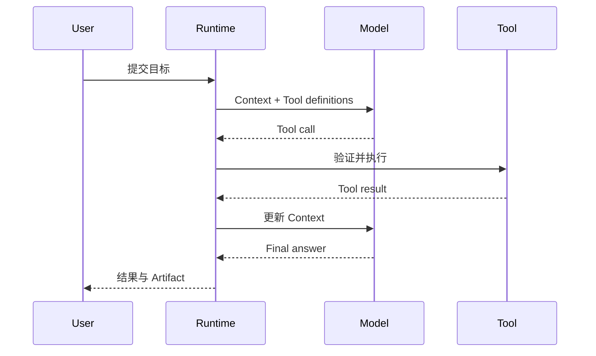

一个实用的工程抽象是：Agent 由模型、上下文和工具组成，并通过 Runtime 与外部环境形成闭环。

:::note[内容状态：通用原理]
本页解释通用 Agent 概念；BearAgent 的具体实现状态以[当前状态](../project/status.md)为准。
:::

## 五个部分分别做什么

| 部分 | 职责 | 不应该负责 |
|---|---|---|
| Model | 根据当前观察选择下一步输出或工具调用 | 持久化事实、授予权限 |
| Context | 组织当前决策所需的信息 | 充当完整数据库或审计日志 |
| Tool | 读取或改变外部环境 | 绕过 Runtime 直接获得宿主权限 |
| Environment | 文件、数据库、网页、用户等真实世界状态 | 被误认为模型上下文本身 |
| Runtime / Harness | 维护循环、状态、预算、验证和安全边界 | 把 Provider SDK 变成领域模型 |

## 最小闭环

关键不是模型“会调用函数”这一瞬间，而是 Runtime 能否验证请求、限制资源、记录事实，并在失败时
给出明确状态。模型输出和工具输出都只是输入数据，不能自行改变权限边界。

## 为什么 Context 不是 Event Store

Context 是模型在某个决策点看到的信息视图，可以被压缩或重组；Event Store 保存已经发生的
不可变事实，用于审计和重建状态。两者可能共享部分内容，但目的完全不同。

## 延伸阅读

- [《深入理解 AI Agent》第 1 章](https://bojieli.github.io/ai-agent-book/book/chapter1/)
- [《深入理解 AI Agent》第 2 章](https://bojieli.github.io/ai-agent-book/book/chapter2/)
