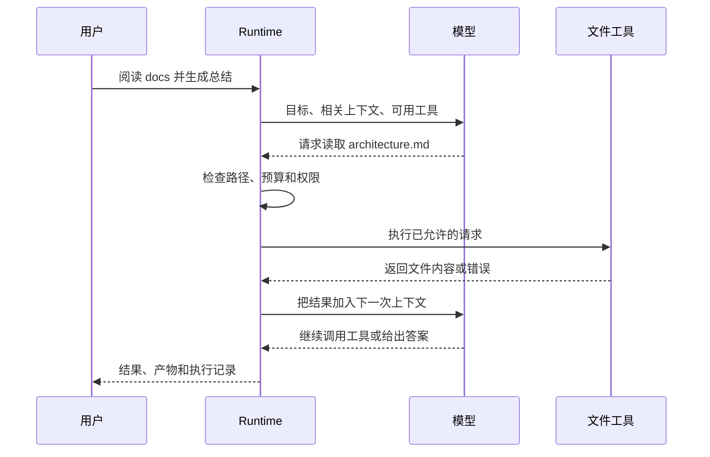

假设用户让 Agent 比较三份设计文档并写一份总结。模型不能自己打开硬盘文件；它只能根据当前
看到的内容，请求一个读文件工具。Runtime 检查请求、执行工具、把结果放回下一次模型输入，
直到模型给出最终答案或任务必须停止。

:::note[通用原理]
本页讲的是 Agent 系统通常怎样分工，不表示 BearAgent 已经接通真实模型和文件工具。
:::

## 一次循环里谁做什么

模型（Model）负责从当前信息中选择下一步。上下文（Context）是这一次选择所需的信息。工具
（Tool）真正读取或改变外部环境。Runtime 把这些步骤组织成循环，并负责验证、状态、预算和权限。

外部环境不等于上下文。一个仓库可以有几万个文件，但模型在某一刻只需要看到其中一小部分。
同样，上下文也不是完整历史记录：它可以为了下一次决策被筛选或压缩，已经发生的事实则应单独保存。

## 为什么不能让模型自己决定权限

模型输出只是数据。文件内容、网页或工具结果都可能包含诱导指令，所以“系统提示词里写了不要
越权”不构成真正的安全边界。模型可以请求写文件，Runtime 必须根据规范化后的路径和已有授权
独立决定是否允许。

BearAgent 把这条原则写成架构限制：所有外部操作都要经过统一的工具执行入口；Prompt、Skill、
模型输出和工具输出都不能给自己增加权限。

## 接下来读什么

下一页先看[BearAgent 内部怎样交换数据](../architecture/domain-contracts.md)，再看
[状态和预算怎样计算](runtime-state-and-budgets.md)。
