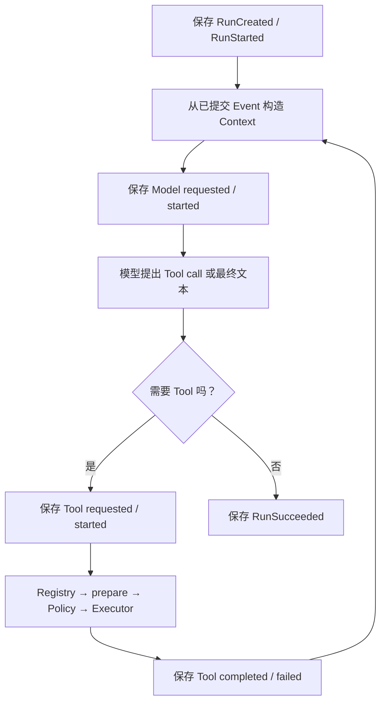

用户提出：“读取 `docs/intro.md`，把介绍写到 `outputs/intro.md`。”F-0016 之前，BearAgent 已经会
单独调用模型、保存 Event 和安全读写文件，但没有模块负责把它们接成一次 Run。现在 application 层的
Agent Loop 负责接线，每一步的规则仍留在原来的边界里。

## Context 不是另一份聊天记录

每次调用模型前，ContextBuilder 都重新读取该 Run 已经保存的 v2 Event。它先放 Runtime 安全规则，
再放 Agent 说明和用户目标，最后放完整的模型/Tool 交互。Tool schema 来自 Registry 注册时的
`ToolSpec`，Agent 的文字说明不能凭空增加一个 Tool，也不能修改 Policy。

ToolResult 太大时，进入下一次模型请求的是带原始 byte 数和有限 preview 的 JSON；完整 ToolResult
仍在 Event 中。整个 Context 太大时，只省略最早的完整交互组，不会留下“有 Tool call、没有结果”的
残缺历史，也不会让模型偷偷总结被省略内容。

## 外部调用前为什么先保存 started

模型调用可能产生费用，`workspace.write` 可能已经让文件生效。Agent Loop 因而先保存 requested 和
started Event，确认保存成功后才调用外部 port。调用返回后，再保存 completed 或 failed。

如果 started 保存失败，外部调用根本不会发生。如果文件已经写完，但 Tool completed Event 保存失败，
Loop 立即停下，不重写文件，也不伪造成功。此时 Run 可能保持非终态；P2 才会根据路径和 hash 做恢复
核对。

## Tool 失败为什么还能继续

模型请求 `../secret.txt` 时，ToolExecutor 会在 prepare 阶段返回结构化路径错误。Agent Loop 把这条
失败保存成 ToolCallFailed，再作为 `is_error=true` 的 Tool message 交给下一次模型调用。只要预算还
允许，模型可以改用合法路径。

Tool 失败不会自动重试或直接终止 Run。模型失败、流协议损坏、Context 无法构造或预算耗尽才会让
Run 失败。每次新的模型或 Tool Activity 前，Loop 都使用 Event 推导出的最新 RunState 检查模型次数、
Tool 次数、token、费用和总时间。

## 当前实现与后续能力

F-0016 已提供 Python application 接口，并用五个固定 Fake Provider 任务在内存和 SQLite Store 上验证
读取、搜索、写入、替换、路径拒绝和预算终止。F-0005 已组装 Provider、SQLite、workspace Tools 与
`run/inspect/events`，并让同一任务集通过 production composition；自动验证仍没有调用真实模型 API。

进程重启后自动继续、Attempt、`UNKNOWN` 和写后 reconcile 属于 P2。用户 Approval、Grant 和 sandbox
属于 P3。当前的持久边界让失败可检查，但不宣称 exactly-once。

继续阅读[从命令行运行并检查一次 Run](run-inspect-events.md)，再到
[有界 Agent Loop 实现导读](../development/agent-loop.md)查看代码位置和测试证据。
