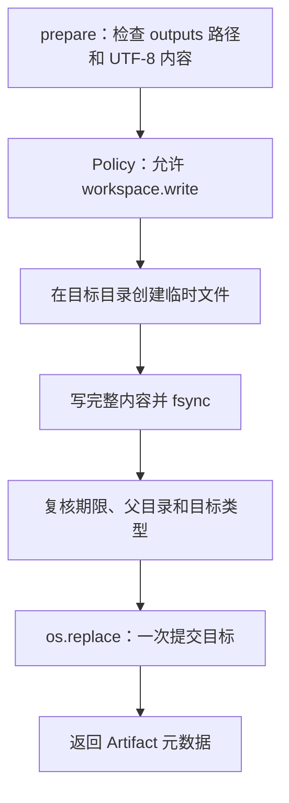

用户希望 Agent 把介绍写到 `outputs/intro.md`。最直接的做法是打开目标文件，然后一段一段写入。
但如果进程写到一半失败，旧文件已经被截断，其他读取者还可能看见半份新内容。

F-0008 把“准备内容”和“让目标生效”分开：先在目标目录写一份完整临时文件，确认内容已写完，
最后才用一次 replace 把目标切换到新文件。



## 为什么临时文件要和目标放在同一目录

replace 只有在同一文件系统内才能作为一个提交点。临时文件如果放在系统临时目录，目标可能位于
另一块磁盘，移动时就会退化成复制，重新暴露半份内容。

BearAgent 因而在 `outputs/intro.md` 所在目录独占创建临时文件。写入和 `fsync` 完成后，再次检查父
目录、目标类型和 deadline。只有这些条件仍成立，才同步执行一次 `os.replace`。这一步之间没有
`await`，避免调用被取消后后台线程又悄悄提交目标。

## “原子”只承诺目标没有半份内容

提交前失败，原目标保持旧内容或不存在；replace 成功后，新打开的读取者看到完整新内容。这是
F-0008 所说的原子可见性。

它不等于以下更强保证：

- 不承诺断电后目录项一定留在磁盘；
- 不承诺进程退出后自动继续；
- 不承诺一次 Tool 请求 exactly-once；
- 不自动扫描或清理强制退出留下的临时文件。

如果进程在 replace 成功后、Event 保存前退出，完整文件可能存在，但 Runtime 还不知道 Activity
是否成功。P2 会根据目标路径和 hash 做 reconcile；F-0008 不猜测，也不自动重写。

## Artifact 让调用者核对结果

成功结果不复制整篇内容，而是返回一个冻结的 Artifact：

```json
{
  "artifact_id": "<uuid4>",
  "path": "outputs/intro.md",
  "kind": "text",
  "encoding": "utf-8",
  "size_bytes": 1234,
  "sha256": "<64 位小写十六进制>"
}
```

`path` 只是元数据，不会额外授予文件权限。调用者可以用字节数和 SHA-256 核对具体内容；F-0016
已把 Artifact 随完整 ToolResult 关联到 Tool Activity Event，但仍不能通过 CLI 或独立 Artifact 表查询。

## 当前已经实现到哪里

`workspace.write` 只接受 `outputs/<file>` 和不超过 512 KiB 的 UTF-8 文本，单行最多 64 KiB。它与
三个只读 Tool 一样，必须经过 Registry、`prepare`、固定 Policy 和 Executor。未进入 allowlist、
路径越界、目标不是普通文件或内容超限时，都不会提交目标。

这条写入边界已有创建、替换、路径逃逸、链接、目标变化、`fsync`/replace 失败、timeout 和取消测试。
F-0016 已实现 Agent Loop 和 Tool Event 接线；F-0005 已让 Run CLI 返回并查询已提交的 Artifact 元数据。

继续阅读[原子输出与 Artifact 实现导读](/BearAgent/zh-cn/development/atomic-output-artifacts/)，查看代码位置和测试。
