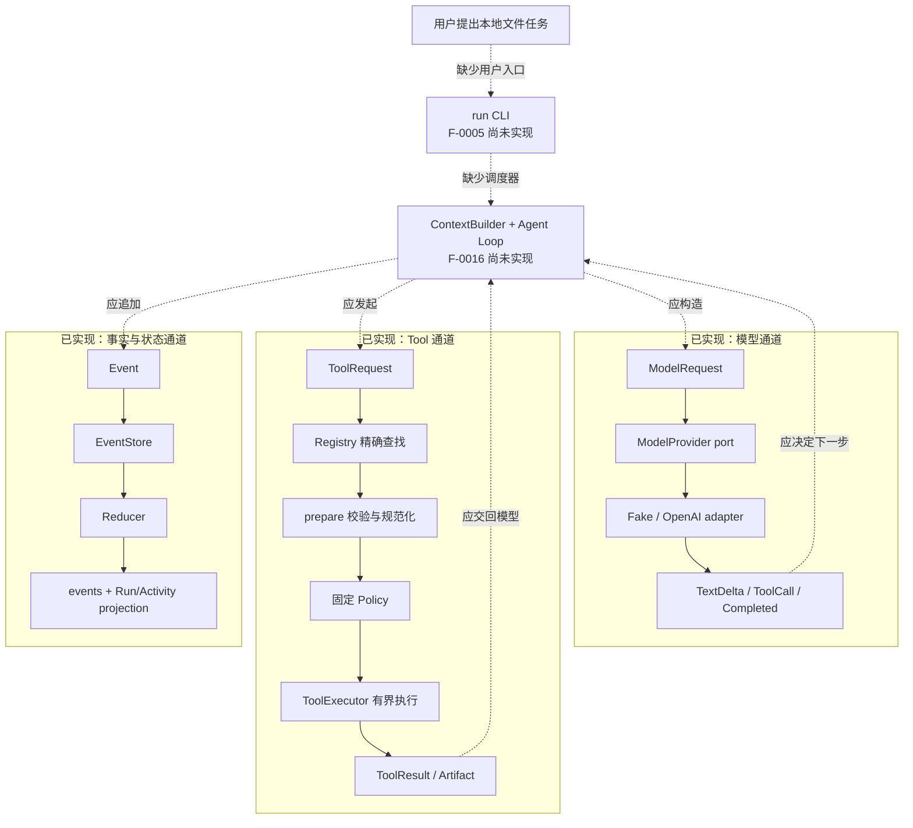
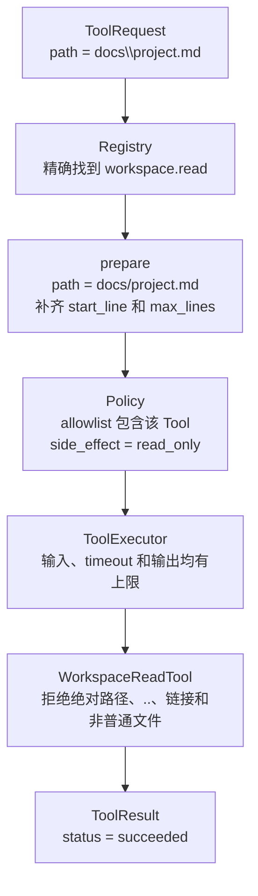
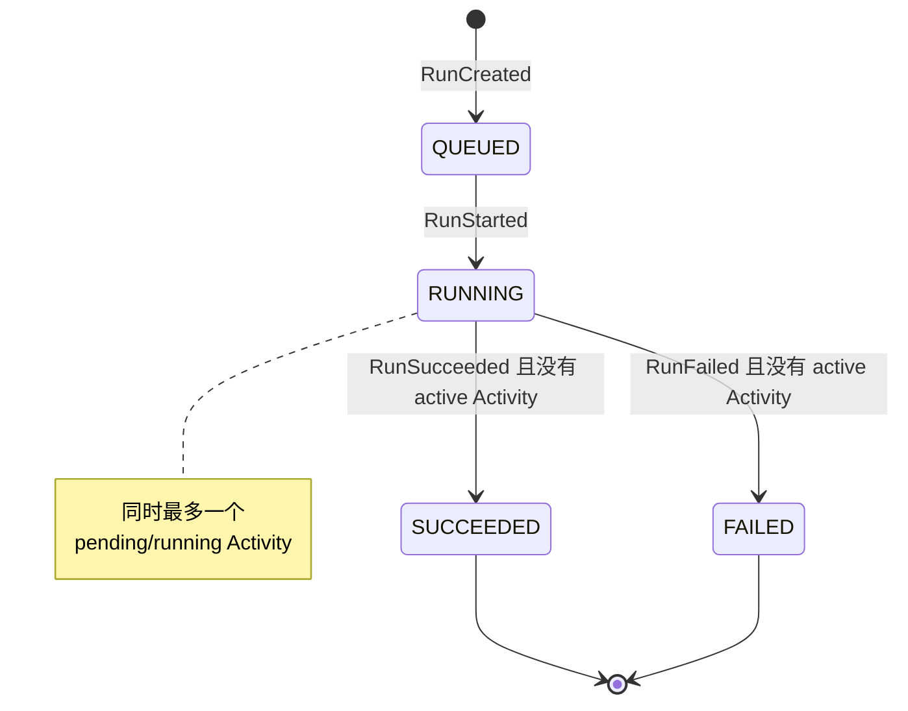
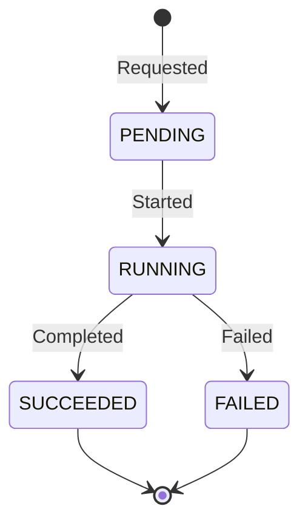

先看结论：F-0016 开始前，BearAgent 已经有三条可以独立验证的通道：模型调用、Tool 安全执行、
Event 持久化与状态计算。现在缺的不是另一个文件 Tool，而是负责组装上下文、推进下一步并保存事实的
`ContextBuilder + Agent Loop`。

因此下面这条命令目前还不能运行：

```powershell
bearagent run "读取 docs/project.md，把简介写到 outputs/intro.md"
```

测试和调用代码已经可以分别使用三条通道，但还没有生产调用方自动把上一段结果交给下一段。

## 三条通道已经做到哪里

| 已实现部分 | 现在可以验证什么 | 还没有负责什么 |
|---|---|---|
| 内部数据 | ID、Message、Error、Event、ModelRequest、ToolRequest 和 Artifact 都经过有界校验 | 不决定下一步 |
| 状态与预算 | Reducer 从 Event 计算 Run/Activity 状态；五类预算在新 Activity 前检查 | 不主动创建 Event |
| SQLite EventStore | Event 与 Run/Activity projection 在同一 transaction 中提交 | 不调度模型或 Tool |
| 模型边界 | Fake Provider 和 OpenAI Responses adapter 返回 BearAgent ModelEvent | 不组装 Context，不写 Run Event |
| Tool 执行边界 | Registry、prepare、固定 Policy、timeout 和结果上限组成统一入口 | 不决定调用哪个 Tool |
| workspace Tool | 可以列目录、分段读取、搜索文本，并原子写入 `outputs/**` | 不把结果自动交回模型 |



实线区域有代码和测试；虚线连接是尚未完成的编排。

## 用固定数据走一次读写任务

假设示例 workspace 中有 `docs/project.md`：

```text
# Project
BearAgent is local-first.
Events record facts.
```

本页固定以下 ID，便于观察同一个 Run 中的数据怎样关联。它们只是讲解值，不是一次真实执行记录。

```text
RunId          R  = 11111111-1111-4111-8111-111111111111
SessionId      S  = 22222222-2222-4222-8222-222222222222
ModelActivity  M1 = 30000000-0000-4000-8000-000000000001
ModelCallId   MC1 = 40000000-0000-4000-8000-000000000001
ReadActivity   T1 = 30000000-0000-4000-8000-000000000002
ReadToolCall  TC1 = 50000000-0000-4000-8000-000000000001
WriteActivity  T2 = 30000000-0000-4000-8000-000000000004
WriteToolCall TC2 = 50000000-0000-4000-8000-000000000002
ArtifactId     A1 = 70000000-0000-4000-8000-000000000001
```

### 1. RunCreated 固定身份和预算

Event 由公共外壳和带类型的 payload 组成：

```json
{
  "event_id": "90000000-0000-4000-8000-000000000001",
  "run_id": "11111111-1111-4111-8111-111111111111",
  "sequence": 1,
  "event_type": "RunCreated",
  "schema_version": 1,
  "occurred_at": "2026-08-18T02:00:00Z",
  "causation_id": "a0000000-0000-4000-8000-000000000001",
  "correlation_id": "b0000000-0000-4000-8000-000000000001",
  "payload": {
    "session_id": "22222222-2222-4222-8222-222222222222",
    "budget_limits": {
      "max_model_iterations": 3,
      "max_tokens": 5000,
      "max_cost_microusd": 1000,
      "max_wall_time_ms": 60000,
      "max_tool_calls": 2
    }
  }
}
```

Reducer 得到 `QUEUED` Run。此时用量全部为 0，`activities` 为空，`last_sequence=1`。随后
`RunStarted` 把 Run 改成 `RUNNING`。

### 2. ModelRequest 和模型输出已经有内部格式

ContextBuilder 将来要构造下面的数据；当前只能由测试或调用代码直接构造。为把重点放在请求外壳，
下面只保留 `input_schema` 的根类型；实际请求会携带 `ToolSpec` 中完整的字段、默认值和上限：

```json
{
  "model": "gpt-5",
  "messages": [
    {
      "role": "system",
      "parts": [{"kind": "text", "text": "只使用给定 workspace Tool。"}]
    },
    {
      "role": "user",
      "parts": [{"kind": "text", "text": "读取 docs/project.md 并生成简介。"}]
    }
  ],
  "tools": [
    {
      "name": "workspace.read",
      "description": "Read one bounded page of complete lines from a UTF-8 workspace file.",
      "input_schema": {"type": "object"}
    }
  ],
  "max_output_tokens": 512,
  "timeout_ms": 60000,
  "prompt_version": "p1-demo-v1"
}
```

Provider adapter 可以把外部流翻译成完整 Tool call：

```json
{
  "kind": "tool_call",
  "tool_call_id": "50000000-0000-4000-8000-000000000001",
  "provider_call_id": "call_read_01",
  "name": "workspace.read",
  "arguments": {
    "path": "docs\\project.md",
    "start_line": 1,
    "max_lines": 12
  }
}
```

完成信号另外携带 Provider request ID、实际模型、停止原因和 token usage。SDK 对象不会进入
Runtime，adapter 也不会在内部自动重试。

### 3. ToolRequest 必须穿过统一入口



这个三行文件会产生：

```json
{
  "tool_call_id": "50000000-0000-4000-8000-000000000001",
  "status": "succeeded",
  "data": {
    "path": "docs/project.md",
    "text": "# Project\nBearAgent is local-first.\nEvents record facts.\n",
    "start_line": 1,
    "end_line": 3,
    "next_start_line": null,
    "total_lines": 3,
    "truncated": false
  },
  "error": null
}
```

`workspace.write` 使用同一条 Registry、Policy 和 Executor 路径。请求写入：

```json
{
  "tool_call_id": "50000000-0000-4000-8000-000000000002",
  "name": "workspace.write",
  "arguments": {
    "path": "outputs/intro.md",
    "content": "BearAgent summary\n"
  }
}
```

Tool 先在目标目录写完整临时文件，再用一次 replace 提交。成功结果不重复返回正文，只返回 Artifact：

```json
{
  "artifact": {
    "artifact_id": "70000000-0000-4000-8000-000000000001",
    "path": "outputs/intro.md",
    "kind": "text",
    "encoding": "utf-8",
    "size_bytes": 18,
    "sha256": "ea27e78a25443e983ec458621fa8017963c69e5d598c368a16c9d5cd65b5ccb6"
  }
}
```

“原子”只表示目标不会出现半份内容，不表示进程中断后可以自动恢复，也不表示写入 exactly-once。

## Event 怎样改变状态和预算

假设未来 Loop 按当前 v1 Event 合法追加事实，Reducer 会得到下面的变化。示例把
`cost_microusd` 写成 0，因为 Provider 当前只返回 token usage，生产代码尚未建立可信定价来源。

| seq | Event | payload 核心值 | Reducer 得到的变化 |
|---:|---|---|---|
| 1 | `RunCreated` | `session=S`、五类预算 | Run=`queued` |
| 2 | `RunStarted` | `{}` | Run=`running` |
| 3 | `ModelCallRequested` | `activity=M1, model_call=MC1` | M1=`pending`；模型次数 `0→1` |
| 4 | `ModelCallStarted` | `M1, MC1` | M1=`running` |
| 5 | `ModelCallCompleted` | `420/28 tokens, cost=0` | M1=`succeeded`；累计 token `0→448` |
| 6 | `ToolCallRequested` | `T1, TC1, workspace.read` | T1=`pending`；Tool 次数 `0→1` |
| 7 | `ToolCallStarted` | `T1, TC1` | T1=`running` |
| 8 | `ToolCallCompleted` | `T1, TC1` | T1=`succeeded` |
| 9–11 | 第二次 Model Activity | `620/40 tokens, cost=0` | 模型次数 `1→2`；累计 token `448→1108` |
| 12–14 | `workspace.write` Activity | `T2, TC2` | Tool 次数 `1→2`；T2 最终 `succeeded` |
| 15–17 | 第三次 Model Activity | `180/12 tokens, cost=0` | 模型次数 `2→3`；累计 token `1108→1300` |
| 18 | `RunSucceeded` | `{}` | Run=`succeeded`，`last_sequence=18` |

模型次数和 Tool 次数在 Requested Event 被接受时增加；token 和费用在 Model Completed/Failed 时按
实际值增加。预算不足时，新 Requested Event 不会成为事实，也不会出现一个凭空的 Activity。

## 两层状态机各自回答什么

Run 回答“整条用户请求做到哪里”：



Activity 回答“一次模型或 Tool 操作做到哪里”：



终态 Run 拒绝任何后续 Event。一次 Run 也不能同时存在两个 `PENDING/RUNNING` Activity。

## SQLite 保存的是事实和查询结果

每次 `EventStore.append` 都在一个 transaction 中完成：

```text
读取旧 projection
    -> Reducer 校验下一条 Event
    -> INSERT events
    -> 更新 run/activity projections
    -> COMMIT
```

`events` 是事实；`run_projections` 和 `activity_projections` 是便于查询的当前结果。如果任何一步失败，
transaction 回滚，不会只提交一半。

正常关闭并重开数据库后，已提交 Event 和 projection 仍可查询。但是 Runtime 不会扫描并继续非终态
Run；Checkpoint、Attempt、重试和 `UNKNOWN` 属于 P2。

## F-0016 要接上的不是一个普通函数

F-0016 需要让一个可信调度器承担完整顺序：

```text
用户目标
    -> 构造有界 ModelRequest
    -> 保存 Model Activity 事实
    -> 调用 Provider 并收集完整结果
    -> 识别 Tool call
    -> 保存并执行 Tool Activity
    -> 把有限 ToolResult 放进下一轮消息
    -> 再次调用模型
    -> 明确成功、失败或预算终止
```

当前 v1 Event 也只能保存状态骨架：`RunCreated` 没有目标和 Agent/Prompt/Tool 版本；
`ModelCallCompleted` 没有模型文本、Provider request ID 和停止原因；`ToolCallCompleted` 没有完整
ToolResult 或 Artifact。F-0016 必须用版本化数据补上这些事实，不能偷偷改变已有 v1 Event 的含义。

F-0016 完成后仍没有 `bearagent run` 用户入口；CLI 与 `inspect/events` 属于 F-0005。进程重启恢复、
Approval 和 sandbox 也仍分别属于 P2/P3。

继续阅读：

- [状态和预算怎样计算](runtime-state-and-budgets.md)
- [一个 Tool 请求为什么要过四道检查](tool-execution-boundary.md)
- [一次请求怎样穿过 BearAgent](../architecture/runtime-flow.md)
- [现在实现到了哪里](../project/status.md)
