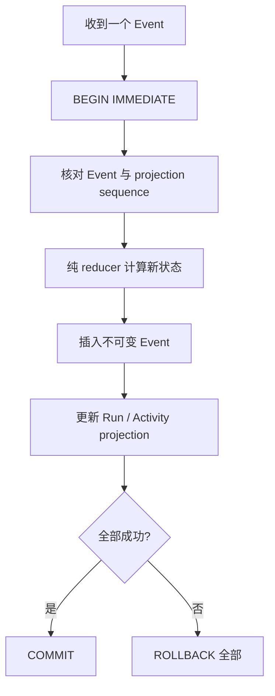

一个进程内 reducer 能回答“这串 Event 会得到什么状态”，但进程退出后，内存里的 Event 也会
消失。F-0003 增加的是 **durable facts**：一次成功提交后，正常关闭并重新打开数据库，仍能查询
完整 Event 和由它派生的 Run/Activity 状态。

## 一次 append 为什么必须原子

Event 是事实，projection 是查询优化。如果二者分开提交，崩溃可能留下“事实存在但状态没变”或
“状态变了但没有事实”的分叉。BearAgent 把 reducer 校验、Event insert 和 projection update 放在
同一个 SQLite transaction；测试还会故意让 projection 写失败，确认先插入的 Event 一并回滚。

## projection 为什么不是第二份真相

F-0003 的 `run_projections` 和 `activity_projections` 让后续 `inspect` 不必每次重放整个 Event stream。
读取时仍会验证字段、sequence 和 typed ID；发现非法 JSON、Event 中间缺口或 projection 序号分叉
就停止，而不是猜一个看似合理的状态。

## 持久化不等于恢复

现在可以证明：

- 已提交 Event 在正常重开 SQLite 后仍可查询；
- 非终态 Run 仍显示真实非终态，不会被误标成功；
- 竞争写同一个 sequence 时最多一个提交；
- Event 与 projection 不会出现半提交。

现在仍不能证明：

- Runtime 启动时会扫描并继续非终态 Run；
- 一个中断的模型或 Tool Activity 应该重试、复用结果还是进入 `UNKNOWN`；
- Checkpoint 损坏时可以安全回退；
- 外部副作用是 exactly-once。

这些属于 P2。F-0003 的价值是先把“发生过什么”可靠留下，P2 才能基于事实决定“应该怎样继续”。
