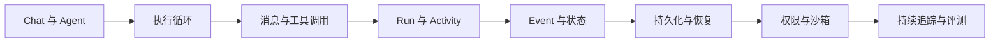

这条路径不是罗列 Agent 产品功能，而是按照工程依赖逐层回答：一个模型调用怎样变成一个可以
长期维护的 Agent Runtime？

:::note[内容状态：通用原理 + BearAgent 学习路线]
本页安排学习顺序；其中一些 BearAgent 模块仍处于规划阶段。
:::

## 第一层：Agent 的最小组成

先理解 Model、Context、Tool 和 Environment，然后观察模型如何根据工具结果继续决策。
从[Agent 基础原理](agent-basics.md)开始。

## 第二层：稳定的运行时契约

当执行跨越多个模型和工具 Activity 时，字符串与任意字典会迅速制造歧义。BearAgent 从
F-0001 开始稳定 ID、Message、Error 和 Event envelope。先读面向初学者的
[F-0001 领域契约导读](../architecture/domain-contracts.md)，需要继续看代码时再进入
[F-0001 开发者实现导读](../development/domain-contracts.md)。

## 第三层：从可检查到可恢复

F-0002 已实现 P1 的 Run/Activity 状态、纯 Reducer 和五维预算门。先阅读
[Run 状态、Reducer 与预算](runtime-state-and-budgets.md)，理解为什么“相同 Event 可重放”仍不等于
“进程重启后能自动续跑”。F-0003/F-0004 将继续补 EventStore 与 Agent Loop；P2 才增加 Checkpoint、
幂等、恢复和 `UNKNOWN`。

## 第四层：安全与质量

P3 学习权限、用户审批和隔离执行。评测则从 P1 就开始：先记录固定任务与执行路径，P2 增加中断
恢复演练，P3 增加越权与隔离测试，P5 再把这些证据做成持续比较系统。它们共同回答 Agent
“能否以允许的方式持续完成任务”，而不只是“偶尔能不能给出好答案”。

## 每个 Feature 如何进入学习路径

后续每个 Feature 完成时，本学习路径都会增加或更新对应概念、前置知识和实现状态；开发者文档
则同步代码入口、契约和测试证据。一个 Feature 只有两条路径与[当前状态](../project/status.md)
都更新后，才算完成文档关闭。
