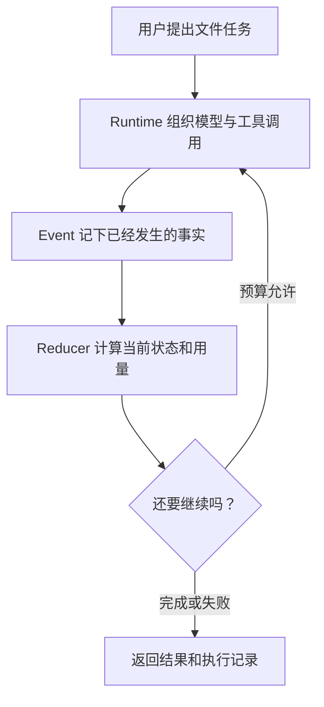

这条学习路径始终使用同一个例子：用户要求 Agent 阅读仓库文档，并把总结写进 `outputs/`。
每一页只增加一个问题，避免先背完术语再猜它们如何协作。

:::note[页面会明确标出实现状态]
学习路径同时讲通用原理、已实现代码和后续设计。出现未来能力时，会直接说明它尚未实现。
:::

## 1. 先分清模型、工具和 Runtime

[一项 Agent 任务怎样运转](agent-basics.md)从最小执行循环开始。你会看到模型只是提出下一步，
文件访问、预算和权限都由 Runtime 控制。

## 2. 再理解模块之间传什么

[BearAgent 内部怎样交换数据](../architecture/domain-contracts.md)解释为什么内部模块使用自己的
ID、Message、Error 和 Event，而不直接传某个模型 SDK 的对象。

## 3. 看状态怎样从事实产生

[状态和预算怎样计算](runtime-state-and-budgets.md)先解释 Event 和 Reducer 的分工，再说明模型次数、
token、费用、时间和工具次数在什么时刻记账。

## 4. 跟完一条具体执行记录

[逐条读懂一次 Run](run-event-reducer-walkthrough.md)把一个模型调用、一次读文件和一次预算拒绝连在
一起。读完后再去看代码，会更容易理解每种 Event 为什么存在。

## 5. 区分“事实保存下来”和“任务会恢复”

[持久事实与安全恢复的边界](durable-events.md)解释 F-0003 怎样用同一个 SQLite transaction 保存
Event 和 projection，以及为什么数据库能够重开仍不等于 Runtime 会自动继续非终态 Run。

## 6. 看外部模型协议怎样停在 adapter 边界

[为什么模型服务需要独立边界](model-provider-boundary.md)沿着 F-0004 的流式请求说明 SDK 对象、
Provider tool call ID、usage 和异常怎样被翻译成 BearAgent 内部数据。

当前这条路径覆盖 F-0001 至 F-0004。文件工具、ContextBuilder 和完整 Agent Loop 仍是 P1 的后续
工作；崩溃恢复和授权分别属于 P2、P3。
