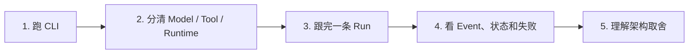

这条主路径始终使用同一个例子：用户要求 Agent 阅读仓库文档，并把总结写进
`outputs/summary.md`。先看到命令和结果，再解释背后的模块；不要求读者先读 Feature 历史或背完整
术语表。

:::note[页面会明确标出实现状态]
P1 的 CLI、文件 Tool、SQLite、Agent Loop 和查询入口已经接通；DeepSeek V4 suite v1.1.1 已通过
真实 5/5，P1 已关闭。出现恢复、Approval 或 sandbox 时，页面会直接标明它们属于后续阶段。
:::

## 1. 先跑通 P1 的命令行

从[P1 命令行完整使用手册](../guides/cli.md)开始。先用零预算 profile 验证 `run/inspect/events`，
再决定是否配置真实 Provider。你会先看见 Run ID、状态、Activity、Artifact 和有序 Event，而不是
先面对内部类名。

## 2. 分清模型、Tool 和 Runtime

[一项 Agent 任务怎样运转](agent-basics.md)从最小执行循环开始。你会看到模型只是提出下一步，
文件访问、预算和权限都由 Runtime 控制。

## 3. 跟完一条完整 Run

[一次文件任务怎样走完整条执行链](agent-loop-file-task.md)把前面的边界接起来。你会看到 Context
怎样只从已提交 Event 重建、外部调用为什么发生在 started Event 之后，以及 Tool 失败怎样回到模型。

接着读[一次请求怎样穿过 BearAgent](../architecture/runtime-flow.md)，把 CLI、Application、Provider、
ToolExecutor 和 SQLite 放进同一张图。

如果要使用自己的模型服务，再读[配置一次模型服务，运行不同目标](configure-model-service.md)。它说明
config v1、RunProfile v2、三种 wire protocol 以及为什么 BearAgent 不猜协议、不 fallback。

## 4. 看懂状态、预算和已保存事实

[状态和预算怎样计算](runtime-state-and-budgets.md)解释 Event 与 Reducer 的分工，以及模型次数、
token、费用、总时间和 Tool 次数何时记账。

[逐条读懂一次 Run](run-event-reducer-walkthrough.md)把一个模型调用、一次读文件和一次预算拒绝连在
一起。[持久事实与安全恢复的边界](durable-events.md)随后解释：SQLite 能重开查询，不等于进程会自动
恢复。

## 5. 理解 P1 最重要的取舍

[P1 为什么这样设计](../architecture/p1-decisions.md)集中解释九项决定：为什么先用 CLI/SQLite，为什么
核心不传 SDK 对象，为什么状态来自 Event，为什么 Tool 必须经过默认拒绝 Policy，为什么路径不跟随
链接，为什么输出原子替换，以及为什么 timeout 不会自动重试。

读完后，进入[开发者代码路线](../development/)；它按实际调用关系链接到实现和测试。

## 按问题继续深挖

| 想弄清的问题 | 页面 |
|---|---|
| Provider SDK 为什么不能进入 Runtime | [为什么模型服务需要独立边界](model-provider-boundary.md) |
| Tool 请求为什么不能直接执行 | [一个 Tool 请求为什么要过四道检查](tool-execution-boundary.md) |
| Windows/Unix 路径怎样统一并防逃逸 | [workspace 路径边界](workspace-read-boundary.md) |
| 为什么输出不会留下半份目标 | [原子输出边界](atomic-output-boundary.md) |
| CLI 与 EventStore 怎样接线 | [从命令行运行并检查一次 Run](run-inspect-events.md) |

行业现状、研究问题和 F-0016 之前的分阶段实现记录放在扩展阅读中，不再打断主路径：
[Agent 现在发展到哪一步](agents-today.md)、[Agent 仍然难在哪里](open-problems.md)、
[F-0016 前的实现快照](before-agent-loop.md)。

当前这条路径已覆盖 F-0017 的离线实现和 DeepSeek V4 suite v1.1.1 真实 5/5。崩溃恢复和用户授权
分别属于 P2、P3。

## 6. 分清恢复、授权和隔离

[一次失败后，Runtime 应先问哪三个问题](recovery-authority-isolation.md)从写文件超时开始，解释
Activity 与 Attempt、副作用分类、`UNKNOWN`、参数绑定 Approval 和隔离 runner。页面也说明 hard
budget 为什么仍要保留，以及 Routing、MCP 和 Memory 为什么不属于 P2/P3。
