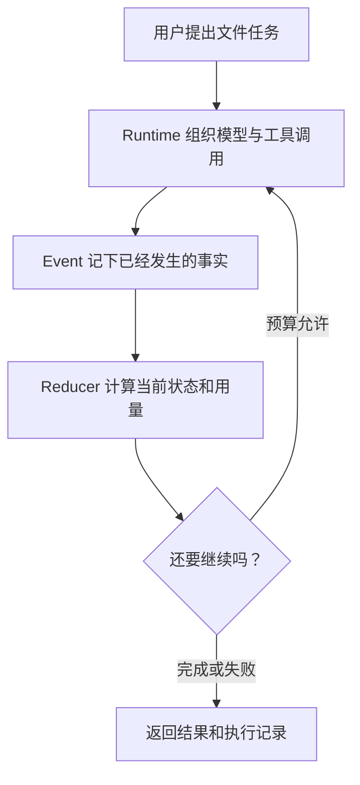

这条学习路径始终使用同一个例子：用户要求 Agent 阅读仓库文档，并把总结写进 `outputs/`。
每一页只增加一个问题，避免先背完术语再猜它们如何协作。

:::note[页面会明确标出实现状态]
学习路径同时讲通用原理、已实现代码和后续设计。出现未来能力时，会直接说明它尚未实现。
:::

## 1. 先分清模型、工具和 Runtime

[一项 Agent 任务怎样运转](agent-basics.md)从最小执行循环开始。你会看到模型只是提出下一步，
文件访问、预算和权限都由 Runtime 控制。

## 2. 再理解模块之间传什么

[BearAgent 内部怎样交换数据](../architecture/domain-contracts.md)解释为什么内部模块使用自己的
ID、Message、Error 和 Event，而不直接传某个模型 SDK 的对象。

## 3. 看状态怎样从事实产生

[状态和预算怎样计算](runtime-state-and-budgets.md)先解释 Event 和 Reducer 的分工，再说明模型次数、
token、费用、时间和工具次数在什么时刻记账。

## 4. 跟完一条具体执行记录

[逐条读懂一次 Run](run-event-reducer-walkthrough.md)把一个模型调用、一次读文件和一次预算拒绝连在
一起。读完后再去看代码，会更容易理解每种 Event 为什么存在。

## 5. 区分“事实保存下来”和“任务会恢复”

[持久事实与安全恢复的边界](durable-events.md)解释 F-0003 怎样用同一个 SQLite transaction 保存
Event 和 projection，以及为什么数据库能够重开仍不等于 Runtime 会自动继续非终态 Run。

## 6. 看外部模型协议怎样停在 adapter 边界

[为什么模型服务需要独立边界](model-provider-boundary.md)沿着 F-0004 的流式请求说明 SDK 对象、
Provider tool call ID、usage 和异常怎样被翻译成 BearAgent 内部数据。

## 7. 看一次 Tool 请求怎样通过检查和权限

[一个 Tool 请求为什么要过四道检查](tool-execution-boundary.md)用读取 `docs/index.md` 的请求解释
Registry、`prepare`、Policy 和 Executor。你会看到参数错误和权限拒绝为什么必须发生在 Tool 真正
执行之前。

## 8. 看 Windows 和 Unix 路径怎样进入同一边界

[Windows 和 Unix 路径为什么先变成同一种写法](workspace-read-boundary.md)从
`docs\guide.md` 和 `docs/guide.md` 解释 F-0007 怎样让 Policy 只看一种路径，再由当前平台读取真实
文件。页面也说明 list、read、search 的分页、链接拒绝和资源上限。

## 9. 看完整结果怎样一次出现

[为什么不能直接覆盖输出文件](atomic-output-boundary.md)沿着 `outputs/intro.md` 解释同目录临时文件、
`fsync`、原子 replace 和 Artifact。你会看到“目标没有半份内容”为什么仍不等于崩溃恢复或
exactly-once。

## 10. 把模型、Tool 和 Event 接成一次 Run

[一次文件任务怎样走完整条执行链](agent-loop-file-task.md)把前面的边界接起来。你会看到 Context
怎样只从已提交 Event 重建、外部调用为什么发生在 started Event 之后，以及 Tool 失败怎样回到模型。

## 11. 从终端启动后检查同一批事实

[从命令行运行并检查一次 Run](run-inspect-events.md)说明 Run profile、production composition、
`inspect/events` 和 human/JSON 输出怎样接到现有 EventStore，而不复制 SQL 或状态规则。

当前这条路径覆盖已实现的 F-0001 至 F-0008、F-0015 和 F-0016。真实模型 P1 退出演练仍待单独
决定；崩溃恢复和用户授权分别属于 P2、P3。
