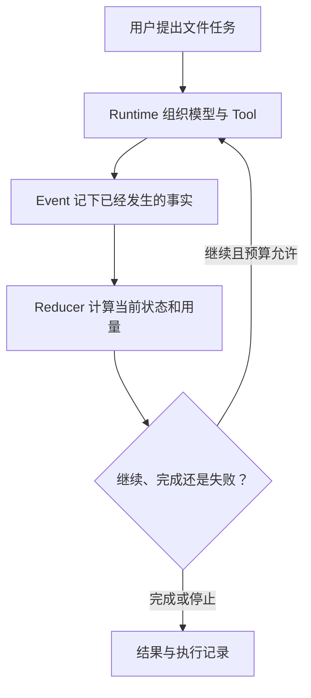

学习 Agent 容易掉进两个极端：只看模型怎样“思考”，或者一上来就背框架名词。这条路径改用一个
具体任务贯穿所有页面：

> 用户要求 Agent 阅读仓库文档，比较几个方案，并把总结写进 `outputs/report.md`。

模型需要理解目标和选择下一步，Tool 才能真正读写文件，Runtime 负责把它们组织成有界执行，并把
已经发生的事实保存下来。

:::note[每页都区分三种内容]
“Agent 通常怎样工作”是通用概念；“BearAgent 为什么这样设计”是项目取舍；“当前代码已经做到”
必须有仓库代码和测试支持。未来能力会在相关段落直接标为尚未实现。
:::

## 第一部分：先建立今天的 Agent 全景

1. [Agent 现在发展到哪一步](agents-today.md)：从聊天、Tool use 到编码、研究和电脑操作 Agent，
   看清能力进步与真实任务限制。
2. [Agent 仍然难在哪里](open-problems.md)：理解长任务可靠性、上下文、评测、安全、权限、成本和
   多 Agent 协作为什么仍是工业界与学术界的热点。
3. [一项 Agent 任务怎样运转](agent-basics.md)：回到最小执行循环，分清 Model、Context、Tool、
   Runtime、Memory 和 Event。

这三页先回答“为什么要有 Runtime”。如果只看模型演示，很难理解 BearAgent 为什么优先做 Event、
预算和 Tool 权限，而不是先堆更多 Tool。

## 第二部分：沿 BearAgent 的执行路径学习

4. [F-0016 前，BearAgent 已经完成什么](before-agent-loop.md)：沿一个读写文件任务查看模型、Tool、
   Event 与状态三条已实现通道，以及它们尚未自动接通的位置。
5. [BearAgent 内部怎样交换数据](../architecture/domain-contracts.md)：为什么内部模块使用自己的 ID、
   Message、Error 和 Event，而不直接传某个模型 SDK 对象。
6. [状态和预算怎样计算](runtime-state-and-budgets.md)：Event 和 Reducer 怎样分工，模型次数、token、
   费用、时间和 Tool 次数在什么时刻记账。
7. [逐条读懂一次 Run](run-event-reducer-walkthrough.md)：把一个模型调用、一次文件读取和一次预算
   拒绝连成完整记录。
8. [持久事实与安全恢复的边界](durable-events.md)：为什么 Event 能重开查询，仍不等于进程重启后
   可以安全继续。
9. [为什么模型服务需要独立边界](model-provider-boundary.md)：SDK 对象、Provider call ID、usage
   和异常怎样翻译成内部数据。
10. [一个 Tool 请求为什么要过四道检查](tool-execution-boundary.md)：Registry、参数准备、Policy 和
   Executor 怎样把模型建议变成受控执行。

## 第三部分：回到整体架构

读完执行路径后，再看[一次请求怎样穿过 BearAgent](../architecture/runtime-flow.md)和
[可靠性与安全边界](../architecture/reliability-boundaries.md)。这时 port、adapter、projection、
fail closed 等术语都会对应到刚看过的具体问题。

## 当前实现边界

当前学习路径涉及的内部数据、状态与预算、SQLite EventStore、模型 adapter、Tool 执行边界和四个
workspace Tool 已经实现。ContextBuilder、完整 Agent Loop 和 Run CLI 尚未接通；崩溃恢复、用户
授权和 sandbox 属于后续阶段。查看随代码同步的[当前实现状态](../project/status.md)。
