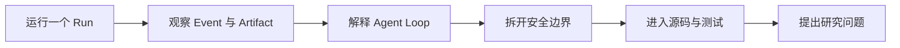

你不需要先读完全部 Spec，也不需要先背 Agent 术语。本书始终使用同一项任务：

> 阅读 workspace 中的项目资料，把一份总结写进 `outputs/summary.md`。

我们先让它运行，再一层层解释是谁调用模型、谁执行 Tool、谁保存 Event、谁阻止越界。读到开发者
部分时，你会沿同一条链进入源码和测试。

:::note[开始前知道两件事就够了]
P1 的 CLI、SQLite、模型 adapter、workspace Tool 和 Agent Loop 已经接通。P2 的进程中断恢复、P3 的
Approval 与隔离 runner 仍是后续计划。页面一旦跨过这条边界，会直接标明。
:::

## 六部分分别解决什么问题

| 部分 | 读者问题 | 读完能做到 |
|---|---|---|
| 第一部：先亲手跑一次 | “这个项目到底怎么用？” | 配置模型，启动 Run，查看 Artifact、状态和 Event |
| 第二部：看懂 Agent 运行 | “Model、Tool、Runtime 各干什么？” | 画出一次 Run 的循环，解释状态和预算来源 |
| 第三部：理解安全边界 | “模型为什么不能直接读写文件？” | 解释 adapter、Policy、路径边界和原子提交 |
| 第四部：拼出系统架构 | “这些模块为什么这样分？” | 看懂 interface、application、runtime、port 和 adapter |
| 第五部：沿代码继续学习 | “从哪个文件开始读，怎么验证？” | 顺着调用链找到实现、契约和失败测试 |
| 第六部：走向研究与扩展 | “今天还有哪些问题没有解决？” | 把恢复、隔离、评测和长任务变成研究问题 |

## 第一部：先亲手跑一次

从[完整命令行手册](/zh-cn/guides/cli/)开始。它集中说明安装、配置、`doctor`、`run`、`inspect`、
`events`、退出码、数据位置和排错，不要求你在 Feature 页面之间来回拼步骤。

随后读[配置一次模型服务](/zh-cn/learn/configure-model-service/)和[运行、检查与读取 Event](/zh-cn/learn/run-inspect-events/)。
此时先把 Run ID、Artifact 和有序 Event 看成“程序给你的收据”，还不用理解全部字段。

## 第二部：看懂 Agent 运行

依次阅读：

1. [一项 Agent 任务怎样运转](/zh-cn/learn/agent-basics/)：分清 Model、Context、Tool 与 Runtime；
2. [一次文件任务的完整链路](/zh-cn/learn/agent-loop-file-task/)：跟完模型—Tool—模型循环；
3. [状态和预算怎样计算](/zh-cn/learn/runtime-state-and-budgets/)：理解 Event 与 Reducer；
4. [逐条读懂一次 Run](/zh-cn/learn/run-event-reducer-walkthrough/)：把抽象规则落到事件序列；
5. [Event 为什么是事实来源](/zh-cn/learn/durable-events/)：分清“能够重开查询”和“能够恢复执行”。

## 第三部：理解安全边界

这部分从四个常见误解出发：

- “SDK 对象直接传进 Runtime 更省事” → [模型为什么需要 adapter](/zh-cn/learn/model-provider-boundary/)；
- “模型都选择 Tool 了，直接调用就行” → [Tool 请求为什么过四道检查](/zh-cn/learn/tool-execution-boundary/)；
- “拒绝 `..` 就不会越界” → [路径怎样留在 workspace](/zh-cn/learn/workspace-read-boundary/)；
- “写文件只要 `write_text`” → [为什么不能直接覆盖文件](/zh-cn/learn/atomic-output-boundary/)。

最后用[失败后先问哪三个问题](/zh-cn/learn/recovery-authority-isolation/)把 P1 的记录、P2 的恢复和 P3 的授权/
隔离分开。

## 第四、五部：从架构进入源码

先读[架构总览](/zh-cn/architecture/)和[一次请求怎样穿过 Runtime](/zh-cn/architecture/runtime-flow/)，再进入
[源码阅读路线](/zh-cn/development/)。源码页不会只列目录：每篇都会给出读代码的顺序、要守住的不变量、
最小实验和对应测试。

## 第六部：把困惑变成研究问题

[Agent 今天能做什么](/zh-cn/learn/agents-today/)帮助你判断适合 Agent 的任务形状；[Agent 仍然难在哪里](/zh-cn/learn/open-problems/)
把长任务、Context、评测、安全、恢复和多 Agent 协作拆成可研究的问题。参考项目只用来解释通用
概念，不能证明 BearAgent 已经具备同样能力。

## 只有半小时，走这条捷径

1. [BearAgent 要解决什么问题](/zh-cn/start/what-is-bearagent/)；
2. [一次文件任务的完整链路](/zh-cn/learn/agent-loop-file-task/)；
3. [一次请求怎样穿过 Runtime](/zh-cn/architecture/runtime-flow/)；
4. [现在实现到了哪里](/zh-cn/project/status/)。

## 每章怎样读最有效

先回答开头的具体问题；再自己画一遍流程；然后打开“代码位置”中的第一个文件；最后只运行该章列出
的最小测试。能够用自己的话解释“失败时会看到什么”，比记住类名更重要。
