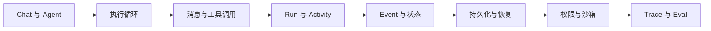

这条路径不是罗列 Agent 产品功能，而是按照工程依赖逐层回答：一个模型调用怎样变成一个可以
长期维护的 Agent Runtime？

:::note[内容状态：通用原理 + BearAgent 学习路线]
本页安排学习顺序；其中一些 BearAgent 模块仍处于规划阶段。
:::

## 第一层：Agent 的最小组成

先理解 Model、Context、Tool 和 Environment，然后观察模型如何根据工具结果继续决策。
从[Agent 基础原理](agent-basics.md)开始。

## 第二层：稳定的运行时契约

当执行跨越多个模型和工具 Activity 时，字符串与任意字典会迅速制造歧义。BearAgent 从
F-0001 开始稳定 ID、Message、Error 和 Event envelope。

## 第三层：可靠执行

后续章节将依次解释有界循环、Reducer、EventStore、幂等、恢复和 `UNKNOWN`。这些内容只有在
相关 Feature 实现并有测试证据后，才会标记为“当前实现”。

## 第四层：安全与质量

最后学习 Grant、Policy、Approval、Sandbox、Trace、Replay 和 Eval。它们回答的是 Agent
“能否以允许的方式持续完成任务”，而不只是“偶尔能不能给出好答案”。
