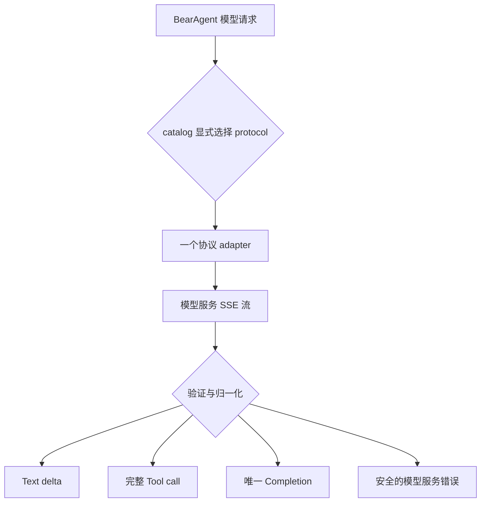

很多 Agent 演示会让主循环直接读取某个 SDK 的响应对象。这样开始很快，但模型厂商的事件
名称、工具调用 ID、用量与异常类型会逐渐进入运行时、持久化和 CLI，最后很难替换或重放。

这里的内部接口（Port）是核心代码只看得到的调用规则；适配器（Adapter）是外层翻译器，把
模型服务的请求、流事件和错误转换成 BearAgent 自己的数据。JSON Schema 则只描述工具参数允许的
JSON 形状，不会授予工具执行权限。

:::tip[内容状态：当前已实现]
F-0004 已实现不依赖特定模型服务商的请求/事件、确定性替代实现，以及首个 OpenAI Responses
流式适配器。F-0016 已实现 ContextBuilder、Agent Loop 和 Tool 接线；F-0005 已通过 production
composition 把它们接到 CLI。自动验收仍使用 Fake Provider。
:::

## 一次模型调用经过三层

`ModelRequest` 只包含模型名、BearAgent Message、工具输入格式、最大输出 token、超时和
提示词版本。API key 不在请求里，SDK 类型也不会进入运行时核心。

成功的流式响应只有三种 BearAgent 事件：文本增量、完整工具调用、唯一模型完成事件。模型完成事件
保留实际模型、停止原因、服务商请求 ID 与实际用量。三个 production adapter 都要求服务报告 usage；
缺失或格式错误会成为 `provider_protocol_error`，不能伪装成 0。领域类型仍允许旧 Event/Fake 数据的
usage 为未知，以保持历史兼容。

## 两种工具调用身份不能混用

服务商的 `call_id` 用来把下一次 ToolResult 关联回它的请求；BearAgent 的 UUID `ToolCallId`
用来关联自己的 Activity、Event 和策略检查。适配器同时保留两者，但服务商 ID 不能替代内部 ID，
更不能授予执行权限。

模型提出 `read_file` 只是一段不可信数据。F-0004 只验证名称和 JSON object arguments；F-0016
以后负责把它转换成 F-0006 的 `ToolRequest`，再交给统一 Executor 和 Policy。P3 还会在同一条路径上
增加 Grant 和用户 Approval。

## 为什么适配器不自动重试

SDK 默认重试可能隐藏第二次费用和第二段输出，使 Event 记录无法解释到底发生过几次模型调用。
F-0004 因此禁用 SDK 自动重试，只把超时、连接失败、429/5xx 标成可重试，把认证、权限、参数、
拒绝与协议损坏标成不可重试。F-0016 的运行时结合预算与 Activity 事实决定终止或继续，但仍不做
自动重试；带 Attempt 的重试语义属于 P2。

流式响应中途失败也不是成功：即使已经看到文本，只要没有合法的模型完成事件，调用就以安全错误结束。

## 下一步

继续到 [F-0004 开发者实现导读](../development/model-provider.md) 查看模型代码边界和测试证据。接着读
[一个 Tool 请求为什么要过四道检查](tool-execution-boundary.md)，可以看到模型提出 Tool call 以后还要
经过哪些独立检查。要理解 Run 如何记录模型 Activity，先读
[Run 状态、Reducer 与预算](runtime-state-and-budgets.md)。
