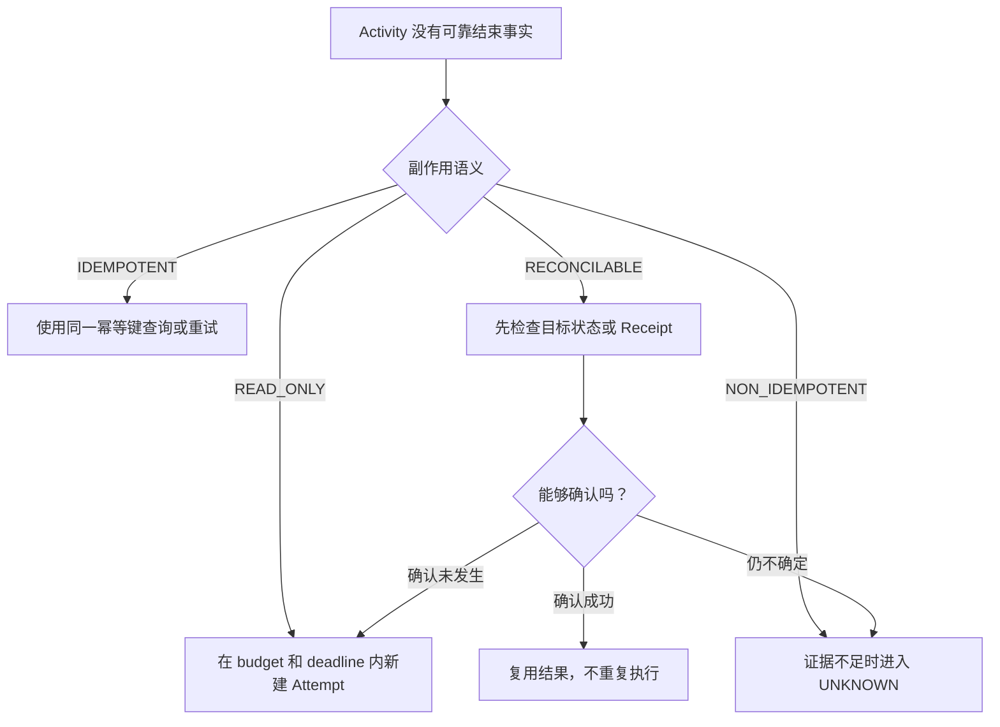
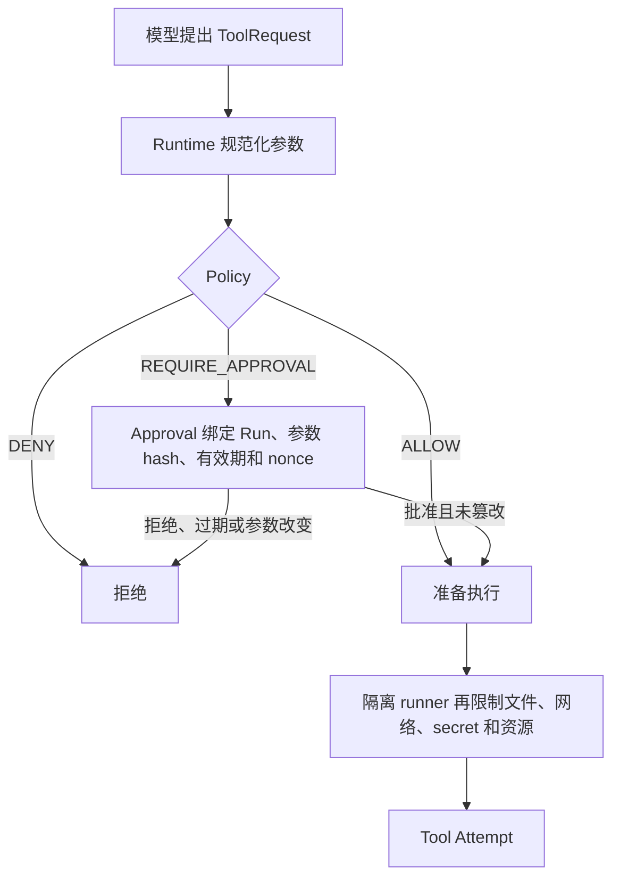

假设 Agent 请求写入 `outputs/report.md`。文件可能已经被完整替换，但进程在保存 ToolResult 之前退出。
重启后只做一句 `retry()` 并不安全，因为同一个动作也许会执行第二次。

BearAgent 会把问题按顺序拆开：

| 阶段 | Runtime 要回答的问题 | 目前状态 |
|---|---|---|
| P1 | 发生了什么？ | 已实现：Event、Reducer、预算和 Artifact 可查 |
| P2 | 根据已有证据，下一步怎样做才安全？ | 未实现 |
| P3 | 这个动作是否获准，又只能影响哪里？ | 未实现 |

这三问看起来接近，实际上负责不同的系统边界。

## P1 先留下事实

P1 会在外部调用前后保存 Event。它也会记录 Tool 的规范化请求、Policy 决定、结果和 Artifact hash。
这些事实让用户知道文件任务走到了哪里。

但是“Event 已经持久化”不等于“Runtime 会在重启后继续”。如果写文件已经发生、成功 Event 没有
保存，P1 会保留非终态 Run，不会猜测成功，也不会自动重写。

## P2 先分类，再决定

P2 会把逻辑 Activity 和真实 Attempt 分开。第一次执行失败后，下一次重试是新的 Attempt，旧失败
仍然保留。

Runtime 还要判断动作属于哪类：

```text
READ_ONLY        没有外部副作用
IDEMPOTENT       用同一幂等键重复执行不会产生新结果
RECONCILABLE     可以检查目标状态或 Receipt
NON_IDEMPOTENT   没有证据时不能自动重做
```

因此恢复路径不是统一的“失败后重试”：



输入写错、临时网络故障、永久失败、权限拒绝和“副作用可能已经发生”也必须分开。Error 上的
`retryable=true` 只是信息，不能单独授予重做外部写入的权力。

Checkpoint 只加快状态重建。删除 Checkpoint 后，完整 Event 仍要得到同一个 RunState。

## hard budget 仍然要保留

模型次数、Tool 次数、token、费用和总时间上限不是笨拙的补丁，而是 Runtime 的 hard stop。P2 的
每个新 Attempt 也要消耗同一 Run budget，不能在“恢复”名义下无限重试。

接近上限时提醒模型收敛，或者阻止“相同 Tool、相同参数、相同确定性失败、没有进展”的重复动作，
可以以后做成小型 guardrail。它们不能可靠判断所有语义死循环，也不能替代 hard budget。

## P3 再判断授权和影响范围

即使 P2 判断一次 Tool 可以安全执行，也不表示它有权执行。P3 会让请求再通过两道门：



Approval 不能只是“用户点过 Yes”。批准 `git.push` 到一个分支，不能被模型改成另一个分支后继续
使用。登录身份也不等于 Tool Grant。

runner 则限制动作实际能碰到什么。它默认断网，读不到 Provider key、主数据库、宿主根目录、用户
home 或 Docker socket。Approval 不能扩大这些隔离边界；sandbox 也不能代替 Policy。

## 为什么 Routing、MCP 和 Memory 还不在这里

Routing 解决“把请求或 Tool 分给谁”，Memory 解决“把哪些历史带进 Context”，MCP 解决“怎样接入
外部 Tool”。它们都会扩大能力表面，却不会自动回答副作用是否发生、能否重试或是否获准。

BearAgent 当前只有有限 workspace Tool，固定 Tool subset 足够。P4 在接入 HTTP、Skill、MCP、Web
和 Memory 后，只有 Tool 数量真的造成问题，才考虑 selector 或 deferred loading。

完整范围和 Feature 顺序见[项目阶段](/BearAgent/zh-cn/project/milestones/)与
[工程 Roadmap](https://github.com/CherryYang05/BearAgent/blob/main/docs/project/roadmap.md)。当前实现边界
见[实现状态](/BearAgent/zh-cn/project/status/)。
