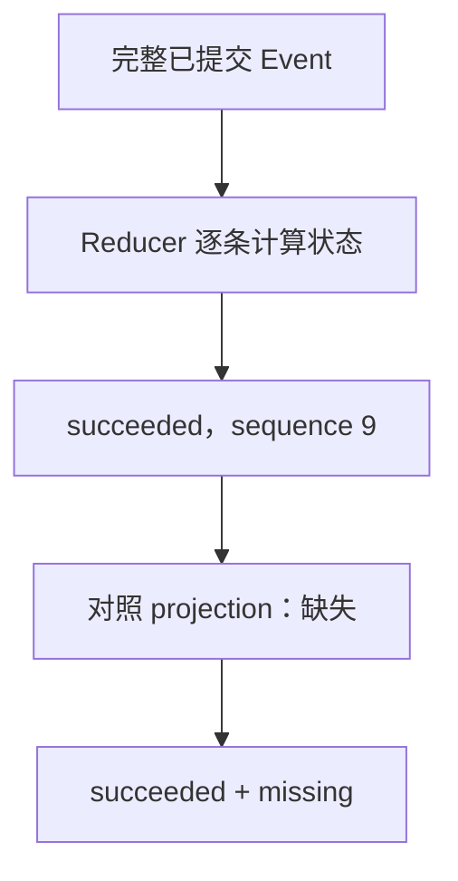

昨天的 Run 没有正常结束，今天还能知道它做到了哪一步吗？先找到运行时使用的数据库和 Run ID：

```console
uv run bearagent run replay RUN_ID
```

把 `RUN_ID` 换成实际 ID。命令默认读当前目录下的 `data/bearagent.db`；如果运行时指定了其他数据库，
查询时也要传同一个 `--database PATH`。它不需要模型配置，不读取 workspace，也不会继续执行。

:::note[这一章对应哪个版本]
F-0021 已于 2026-09-13 随 [PR #26](https://github.com/CherryYang05/BearAgent/pull/26) 合入 main。
从包含该合并的源码版本可以使用 `replay/check`，P1 的 `v0.1.0` tag 不含它们。当前只实现事实重建与
显式检查；自动恢复、Attempt、Checkpoint 和 `UNKNOWN` 处置仍待后续实现。
:::

## 先选对问题，再选命令

| 你现在想知道什么 | 使用什么 | 结果来自哪里 |
|---|---|---|
| 已保存的状态、预算和 Artifact 是什么？ | `run inspect RUN_ID` | 已验证的 projection，以及已提交的 Tool Event |
| 每一条事实记录了什么？ | `run events RUN_ID` | 分页 Event；原有查询仍依赖 projection 校验 |
| projection 不可靠时，Event 能推导出什么状态？ | `run replay RUN_ID` | 从 sequence 1 开始的完整已提交历史 |
| 这批 Run 中哪些尚未结束或需要查看？ | `run check` | 从 Event 枚举 Run，再逐个重建 |

`projection` 是为了方便查询而保存的状态视图。正常写入会把 Event 和 projection 放在同一事务里提交，
因此进程中断本身不应留下这次事务的半边。手工改库或数据损坏仍可能使 projection 不可用；`replay`
提供一条独立的只读入口，让我们能检查剩下的 Event，而不放宽原有写入和查询的校验。

## 例子一：Event 说已完成，projection 却丢了

仓库的测试样例有 9 条 Event，最后一条是 `RunSucceeded`。在临时数据库中删除 projection 后，
`inspect` 无法返回正常结果，`replay` 仍可重建。下面是 `--json` 结果中几个字段的节选：

```json
{
  "status": "succeeded",
  "last_sequence": 9,
  "last_event_type": "RunSucceeded",
  "projection": "missing"
}
```

这四个字段要分开读：前三个描述 Event 推导的执行状态；最后一个描述缓存与重建状态的对照情况。
`missing` 不会把已经记录的 `succeeded` 改成 `failed`。命令退出 1，提醒你查看数据异常；它没有把
projection 补回数据库，也没有确认输出内容是否满足任务要求。



同样的对照共有四种结果：

| `projection` | 怎样理解 | 它没有说明什么 |
|---|---|---|
| `matched` | projection 与完整重建的 RunState 一致 | 不证明外部文件仍正确，也不授权再次执行 |
| `missing` | Run projection 行或所需 projection 表缺失 | 不表示 Event 丢失，也没有完成修复 |
| `mismatch` | projection 可以读取，但状态、用量或 Activity 等字段不同 | 不能仅凭这个值定位损坏原因 |
| `unreadable` | projection 字段或结构无法正常读取 | 不表示 Event 一定也损坏 |

如果 Event 自身缺少中间 sequence、使用未知版本或存在非法转换，重建会失败并退出 2。它不会跳过
坏记录，用前半段历史冒充完整结果。这里的“完整”指从第一条到读取时最后一条已提交 Event，
不要求 Run 已有终态。

## 例子二：文件已经出现，为什么仍显示 running

`workspace.write` 先提交文件替换，再由执行链提交 Tool 完成 Event。进程可能在这两个动作之间退出：

```text
ToolCallStarted 已提交
    ↓
文件替换成功
    ↓
进程退出，ToolCallCompleted 尚未提交
```

这时 `replay` 只能重建出 `running` 和尚未完成的 Activity。即使用户在磁盘上看到了新文件，命令也
不会读取它、计算当前 hash 或补写成功。F-0018 的 K4 故障测试专门覆盖这个窗口。

`running` 也可能来自一个仍在正常执行的进程。检查结果说明的是“还没有提交终态”，无法判断
“当前无人执行”。因此不能根据它直接再运行同一个目标：新 Run 可能重复已经发生的外部动作。
后续恢复需要核对副作用证据、预算和执行权限；当前命令没有这些决定能力。

## 不知道 Run ID 时，用 check 查一批

```console
uv run bearagent run check --limit 100 --json
```

它从 Event 查找 Run ID，而不是先查询 projection 中的 `running`。所以即使 projection 错误地写成
`succeeded`，只要 Event 推导的 Run 尚未结束，仍会出现在检查结果中。

一页包含两个不同的数量：`scanned_count` 是实际检查的 Run 数；`items` 只保留需要查看的 Run。
一个已正确记录失败、projection 也一致的 Run 是健康终态，不进入 `items`。要查看其失败原因，使用
`inspect`；`check` 不是任务成功率报表，也不是所有 Run 的管理列表。

例如当前页检查了 2 个健康终态 Run，后面还有其他 Run：`scanned_count` 为 2、`items` 为空，
`has_more` 仍为 `true`。继续请求时，把返回的 `next_after_run_id` 原样放入下一次命令：

```console
uv run bearagent run check --after-run-id UUID_FROM_PREVIOUS_PAGE --limit 100 --json
```

以 `has_more` 判断是否结束，不以 `items` 是否为空判断。UUID 排序只用于推进游标，不代表执行时间。
每个 Run 的 Event 与 projection 在同一读事务中捕获，但不同 Run、不同页不共享一个整库快照。
扫描期间新建的 Run 可能落在已经走过的游标之前，需要之后重新扫描。

## 退出码说的是检查结果，不是任务质量

| 退出码 | 本次检查的结论 | 一个例子 |
|---:|---|---|
| 0 | 所查范围内均为终态，且 projection 一致；check 范围也可能为空 | `failed + matched` 仍可退出 0 |
| 1 | 存在尚未结束的 Run 或 projection 异常 | `running + matched` 或 `succeeded + missing` |
| 2 | 输入、历史、读取或期限失败 | Event 缺口、数据库不存在、查询超时 |

同一页有多类问题时采用最高严重级别。单个坏 Run 可以作为带 `error_code` 的项返回，其余 Run 继续
检查；整个命令期限耗尽时返回命令错误，不能把它当成已成功扫描的一页。脚本应先分清 JSON 是
`result` 还是 `error`，再读取字段；`result.items` 内也可能存在单 Run 错误。

## state hash 能帮你比较什么

`replay` 摘要还包含 `state_hash` 与 `state_format_version`。前者是完整重建 RunState 的摘要值，
后者说明采用哪版计算格式。同一 Run 在同一格式下得到相同状态，hash 也相同；比较时应同时保存
Run ID、最后 sequence 和格式版本。

它没有给整串 Event 签名。两串历史可能得到同一 RunState，而其中的消息内容不同；hash 相同不能
证明历史内容相同，更不能证明来源可信、文件未变或允许恢复。Tool/Policy 的历史 contract identity
也不是这个 hash：那是 RunCreated v4 中另行保存的声明，legacy Run 缺少时不会用当前配置补齐。

默认 human 和 JSON 摘要不输出目标、消息、Tool 参数和历史错误文本。需要导出具体 Event 时才使用
`events --json`，并留意其中可能包含的业务内容；它仍受原有查询校验约束。

## 大历史超时后，怎样判断问题

单 Run 最多读取 10,000 条 Event、16 MiB 序列化历史；`check` 默认每页 100 个 Run，最多 1,000 个。
每条命令的读取和重建共用 30 秒期限。超过输入上限返回 `query_limit_exceeded`，期限耗尽返回
`query_timeout`。这些是不同的失败原因。

上限内也可能超时。[已保存的合成样本](https://github.com/CherryYang05/BearAgent/blob/main/docs/evidence/F-0021-replay-benchmark-v1.json)
中，1,000 条模型 Activity 历史约 0.47 秒，10,000 条触发 30 秒期限。这是一次 Windows 测量，
不是所有机器与历史形状的耗时保证。

若整页太慢，可以减少 `check --limit`，或对某个 Run 单独 `replay` 来缩小检查范围。减少页大小
不能缩短同一个 Run 的完整重建；当前也不能靠 Checkpoint 加速，不会截断历史后宣称检查成功。

## 用离线测试亲自核对

在源码仓库完成开发依赖安装后运行：

```console
uv run pytest tests/integration/test_event_replay.py -k reconstructs_without_trusting_or_repairing_projection -q
uv run pytest tests/integration/test_replay_cli.py -q
```

第一条在 pytest 临时数据库中制造 projection 缺失、差异和不可读场景，并比较检查前后的数据库记录。
第二条核对 CLI 输出、退出码、无配置查询和缺库不创建。它们使用测试数据，不需要模型凭据。

接下来读[只读重建怎样穿过源码](/zh-cn/development/event-replay/)。要理解以后为何还需要恢复决定，
读[失败后先问哪三个问题](/zh-cn/learn/recovery-authority-isolation/)；完整选项留在[命令行手册](/zh-cn/guides/cli/)。
