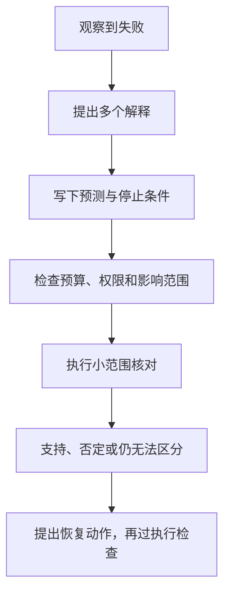

一个文件写入超时了。重新执行后任务成功，能说明系统找到了正确原因吗？不能。原来的写入可能已经
成功，只是结果还没记录；重新执行也可能暂时绕过了故障。

这就是 BearAgent 可以帮助研究的一个小问题：**先核对证据再恢复，能否减少错误动作？为此多花的时间
和资源是否值得？** 下面是 P2/P3 的实验规划，当前 P1 只提供部分执行记录与故障测试。

## 先把两个“验证”分开

查看文件 hash，是在核对写入结果。对一个怀疑的原因安排小规模干预，并观察事先预测的中间信号，
才是在检验诊断假设。最终结果恢复正常，不能自动代替后者。

例如实验假设“超时来自响应回传，而写入已完成”。应分别观察目标文件、提交边界和响应路径。只看
任务再次成功，无法排除“第二次调用重新写了一遍”这个解释。

## P2 先让实验可以重复

先固定一个文件任务，在写入前、写入后、结果提交前注入中断。每次真正执行称为一个 Attempt；重复
尝试必须留下新的记录。然后比较规则基线与候选策略：它们是否多写了一次，是否正确停在结果不明，
是否耗尽了同一个预算。

研究算法先只能提出建议。Runtime 保留 Event、状态、预算和工具检查，不能因为模型说“我确定”就
重做外部写入。`UNKNOWN` 表示副作用结果不明；不知道根因时应保留未验证假设，不混成同一个状态。

## P3 再让干预受到约束

如果验证需要改服务参数、运行代码或发送 canary 请求，它本身也可能造成影响。P3 的 Approval 绑定
具体参数，runner 限制文件、网络、进程和资源；超时后仍由 P2 核对结果。批准一次探测不等于允许
无限重试或全量恢复。

## 第一份实验报告需要什么

用同一组输入与故障，比较“规则恢复”“直接根据诊断恢复”“先验证再恢复”。记录样本数、故障真值、
候选假设、预测与实际观测，以及有害动作率、重复副作用、成功率、验证延迟和资源开销。
没有价格或 usage 时写“未知”，不能按零成本汇总。

先用 Fake 环境定位机制问题，再用真实模型重复实验。五个任务全通过是功能门禁；算法是否更好还需要
留出任务、无故障对照、复合故障和不确定性报告。

## 框架从哪里长出来

先让两个算法在同一个实验中交换位置，再把稳定的输入输出提取为策略接口。工作量增加到确有需要时，
才扩展新的 Tool 或环境。LLM serving 的 GPU、KV cache 与调度信号来自独立环境，不能从 BearAgent
的文件任务中推断。

完整的阶段切片、实验契约和研究边界见
[科研 Runtime 规划](https://github.com/CherryYang05/BearAgent/blob/main/docs/project/research-runtime.md)。
也可以继续读[阶段路线](/zh-cn/project/milestones/)，看恢复与隔离将按什么顺序实现。
