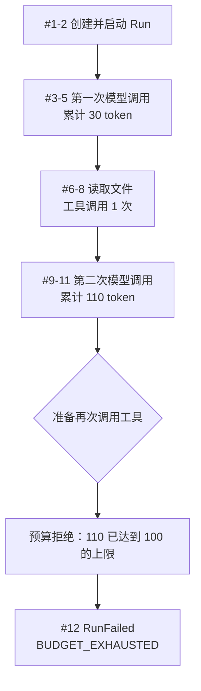

用户要求 Agent 读取一个文件。模型先请求读文件；工具返回内容后，模型再次思考。第二次模型
调用让累计 token 超过上限，所以 Runtime 不再允许新的工具调用，并以预算耗尽结束 Run。

:::note[规则已实现，完整调度尚未实现]
下面的 Event、状态变化和预算判断已有 F-0002 代码支持。真实模型、文件工具和负责追加这些 Event
的 Agent Loop 已由 F-0016 实现；本页仍只聚焦 Reducer 怎样读取事实。
:::

## 开始时有什么限制

本例最多允许 3 次模型调用、2 次工具调用、100 token、10,000 micro-USD 和 60 秒。限制来自创建
Run 的受信请求，模型和工具返回的数据都不能提高它们。

## 执行过程

| seq | 发生的事实 | Reducer 算出的变化 |
|---:|---|---|
| 1 | `RunCreated` | Run 为 `QUEUED`，保存全部限制 |
| 2 | `RunStarted` | Run 为 `RUNNING`，开始计算总时间 |
| 3–5 | 第一次模型请求、开始、完成 | Activity 成功；模型次数 1，累计 30 token |
| 6–8 | 读文件请求、开始、完成 | 工具 Activity 成功；工具次数 1 |
| 9–11 | 第二次模型请求、开始、完成 | Activity 成功；模型次数 2，累计 110 token |
| 12 | `RunFailed` | Run 以 `BUDGET_EXHAUSTED` 结束 |

请求、开始和完成分别记录，是因为它们可能在不同时间持久化。进程如果在“开始”之后中断，系统
不能假装该操作从未发生。P1 还不会自动处理这种中断，但 Event 已经为后续判断保留了位置。

## 被拒绝的工具请求为什么没有成为 Event

第二次模型完成后，110 token 已经实际使用，Reducer 必须如实记账。Runtime 随后准备创建下一条
`ToolCallRequested`，预算检查在 Event 被接受前拒绝了请求。因此旧状态仍停在 sequence 11，
也不会凭空出现新的工具 Activity。

接下来真正发生的事是 Run 因预算耗尽而终止，所以 `RunFailed` 使用连续的 sequence 12。这里可以
看出 Event 与“想做的动作”的区别：请求可以被拒绝，只有系统接受的事实才进入 Event 序列。

:::caution[预算不会抹掉已经完成的工作]
如果第二次模型结果已经足以回答用户，调用方仍可以记录 `RunSucceeded`。预算只阻止新的 Activity，
不会把已有结果改写成不存在。
:::

## 按这条路线读代码

1. 在 `domain/run_events.py` 找 Event 携带的数据；
2. 在 `runtime/reducer.py` 看该 Event 允许在哪种状态出现；
3. 遇到 `*Requested` 时，到 `runtime/budgets.py` 看请求为什么允许或拒绝；
4. 用 `tests/unit/test_run_reducer.py` 和 `tests/unit/test_budgets.py` 确认边界情况。

数据库以后只负责保存 Event 和查询结果，Agent Loop 负责决定下一步；它们都不应重新发明状态规则。
