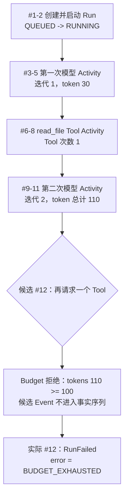

如果只看类型定义，`Run`、`Activity`、`Event`、`Reducer` 和 `Budget` 很容易像五个互不相干的
名词。本页把它们放进同一次执行：用户让 Agent 读取一个文件，模型先决定调用 Tool，Tool 完成后
模型继续回答，但实际 token 用量超过上限，因此下一次 Activity 被拒绝。

:::note[内容状态：已实现规则 + 教学演练]
F-0002 已实现本页使用的 Event payload、Reducer 和 budget gate。下面的 Agent Loop 调度过程用于
解释这些规则怎样协作；真正的 Provider、Tool 执行和 Agent Loop 仍是后续 Feature。
:::

## 先给五个对象分工

| 对象 | 在例子中的问题 | 它不负责什么 |
|---|---|---|
| Run | “处理这一次用户请求”现在整体进行到哪里？ | 不把每次模型或 Tool 调用塞进顶层状态 |
| Activity | 某一次模型调用或 Tool 调用进行到哪里？ | 不代表整次用户请求 |
| Event | 已经接受了什么不可变事实？ | 不表示“希望发生但被拒绝”的动作 |
| Reducer | 截至当前 Event，RunState 应该是什么？ | 不调用模型、Tool 或数据库 |
| Budget | 是否还能请求下一个 Activity？已实际用了多少？ | 不抹掉已经发生的超额用量 |

可以把关系记成一句话：**Run 包含 Activity；Event 记录事实；Reducer 用事实计算状态；Budget 在
下一个 Activity 进入事实序列前把关。**

## 为什么叫 Reducer

`reduce` / `fold` 的含义是“把一串输入逐个合并成一个结果”。代码中的核心循环等价于：

```python
state = None
for event in events:
    state = reduce_event(state, event)
```

用公式写就是：

```text
state(n) = reduce_event(state(n-1), event(n))
```

一串 Event 最终被折叠为一个 `RunState`，所以这个函数叫 Reducer。它并不删除 Event；Reducer 是
计算规则，Event 才是事实。因为函数没有 I/O、不修改旧 state，同样的有序 Event 永远得到值相等
的 state，这就是确定性重放的基础。

## 例子的初始预算

`RunCreated` 把受信边界给出的限制固定为第一条事实：

| 维度 | 上限 | 记账时机 |
|---|---:|---|
| 模型迭代 | 3 | 接受 `ModelCallRequested` 时 +1 |
| token | 100 | 接受模型 completion/failure 时累加实际 usage |
| 费用 | 10,000 micro-USD | 接受模型 completion/failure 时累加 |
| wall time | 60,000 ms | 请求新 Activity 时用发生时间计算 |
| Tool 次数 | 2 | 接受 `ToolCallRequested` 时 +1 |

这些 limit 不能由模型或 Tool 输出扩大。usage 也不是任意计数器，而是 Reducer 只从已经接受的
Event 推导出来。

## 一条完整的 Event sequence



逐条看状态变化：

| seq | Event | Reducer 接受后的关键状态 |
|---:|---|---|
| 1 | `RunCreated` | Run=`QUEUED`；保存五维 limits；usage 全为 0 |
| 2 | `RunStarted` | Run=`RUNNING`；记录 `started_at` |
| 3 | `ModelCallRequested` | Model Activity=`PENDING`；`model_iterations=1` |
| 4 | `ModelCallStarted` | 该 Activity=`RUNNING` |
| 5 | `ModelCallCompleted` | Activity=`SUCCEEDED`；input 20 + output 10，`tokens=30` |
| 6 | `ToolCallRequested(read_file)` | Tool Activity=`PENDING`；`tool_calls=1` |
| 7 | `ToolCallStarted` | Tool Activity=`RUNNING` |
| 8 | `ToolCallCompleted` | Tool Activity=`SUCCEEDED` |
| 9 | `ModelCallRequested` | 第二个 Model Activity=`PENDING`；`model_iterations=2` |
| 10 | `ModelCallStarted` | 第二个 Model Activity=`RUNNING` |
| 11 | `ModelCallCompleted` | Activity=`SUCCEEDED`；再记 80 token，`tokens=110` |
| 12 | `RunFailed` | Run=`FAILED`；终态错误为 `BUDGET_EXHAUSTED` |

每个 request/start/completion 都是独立 Event，因为它们是不同时间发生、恢复时必须区分的事实。
P1 同时只允许一个 `PENDING` 或 `RUNNING` Activity，所以 seq 6 必须等 seq 5 完成后才能接受。

## “候选 #12”为什么不是 Event #12

完成 seq 11 时，Provider 已经实际使用 80 个新 token。Reducer 必须如实记账，所以总量从 30
变成 110；它不能为了让数字好看而丢弃 `ModelCallCompleted`。

当调用方随后尝试构造 `ToolCallRequested(sequence=12)` 时，budget gate 看到 `110 >= 100`，返回
`BUDGET_EXHAUSTED`。这个对象只是**候选 Event**：验证失败后没有被接受，旧 state 仍停在
`last_sequence=11`，也不会凭空出现新的 Tool Activity。

调用方接着可以用同一个连续 sequence 记录真正发生的终止事实：

```text
RunFailed(sequence=12, error.code="budget_exhausted")
```

这也解释了 Event 与“想做的动作”的区别：动作可以被拒绝；只有被接受并记录的结果才进入 Event
sequence。F-0002 已规定 reducer 和错误语义，后续 Agent Loop 负责捕获这个拒绝并追加 `RunFailed`。

:::caution[预算只阻止新的 Activity]
如果 seq 11 的模型结果已经足以完成用户目标，调用方仍可记录 `RunSucceeded`，因为 budget gate
不否认已经完成的工作。只有当 Runtime 还想请求下一次模型或 Tool Activity 时，超限才触发拒绝。
:::

## 自己读代码时按这条线走

1. 在 `domain/run_events.py` 看 Event payload 声明了哪些输入；
2. 在 `runtime/reducer.py` 找对应分支，看它检查什么并怎样返回新 state；
3. 遇到 `*Requested`，继续进入 `runtime/budgets.py` 看候选请求为何允许或拒绝；
4. 回到 `tests/unit/test_run_reducer.py` 和 `tests/unit/test_budgets.py`，用测试确认边界；
5. 最后再看 Store 或 Agent Loop，避免把“状态计算”“事实持久化”和“动作执行”混为一谈。

继续阅读：[Run 状态、Reducer 与预算](runtime-state-and-budgets.md)、
[F-0002 开发者实现导读](../development/run-reducer-and-budgets.md)和
[术语表](../reference/glossary.md)。
